# Suggestions for Making REUSABLE_PACKAGE World-Class

## Executive Summary

This document provides comprehensive suggestions to elevate the REUSABLE_PACKAGE from good to world-class, making it a truly reusable, maintainable, and professional backlog management system that can be adopted by any software project.

**Priority**: 🔴 Critical / 🟠 High / 🟡 Medium / 🟢 Low

---

## 1. Structure & Organization Enhancements

### 1.1 Add Version Control & Changelog ⭐ HIGH PRIORITY

**Current State**: No version tracking or changelog system.

**Recommendation**:
- Add `CHANGELOG.md` following [Keep a Changelog](https://keepachangelog.com/) format
- Add `VERSION` file or version metadata in README
- Use semantic versioning (MAJOR.MINOR.PATCH)

**Implementation**:
```markdown
# CHANGELOG.md
## [1.1.0] - 2025-01-27
### Added
- Template validation scripts
- Example files for each template
- Migration guide from v1.0

### Changed
- Updated template structure for better cross-referencing
- Enhanced documentation with troubleshooting section

## [1.0.0] - 2025-01-15
### Added
- Initial release with 4 templates and 2 process documents
```

### 1.2 Create Template Index/Catalog ⭐ HIGH PRIORITY

**Current State**: Users must explore directories to understand what's available.

**Recommendation**:
- Add `TEMPLATE_CATALOG.md` with:
  - Quick reference table of all templates
  - Use case matrix (when to use each template)
  - Template selection flowchart
  - Dependency graph (which templates work together)

**Structure**:
```markdown
| Template | Use Case | Prerequisites | Output | Time to Complete |
|----------|----------|---------------|--------|------------------|
| Feature Request | New feature | Requirements | FR-XXX.md | 15-30 min |
| Bug Fix | Bug report | Bug details | BF-XXX.md | 10-20 min |
| Sprint Planning | Sprint setup | Backlog items | sprint-XX.md | 1-2 hours |
```

### 1.3 Add Examples Directory ⭐ HIGH PRIORITY

**Current State**: Templates are empty, hard to understand usage.

**Recommendation**:
- Create `EXAMPLES/` directory with:
  - `feature-request-example.md` (filled-out example)
  - `bug-fix-example.md` (filled-out example)
  - `sprint-planning-example.md` (filled-out example)
  - `product-backlog-example.md` (sample backlog)
  - Note: Use generic/placeholder data (no project-specific info)

**Benefits**:
- Shows best practices in action
- Reduces learning curve
- Provides copy-paste starting points

### 1.4 Improve Directory Structure

**Current State**: Flat structure, no clear separation of concerns.

**Recommendation**:
```
REUSABLE_PACKAGE/
├── README.md
├── QUICK_START.md
├── CHANGELOG.md
├── VERSION
├── LICENSE (add open source license)
├── CONTRIBUTING.md (if accepting contributions)
├── TEMPLATES/
│   ├── README.md (template overview)
│   ├── feature-request-template.md
│   ├── bug-fix-template.md
│   ├── product-backlog-table-template.md
│   └── sprint-planning-template.md
├── EXAMPLES/
│   ├── README.md (how to use examples)
│   ├── feature-request-example.md
│   ├── bug-fix-example.md
│   ├── sprint-planning-example.md
│   └── product-backlog-example.md
├── PROCESSES/
│   ├── README.md (process overview)
│   ├── backlog-management-process.md
│   └── product-backlog-structure.md
├── SCRIPTS/ (optional, for automation)
│   ├── validate-template.sh
│   └── create-backlog-item.sh
├── INTEGRATIONS/ (optional)
│   ├── github-actions/
│   ├── gitlab-ci/
│   └── jira-export/
└── docs/ (optional, extended documentation)
    ├── advanced-usage.md
    ├── customization-guide.md
    └── troubleshooting.md
```

---

## 2. Documentation Enhancements

### 2.1 Add Comprehensive README Sections ⭐ HIGH PRIORITY

**Missing Sections**:
1. **Table of Contents** - Quick navigation
2. **Prerequisites** - What users need to know/install
3. **Installation Instructions** - Step-by-step setup
4. **Quick Start** - 30-second getting started
5. **Features** - What this package offers
6. **Troubleshooting** - Common issues and solutions
7. **FAQ** - Frequently asked questions
8. **Roadmap** - Future improvements
9. **Contributing** - How to contribute (if applicable)
10. **License** - Legal information

**Current README Issues**:
- Links to `REUSABLE_BACKLOG_PACKAGE.md` in parent directory (external dependency)
- No clear "Why use this?" value proposition
- Missing visual diagrams/flowcharts

### 2.2 Add Visual Documentation ⭐ MEDIUM PRIORITY

**Recommendation**:
- Add Mermaid diagrams for:
  - Backlog lifecycle workflow
  - Sprint planning process flow
  - Template selection decision tree
  - Status transition diagram

**Example**:
```markdown
## Backlog Lifecycle

```mermaid
graph LR
    A[⭕ Not Started] --> B[⏳ In Progress]
    B --> C[✅ Completed]
    B --> A
```


```

### 2.3 Add Quick Reference Cards

**Recommendation**:
- Create `QUICK_REFERENCE.md` with:
  - Status values cheat sheet
  - Priority levels cheat sheet
  - Story point guide (condensed)
  - File naming conventions
  - Common commands/operations

### 2.4 Improve Cross-References ⭐ HIGH PRIORITY

**Current State**: Some templates reference external files inconsistently.

**Recommendation**:
- Standardize all file paths to be relative
- Add validation that referenced files exist
- Create a "link checker" script
- Use consistent path format throughout

**Example**:
- ❌ Bad: `See ../sprints/sprint-planning-template.md`
- ✅ Good: `See [Sprint Planning Template](../TEMPLATES/sprint-planning-template.md)`

---

## 3. Template Improvements

### 3.1 Add Template Metadata/Headers ⭐ MEDIUM PRIORITY

**Recommendation**: Each template should start with:
```markdown
---
template_version: 1.0.0
last_updated: 2025-01-27
compatible_with: [feature-request, bug-fix, sprint-planning]
requires: [markdown-support]
---

# Template Name
```

### 3.2 Add Validation Checklist to Templates

**Recommendation**: Add validation checklist at end of each template:
```markdown
## Template Validation Checklist

Before submitting, ensure:
- [ ] All required fields are filled
- [ ] Acceptance criteria are testable
- [ ] Technical references are valid
- [ ] Story points are estimated
- [ ] Priority is assigned
- [ ] Links are correct
```

### 3.3 Add Template Variants

**Recommendation**: Provide variations for different use cases:
- `feature-request-template-simple.md` (minimal version)
- `feature-request-template-detailed.md` (comprehensive version)
- `bug-fix-template-technical.md` (for technical teams)
- `bug-fix-template-user-facing.md` (for user-reported bugs)

### 3.4 Add Placeholder/Helper Text ⭐ HIGH PRIORITY

**Current State**: Templates are mostly empty, unclear what to fill.

**Recommendation**: Add helpful placeholder text with examples:
```markdown
## User Story

As a [user type: e.g., "registered user", "admin", "mobile app user"], 
I want [functionality: e.g., "to filter search results by date"], 
so that [benefit: e.g., "I can quickly find recent items"].

**Tips**:
- Start with user role
- Use action verbs (filter, create, delete, view)
- Focus on value, not implementation
```

---

## 4. Process Documentation Improvements

### 4.1 Add Process Diagrams ⭐ MEDIUM PRIORITY

**Recommendation**: Visualize processes:
- Backlog refinement workflow
- Sprint planning workflow
- Bug triage process
- Feature request evaluation process

### 4.2 Add Role-Based Guides

**Recommendation**: Create role-specific quick guides:
- `PROCESSES/for-product-owners.md`
- `PROCESSES/for-developers.md`
- `PROCESSES/for-scrum-masters.md`
- `PROCESSES/for-project-managers.md`

### 4.3 Add Metrics & KPIs Section

**Recommendation**: Add to `backlog-management-process.md`:
```markdown
## Backlog Health Metrics

### Key Performance Indicators
- **Backlog Size**: Target 20-50 items
- **Age of Oldest Item**: Target < 3 months
- **Completion Rate**: Target > 80%
- **Velocity Stability**: Target ±20% variance

### Health Indicators
- ⚠️ Warning: > 50% items > 13 points
- ⚠️ Warning: > 30% items unprioritized
- ✅ Healthy: Clear sprint goals, manageable backlog
```

### 4.4 Add Decision Framework

**Recommendation**: Add decision trees for:
- When to create a feature request vs. bug fix
- How to prioritize items (scoring matrix)
- When to break down large stories
- When to archive/remove items

---

## 5. Automation & Tooling

### 5.1 Add Validation Scripts ⭐ MEDIUM PRIORITY

**Recommendation**: Create scripts to:
- Validate template completeness
- Check for broken links
- Verify file naming conventions
- Generate backlog statistics

**Example Script** (`SCRIPTS/validate-backlog.sh`):
```bash
#!/bin/bash
# Validates backlog structure and templates

# Check required directories exist
# Validate file naming conventions
# Check for broken links
# Verify required fields in templates
```

### 5.2 Add Template Generator Scripts

**Recommendation**: Create interactive scripts:
- `create-feature-request.sh` - Prompts for info, generates file
- `create-bug-fix.sh` - Interactive bug report creation
- `update-backlog-table.sh` - Auto-update main backlog

### 5.3 Add CI/CD Integration Templates ⭐ LOW PRIORITY

**Recommendation**: Provide integration examples:
- GitHub Actions workflow to validate backlog
- GitLab CI pipeline for backlog checks
- Pre-commit hooks for template validation

### 5.4 Add Export/Import Tools

**Recommendation**: Scripts to:
- Export backlog to CSV/Excel
- Import from Jira/GitHub Issues
- Generate reports (PDF, HTML)

---

## 6. Reusability Enhancements

### 6.1 Create Platform-Specific Variants ⭐ MEDIUM PRIORITY

**Recommendation**: Add platform-specific sections or variants:
- `TEMPLATES/web/` - Web-specific templates
- `TEMPLATES/mobile/` - Mobile-specific templates
- `TEMPLATES/backend/` - Backend/API-specific templates

**Alternative**: Use template variables/placeholders:
```markdown
## Environment
**Platform**: {PLATFORM} <!-- web, mobile-ios, mobile-android, desktop, backend -->
**Framework**: {FRAMEWORK} <!-- React, Flutter, Django, etc. -->
```

### 6.2 Add Framework-Agnostic Language

**Current State**: Some references are framework-specific.

**Recommendation**:
- Replace "Flutter Health Management App" with placeholders
- Use generic terms: "application" instead of "app"
- Make technical references format-agnostic

### 6.3 Create Configuration File

**Recommendation**: Add `config.yaml` or `config.json`:
```yaml
project:
  name: "Your Project Name"
  id_format: "FR-XXX"  # or "FEAT-XXX", "STORY-XXX"
  sprint_duration: 2  # weeks
  story_point_scale: fibonacci  # or linear, t-shirt

paths:
  backlog: "project-management/backlog"
  feature_requests: "backlog/feature-requests"
  bug_fixes: "backlog/bug-fixes"
  sprints: "project-management/sprints"

priorities:
  critical: "🔴"
  high: "🟠"
  medium: "🟡"
  low: "🟢"
```

### 6.4 Add Multiple ID Format Support

**Recommendation**: Document common ID formats:
- `FR-XXX` (Feature Request)
- `FEAT-XXX` (Feature)
- `STORY-XXX` (User Story)
- `US-XXX` (User Story)
- Custom format instructions

---

## 7. Quality & Best Practices

### 7.1 Add Template Best Practices Guide ⭐ HIGH PRIORITY

**Recommendation**: Create `docs/best-practices.md`:
- How to write good user stories
- How to create testable acceptance criteria
- How to estimate story points accurately
- How to prioritize effectively
- Common anti-patterns to avoid

### 7.2 Add Common Pitfalls Section

**Recommendation**: Document mistakes to avoid:
- Too vague acceptance criteria
- Over/under-estimating story points
- Not updating status regularly
- Creating duplicate items
- Missing dependencies

### 7.3 Add Quality Checklist

**Recommendation**: Add quality gates:
```markdown
## Quality Checklist

### Feature Request Quality
- [ ] User story follows "As a... I want... So that..." format
- [ ] At least 3 acceptance criteria
- [ ] Business value is clear
- [ ] Dependencies identified
- [ ] Story points estimated

### Bug Fix Quality
- [ ] Steps to reproduce are clear
- [ ] Expected vs. actual behavior documented
- [ ] Environment details complete
- [ ] Priority assigned based on impact
```

### 7.4 Add Code Review Process

**Recommendation**: Document how backlog items are reviewed:
- Who reviews backlog items?
- What are review criteria?
- How are changes requested?
- What's the approval process?

---

## 8. Integration & Compatibility

### 8.1 Add Integration Guide ⭐ MEDIUM PRIORITY

**Recommendation**: Create `docs/integrations.md`:
- How to use with GitHub Issues
- How to use with Jira
- How to use with Linear
- How to use with Notion
- How to use with other tools

### 8.2 Add Migration Guides

**Recommendation**: Guides for:
- Migrating from Jira to file-based backlog
- Migrating from GitHub Issues
- Migrating from other systems

### 8.3 Add Git Workflow Integration

**Recommendation**: Document:
- How to use with Git branches (feature branches)
- How to link backlog items to PRs
- How to use commit message conventions
- How to auto-link from commit messages

**Example**:
```bash
# Commit message format
feat(FR-042): Add user authentication

Refs FR-042
```

### 8.4 Add API/Database Integration Hooks ⭐ LOW PRIORITY

**Recommendation**: If building automation:
- REST API spec for backlog items
- Database schema for backlog storage
- Webhook support for updates

---

## 9. Testing & Validation

### 9.1 Add Test Templates ⭐ MEDIUM PRIORITY

**Recommendation**: Create test scenarios:
- `TEST_SCENARIOS.md` with example scenarios
- Test data for templates
- Validation test cases

### 9.2 Add Template Testing Script

**Recommendation**: Script to test:
- Template syntax (Markdown validity)
- Required fields presence
- Link validity
- File structure correctness

### 9.3 Add Regression Testing

**Recommendation**: Test suite for:
- Template compatibility across versions
- Process document accuracy
- Cross-reference validity

---

## 10. Accessibility & Usability

### 10.1 Improve Navigation ⭐ HIGH PRIORITY

**Current State**: Hard to navigate between related documents.

**Recommendation**:
- Add navigation breadcrumbs
- Add "Related Documents" sections
- Add table of contents to long documents
- Add "Previous/Next" navigation

### 10.2 Add Search Functionality

**Recommendation**: If hosting as website:
- Full-text search
- Tag-based search
- Filter by type (feature, bug, sprint)

### 10.3 Improve Readability

**Recommendation**:
- Use consistent heading hierarchy
- Add visual separators
- Use tables for structured data
- Add code syntax highlighting examples
- Use consistent emoji usage

### 10.4 Add Print-Friendly Versions

**Recommendation**: CSS or markdown formatting for:
- PDF generation
- Print-friendly layouts
- Offline usage

---

## 11. Community & Collaboration

### 11.1 Add Contributing Guidelines ⭐ MEDIUM PRIORITY

**Recommendation**: If accepting contributions:
- `CONTRIBUTING.md` with:
  - How to suggest improvements
  - How to submit pull requests
  - Code of conduct
  - Style guidelines

### 11.2 Add Feedback Mechanism

**Recommendation**:
- Feedback form or issue tracker
- User testimonials section
- Use cases from adopters
- Community examples

### 11.3 Add License File

**Recommendation**: Add `LICENSE` file:
- MIT License (permissive, widely used)
- Apache 2.0 (if need patent protection)
- CC0 (public domain, maximum reuse)

**Current State**: README mentions "no specific license" but this is ambiguous.

### 11.4 Add Adoption Guide

**Recommendation**: `ADOPTION.md`:
- Success stories
- Before/after comparisons
- ROI metrics
- Time savings

---

## 12. Advanced Features (Future)

### 12.1 Add Analytics & Reporting

**Recommendation**: Templates for:
- Velocity tracking dashboard
- Burn-down charts
- Cycle time analysis
- Throughput metrics

### 12.2 Add Automation Templates

**Recommendation**: Scripts for:
- Auto-generate sprint reports
- Auto-update status from git commits
- Auto-calculate metrics
- Auto-sync with external tools

### 12.3 Add Multi-Team Support

**Recommendation**: Extensions for:
- Multiple teams
- Program-level backlog
- Portfolio management
- Cross-team dependencies

### 12.4 Add AI/LLM Integration

**Recommendation**: Prompts for:
- AI-assisted story writing
- AI-assisted acceptance criteria generation
- AI-assisted prioritization
- AI-assisted estimation

---

## 13. Documentation Completeness

### 13.1 Add Glossary

**Recommendation**: `GLOSSARY.md` with:
- Agile/Scrum terms
- Backlog-specific terms
- Template-specific terms
- Process-specific terms

### 13.2 Add FAQ Section ⭐ HIGH PRIORITY

**Recommendation**: Expand FAQ in QUICK_START with:
- Common setup issues
- Template customization questions
- Process workflow questions
- Integration questions
- Troubleshooting questions

### 13.3 Add Video Tutorials/Webinars ⭐ LOW PRIORITY

**Recommendation**: If resources allow:
- Screencast walkthrough
- Video tutorials for each template
- Webinar recording

### 13.4 Add Case Studies

**Recommendation**: Document:
- How this package was used in original project
- Success metrics achieved
- Lessons learned
- Improvement iterations

---

## 14. Critical Missing Elements

### 14.1 No LICENSE File ⭐ CRITICAL

**Issue**: Legal ambiguity about reuse.

**Fix**: Add appropriate open source license.

### 14.2 No VERSION Tracking ⭐ HIGH PRIORITY

**Issue**: Can't track changes or compatibility.

**Fix**: Add versioning system with changelog.

### 14.3 No Examples ⭐ HIGH PRIORITY

**Issue**: Hard to understand usage without examples.

**Fix**: Add complete, realistic examples for each template.

### 14.4 Incomplete Cross-References ⭐ MEDIUM PRIORITY

**Issue**: Some links point to external files, inconsistent paths.

**Fix**: Standardize all paths, make relative, validate links.

### 14.5 No Validation/Testing ⭐ MEDIUM PRIORITY

**Issue**: No way to verify template correctness.

**Fix**: Add validation scripts and test templates.

---

## 15. Prioritized Action Plan

### Phase 1: Critical Foundations (Week 1)
1. ✅ Add LICENSE file
2. ✅ Add VERSION and CHANGELOG.md
3. ✅ Add EXAMPLES directory with filled templates
4. ✅ Fix all cross-references
5. ✅ Add template validation scripts

### Phase 2: Documentation Enhancement (Week 2)
1. ✅ Enhance README with missing sections
2. ✅ Add QUICK_REFERENCE.md
3. ✅ Add FAQ expansion
4. ✅ Add GLOSSARY.md
5. ✅ Add best practices guide

### Phase 3: Process Improvements (Week 3)
1. ✅ Add process diagrams (Mermaid)
2. ✅ Add role-based guides
3. ✅ Add metrics/KPIs section
4. ✅ Add decision frameworks

### Phase 4: Reusability (Week 4)
1. ✅ Add config.yaml for customization
2. ✅ Create platform-agnostic variants
3. ✅ Document multiple ID format support
4. ✅ Add migration guides

### Phase 5: Advanced Features (Ongoing)
1. Integration guides
2. Automation scripts
3. Analytics templates
4. Multi-team support

---

## 16. Success Metrics

Track package quality with:

### Adoption Metrics
- Number of projects using this package
- GitHub stars/forks (if published)
- Download/usage statistics

### Quality Metrics
- Template completeness rate
- User satisfaction surveys
- Issue/bug reports
- Contribution rate

### Effectiveness Metrics
- Time to set up backlog system
- Time saved vs. manual process
- Error rate reduction
- Process compliance improvement

---

## 17. Conclusion

The REUSABLE_PACKAGE has a solid foundation but needs enhancements in:

1. **Completeness**: Examples, validation, testing
2. **Reusability**: Configuration, platform variants, multiple formats
3. **Documentation**: Comprehensive guides, visual aids, troubleshooting
4. **Professionalism**: License, versioning, changelog, contributing guidelines
5. **Usability**: Navigation, search, accessibility, automation

**Recommended Focus**: Start with Phase 1 (Critical Foundations) to make it immediately usable, then iterate through remaining phases based on user feedback.

---

## 18. Additional Resources

### Recommended Reading
- [Keep a Changelog](https://keepachangelog.com/)
- [Semantic Versioning](https://semver.org/)
- [Write the Docs](https://www.writethedocs.org/)
- [Documentation Best Practices](https://documentation.divio.com/)

### Tools to Consider
- Markdown linters (markdownlint)
- Link checkers (markdown-link-check)
- Template engines (mustache, handlebars)
- Documentation generators (MkDocs, Docusaurus)

---

**Last Updated**: 2025-01-27  
**Version**: 1.0  
**Status**: Comprehensive Review Complete

