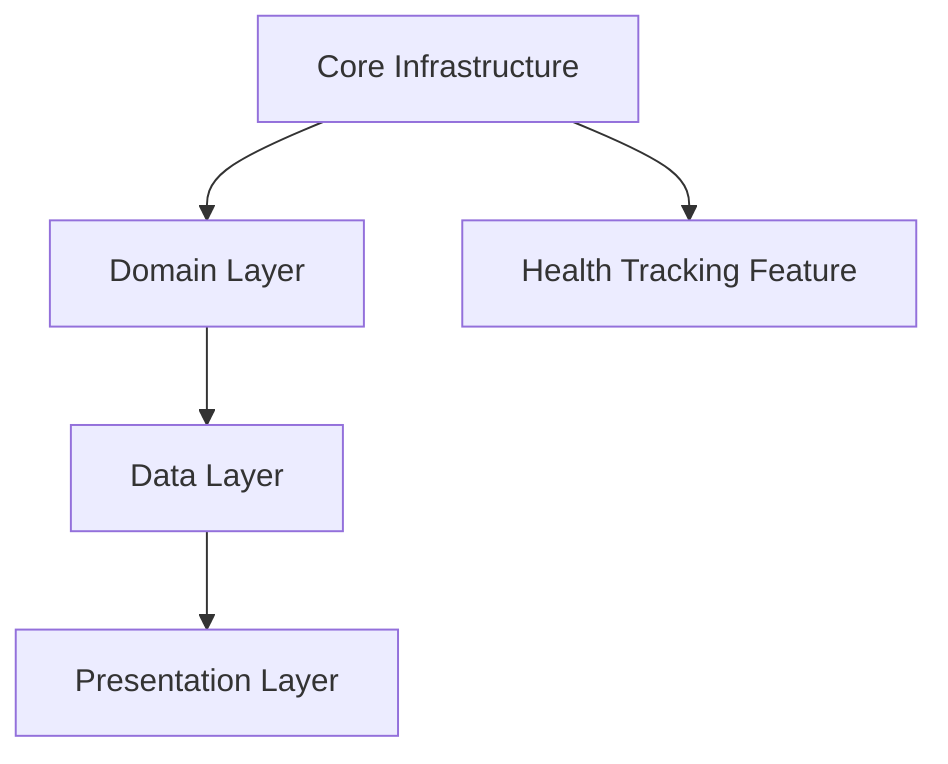

# Prompt: Implementation Order and Sprint Planning

## Task

Act as a Scrum Master and analyze all artifacts in the `artifacts/` directory to create a comprehensive implementation plan. As the Scrum Master, you will determine the optimal order for implementing the Flutter Health Management App for Android, then break that order down into sprints, user stories, and tasks. This integrated approach ensures that implementation order aligns with sprint planning and task breakdown.

## Input Files to Analyze

Read and analyze the following artifacts in this order:

### Foundation Documents
1. `artifacts/requirements.md` - Core requirements and technical decisions
2. `artifacts/orchestration-definition.md` - Overall project structure
3. `artifacts/orchestration-analysis-report/project-summary.md` - High-level overview
4. `artifacts/orchestration-analysis-report/recommendations.md` - Prioritized recommendations

### Phase 1: Foundations
5. `artifacts/phase-1-foundations/architecture-documentation.md` - Architecture patterns and principles
6. `artifacts/phase-1-foundations/project-structure-specification.md` - File/folder organization
7. `artifacts/phase-1-foundations/database-schema.md` - Database structure
8. `artifacts/phase-1-foundations/data-models.md` - Entity and model definitions
9. `artifacts/phase-1-foundations/design-system-options.md` - UI design system
10. `artifacts/phase-1-foundations/component-specifications.md` - Reusable components
11. `artifacts/phase-1-foundations/wireframes.md` - Screen layouts
12. `artifacts/phase-1-foundations/health-domain-specifications.md` - Business logic rules
13. `artifacts/phase-1-foundations/clinical-safety-protocols.md` - Safety requirements

### Phase 2: Features
14. `artifacts/phase-2-features/health-tracking-module-specification.md`
15. `artifacts/phase-2-features/nutrition-module-specification.md`
16. `artifacts/phase-2-features/exercise-module-specification.md`
17. `artifacts/phase-2-features/medication-management-module-specification.md`
18. `artifacts/phase-2-features/behavioral-support-module-specification.md`
19. `artifacts/phase-2-features/analytics-module-specification.md`

### Phase 3: Integration
20. `artifacts/phase-3-integration/integration-specifications.md`
21. `artifacts/phase-3-integration/platform-specifications.md`
22. `artifacts/phase-3-integration/sync-architecture-design.md` (post-MVP reference)

### Phase 4: Testing
23. `artifacts/phase-4-testing/testing-strategy.md`
24. `artifacts/phase-4-testing/test-specifications.md`

### Phase 5: Management
25. `artifacts/phase-5-management/sprint-planning-template.md` - Sprint planning structure and format
26. `artifacts/phase-5-management/product-backlog-structure.md` - Backlog templates
27. `artifacts/phase-5-management/backlog-management-process.md` - Backlog management workflow

## Role: Scrum Master

You are an expert Scrum Master and Agile practitioner specializing in sprint planning, backlog management, and implementation sequencing. Your expertise includes:
- Analyzing technical requirements and architecture to determine optimal implementation order
- Breaking down work into sprints with clear goals and deliverables
- Creating user stories with acceptance criteria and story point estimates
- Decomposing user stories into actionable tasks with technical references
- Identifying dependencies and critical path items
- Managing sprint capacity and team velocity

## Execution Approach

As the Scrum Master, you will:
1. **Analyze all artifacts** to understand the complete project scope
2. **Determine implementation order** based on dependencies, architecture layers, and MVP priorities
3. **Create sprint breakdown** organizing work into logical sprint cycles
4. **Create user stories** for each sprint with proper estimation
5. **Break down tasks** for each user story with technical references

## Output Documents

As the Scrum Master, you will create the following documents:

### 1. Implementation Order Document

Create `artifacts/implementation-order.md` with the following structure:

```markdown
# Implementation Order Guide: Flutter Health Management App

## Executive Summary
Brief overview of the implementation approach and key principles determined by Scrum Master analysis.

## Implementation Principles
- Dependency-based ordering (build dependencies before dependents)
- Layer-based ordering (domain → data → presentation)
- MVP-first approach (core features before advanced)
- Test-driven development order
- Sprint-aligned sequencing (work organized for sprint execution)

## Implementation Phases

[Organize work into logical phases with estimated durations]

### Phase 0: Project Setup
- Flutter project initialization
- Project structure creation
- Dependencies installation
- Development environment setup

### Phase 1: Core Infrastructure
[List specific components in order]

### Phase 2: Foundation Data Layer
[List specific components in order]

[Continue with additional phases...]

## Dependencies Map
Use Mermaid.js to create a dependency graph diagram showing what depends on what (flowchart or graph diagram).

## Critical Path Items
Items that must be completed before other work can proceed.

## Parallel Development Opportunities
Use Mermaid.js to create a diagram showing areas that can be developed in parallel by different developers (flowchart or gantt diagram).

## Risk Mitigation Order
High-risk items that should be tackled early.

## Sprint Mapping
Use Mermaid.js to create a diagram showing how phases map to sprints (flowchart, timeline, or gantt diagram).

## Post-MVP Roadmap
Brief overview of post-MVP features and their implementation order.
```

**Note**: The implementation order document should serve as the strategic foundation that informs sprint planning. Sprints will be created based on this order.

### 2. Sprint Planning Documents

Create individual sprint planning documents:
- One markdown file per sprint: `artifacts/phase-5-management/sprint-01-[name].md`, `sprint-02-[name].md`, etc.
- Each sprint document should follow the template structure from `sprint-planning-template.md`
- Include sprint header, overview, user stories with tasks, dependencies, and risks
- Cross-reference back to implementation order document phases

### 3. Sprint Overview Document

Create `artifacts/phase-5-management/sprint-overview.md`:
- High-level view of all sprints
- Summary table showing all sprints, goals, story point totals, and timeline
- Cross-reference to implementation order document
- Use Mermaid.js to create sprint dependencies and critical path visualization (flowchart or gantt diagram)
- Use Mermaid.js to create a sprint timeline/Gantt chart showing sprint sequence and duration

## Analysis Requirements

When analyzing the artifacts, consider:

1. **Architecture Dependencies**: 
   - Core layer must be built before features
   - Domain entities must exist before data models
   - Data layer must exist before presentation layer
   - Repository interfaces must exist before implementations

2. **Feature Dependencies**:
   - Health tracking may be needed by analytics
   - Medication data may be needed by health tracking
   - Shared widgets must exist before feature UIs

3. **MVP Priorities**:
   - Focus on MVP features first (health tracking, nutrition, exercise, medication)
   - Defer post-MVP features (sync, LLM integration, advanced analytics)

4. **Testing Strategy**:
   - Unit tests should be written alongside implementation
   - Widget tests follow presentation layer
   - Integration tests come after features are complete

5. **Risk Mitigation**:
   - Data export should be implemented early (recommendation from analysis)
   - Critical safety features should be prioritized
   - Core infrastructure risks should be addressed first

6. **Development Efficiency**:
   - Identify what can be developed in parallel
   - Identify critical path items (blockers)
   - Consider feature team assignments

## Key Considerations

- **Technology Stack**: Flutter, Riverpod (state management), Hive (local storage)
- **Architecture Pattern**: Feature-First Clean Architecture (domain → data → presentation)
- **MVP Scope**: Local-only, no cloud sync, no authentication
- **Test Coverage Targets**: 80% unit tests, 60% widget tests
- **Critical Features**: Health tracking, medication management, nutrition, exercise
- **Reference Material**: Health domain logic in `reference-material/artifacts/`

## Output Format

- Use clear section headers with numbered phases
- Include specific file paths for each component
- Reference relevant artifact sections
- Provide estimated time/sprint allocations where possible
- Use checkboxes for tracking progress
- **Use Mermaid.js diagrams** for all visualizations (dependencies, workflows, timelines, critical path)
- All diagrams must use proper Mermaid.js syntax wrapped in code blocks with `mermaid` language tag

## Quality Checklist

Before finalizing the document, ensure:
- [ ] All critical dependencies are identified
- [ ] MVP features are prioritized correctly
- [ ] Architecture layers are respected
- [ ] Testing strategy is integrated
- [ ] Risk mitigation items are addressed early
- [ ] Parallel development opportunities are identified
- [ ] Post-MVP items are clearly separated
- [ ] Implementation order is logical and efficient
- [ ] Document references specific artifact files and sections

## Scrum Master Tasks

As the Scrum Master, you will create comprehensive sprint planning documents by:

1. **Analyze Artifacts and Determine Implementation Order**:
   - Analyze all input artifacts to understand project scope, architecture, and requirements
   - Identify dependencies between components (architecture layers, features, integrations)
   - Determine optimal implementation order based on:
     - Architecture dependencies (core → domain → data → presentation)
     - Feature dependencies (health tracking may feed analytics)
     - MVP priorities (core features before advanced)
     - Risk mitigation (critical safety features early)
   - Document implementation phases in logical sequence

2. **Create Sprint Breakdown**:
   - Break down implementation phases into individual sprints
   - Assign each sprint a number, name, goal, and duration (typically 2 weeks per sprint)
   - Define sprint objectives and deliverables
   - Identify dependencies between sprints
   - Ensure sprint capacity aligns with team velocity (typically 20-40 story points per sprint)

3. **Create User Stories**:
   - Convert each implementation phase/component into user stories
   - Use format: "As a [user type], I want [functionality], so that [benefit]"
   - Assign story points using Fibonacci sequence (1, 2, 3, 5, 8, 13)
   - Set priority levels (🔴 Critical / 🟠 High / 🟡 Medium / 🟢 Low)
   - Reference relevant artifact documents and sections

4. **Break Down Tasks**:
   - Decompose each user story into specific, actionable tasks
   - Each task should be completable within 1-2 days
   - Include technical references (class names, method names, file paths)
   - Reference specific artifact sections for requirements
   - Assign task-level story points
   - Mark initial status as ⭕ Not Started

5. **Create Sprint Planning Documents**:
   - Create individual sprint planning documents following `sprint-planning-template.md`
   - Use naming convention: `artifacts/phase-5-management/sprint-01-[name].md`, `sprint-02-[name].md`, etc.
   - Include sprint header, overview, user stories, and tasks table
   - Document dependencies, risks, and blockers
   - Cross-reference back to implementation order document phases

## Sprint Planning Guidelines

When creating sprints and tasks, follow these principles:

1. **Sprint Structure**:
   - Each sprint should have a clear, measurable goal
   - Sprint capacity should align with team velocity (adjust based on team size)
   - Typical sprint: 2 weeks, 20-40 story points (adjust based on team)

2. **User Story Creation**:
   - One user story per feature component or significant functionality
   - User stories should be testable and have clear acceptance criteria
   - Reference architecture documents, feature specs, and data models
   - Include both functional and non-functional requirements

3. **Task Breakdown**:
   - Tasks should map to specific code files, classes, or methods
   - Include tasks for: domain entities, data models, repositories, use cases, UI pages, widgets, providers, tests
   - Each task should reference the specific artifact section that defines requirements
   - Include tasks for unit tests and widget tests alongside implementation

4. **Dependency Management**:
   - Ensure tasks within a sprint respect layer dependencies (domain → data → presentation)
   - Critical path items should be scheduled early in sprints
   - Tasks that can be parallelized should be clearly marked

5. **Testing Integration**:
   - Include test tasks for each feature implementation
   - Unit tests should be in the same sprint as domain/data layer implementation
   - Widget tests should be in the same sprint as presentation layer implementation

6. **Story Point Estimation**:
   - Use Fibonacci sequence: 1, 2, 3, 5, 8, 13
   - Consider complexity, uncertainty, and dependencies
   - Smaller, well-defined tasks = lower story points
   - Complex, uncertain, or risky tasks = higher story points

7. **Mermaid.js Documentation**:
   - Use Mermaid.js diagrams to visualize dependencies, workflows, and relationships
   - Create dependency graphs using `graph` or `flowchart` syntax
   - Create sprint timelines using `gantt` syntax
   - Create task/workflow diagrams using `flowchart` syntax
   - Use appropriate Mermaid diagram types: flowchart, graph, gantt, timeline
   - All diagrams should be properly formatted and renderable in Markdown viewers

### Example Sprint Structure

```markdown
# Sprint 1: Project Foundation & Core Infrastructure

**Sprint Goal**: Establish project structure, core utilities, and database foundation
**Duration**: [Start Date] - [End Date] (2 weeks)
**Total Story Points**: 21

## User Stories

### Story 1.1: Project Setup - 2 Points
**User Story**: As a developer, I want the Flutter project initialized with proper structure, so that development can begin.

**Tasks**:
- T-001: Initialize Flutter project → ⭕ Not Started (1 point)
- T-002: Create folder structure per project-structure-specification.md → ⭕ Not Started (1 point)

### Story 1.2: Core Constants and Utilities - 3 Points
[Additional stories...]
```

### Mermaid.js Documentation Requirements

The Scrum Master must use Mermaid.js to create visual diagrams in all output documents:

1. **Implementation Order Document** (`implementation-order.md`):
   - Dependency graph/map showing component dependencies (use `graph` or `flowchart`)
   - Critical path visualization (use `flowchart`)
   - Parallel development opportunities diagram (use `flowchart` or `gantt`)
   - Sprint mapping diagram showing phases to sprints (use `flowchart`, `gantt`, or `timeline`)

2. **Sprint Planning Documents** (each sprint file):
   - Sprint workflow/dependency diagram within sprint (use `flowchart` if needed)
   - Task dependency visualization if complex (use `flowchart`)

3. **Sprint Overview Document** (`sprint-overview.md`):
   - Sprint timeline/Gantt chart (use `gantt`)
   - Sprint dependencies diagram (use `flowchart` or `graph`)
   - Critical path across sprints (use `flowchart`)

**Mermaid.js Syntax Requirements**:
- All diagrams must be wrapped in code blocks with language tag `mermaid`
- Use appropriate diagram types: `flowchart`, `graph`, `gantt`, `timeline`
- Ensure diagrams are properly formatted and renderable
- Use clear, descriptive node labels
- Use directional arrows to show dependencies and flow

**Example Mermaid.js Usage**:
````markdown
## Dependencies Map


````

### Additional Reference Files

When creating the sprint planning documents, reference:
- `artifacts/phase-5-management/sprint-planning-template.md` - Template format and structure
- `artifacts/phase-5-management/product-backlog-structure.md` - User story and backlog formats
- `artifacts/phase-5-management/backlog-management-process.md` - Status tracking and workflow
- `artifacts/requirements.md` - CRISPE Framework standards and sprint planning requirements
- Mermaid.js documentation: https://mermaid.js.org/ for syntax reference

### Quality Checklist

Before finalizing documents, ensure:
- [ ] All artifacts have been analyzed and dependencies identified
- [ ] Implementation order respects architecture layers and dependencies
- [ ] All implementation phases are covered by sprints
- [ ] User stories follow format: "As a [user type], I want [functionality], so that [benefit]"
- [ ] User stories have clear acceptance criteria
- [ ] Tasks reference specific artifact sections
- [ ] Tasks include technical references (classes, methods, file paths)
- [ ] Story points are assigned using Fibonacci sequence (1, 2, 3, 5, 8, 13)
- [ ] Dependencies between sprints are documented
- [ ] Critical path items are prioritized early in sprints
- [ ] Testing tasks are included for each feature (unit tests with domain/data, widget tests with presentation)
- [ ] Sprint documents follow the template format from `sprint-planning-template.md`
- [ ] Total story points per sprint align with team capacity (adjust based on team size)
- [ ] Implementation order document and sprint documents are consistent
- [ ] All MVP features are prioritized over post-MVP features
- [ ] **Mermaid.js diagrams are used for all visualizations** (dependencies, timelines, workflows)
- [ ] All Mermaid.js diagrams use proper syntax and are wrapped in code blocks with `mermaid` language tag
- [ ] Dependency graphs are created using Mermaid.js in implementation order document
- [ ] Sprint timeline/Gantt chart is created using Mermaid.js in sprint overview document
- [ ] All diagrams are properly formatted and renderable

---

**Execute this prompt as Scrum Master**: Analyze all artifacts, determine implementation order, then create sprint planning documents with user stories and tasks following the structure and requirements above.

