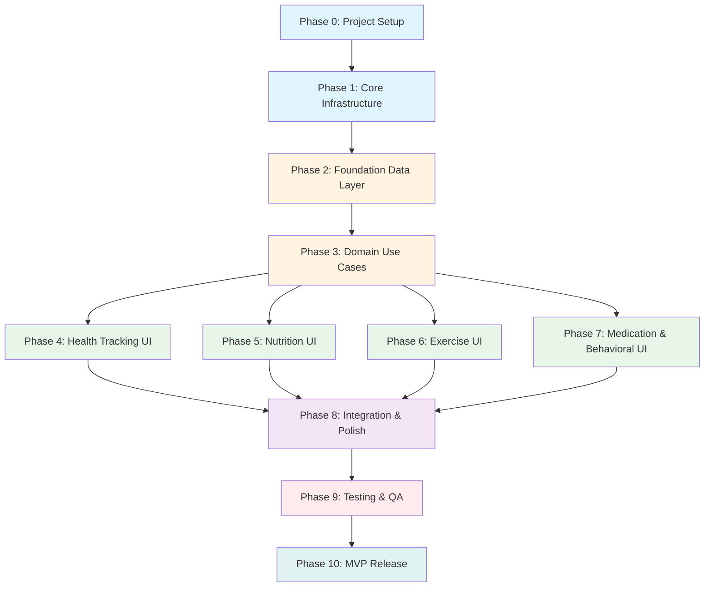
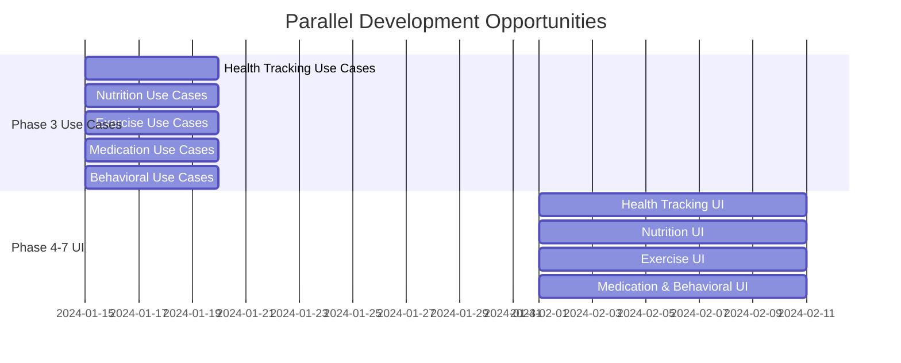
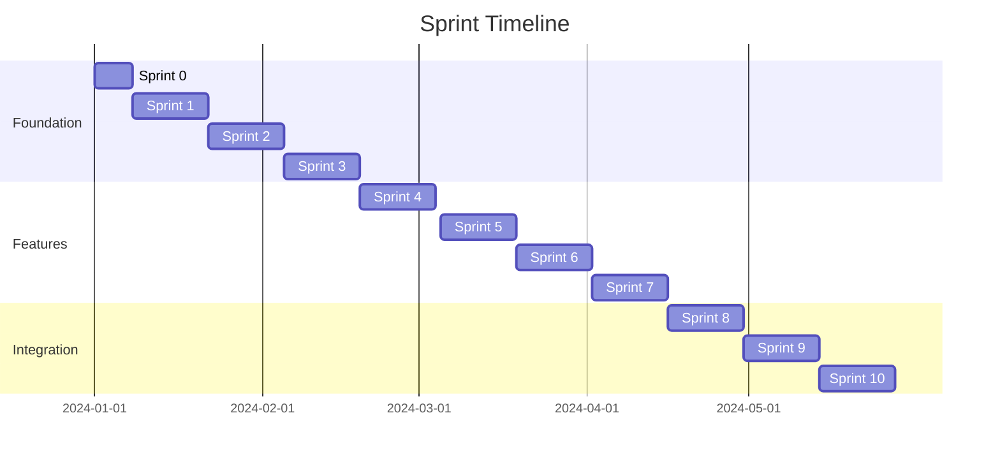

# Implementation Order Guide: Flutter Health Management App

## Executive Summary

This document defines the optimal implementation order for the Flutter Health Management App for Android, determined through comprehensive analysis of all project artifacts. The implementation follows a dependency-based, layer-first approach that prioritizes MVP features while establishing a solid foundation for post-MVP enhancements.

**Key Principles**:
- **Dependency-Based Ordering**: Build dependencies before dependents (core → domain → data → presentation)
- **Layer-Based Ordering**: Domain entities → data models → repositories → use cases → UI
- **MVP-First Approach**: Core features before advanced features
- **Test-Driven Development**: Unit tests with domain/data, widget tests with presentation
- **Risk Mitigation**: Critical safety features and data export implemented early
- **Sprint-Aligned Sequencing**: Work organized for efficient sprint execution

## Implementation Principles

### 1. Dependency-Based Ordering

Components are built in order of dependencies:
- Core infrastructure must exist before features
- Domain entities must exist before data models
- Data layer must exist before presentation layer
- Repository interfaces must exist before implementations
- Shared widgets must exist before feature UIs

### 2. Layer-Based Ordering

Within each feature, implementation follows Clean Architecture layers:
1. **Domain Layer**: Entities and repository interfaces
2. **Data Layer**: Models, data sources, repository implementations
3. **Presentation Layer**: Providers, widgets, pages

### 3. MVP-First Approach

MVP features are prioritized:
- ✅ **Included**: Health tracking, nutrition, exercise, medication, behavioral support (basic)
- ❌ **Deferred**: Cloud sync, authentication, LLM integration, advanced analytics

### 4. Test-Driven Development Order

Testing is integrated throughout:
- Unit tests written alongside domain/data layer implementation
- Widget tests written alongside presentation layer implementation
- Integration tests after features are complete

### 5. Risk Mitigation Order

High-risk items addressed early:
- Data export functionality (Sprint 1-2) - mitigates data loss risk
- Clinical safety protocols (Sprint 3-4) - critical safety features
- Core infrastructure validation (Sprint 1) - prevents rework

## Implementation Phases

### Phase 0: Project Setup (Sprint 0 - Pre-Sprint)

**Duration**: 1 week (pre-sprint setup)

**Objectives**:
- Initialize Flutter project
- Set up project structure
- Install dependencies
- Configure development environment

**Components**:
- [ ] Flutter project initialization
- [ ] Project folder structure creation (`lib/core/`, `lib/features/`, `test/`)
- [ ] Dependencies installation (Riverpod, Hive, fpdart, etc.)
- [ ] Linter configuration (`analysis_options.yaml`)
- [ ] Git repository setup
- [ ] CI/CD pipeline setup (basic)
- [ ] Development environment documentation

**Dependencies**: None

**Deliverables**:
- Working Flutter project structure
- All dependencies installed
- Development environment ready

---

### Phase 1: Core Infrastructure (Sprint 1)

**Duration**: 2 weeks

**Objectives**:
- Establish core utilities, constants, and error handling
- Set up Hive database foundation
- Create shared widgets and providers
- Implement data export functionality (risk mitigation)

**Components**:

#### 1.1 Core Constants and Utilities
- [ ] `lib/core/constants/app_constants.dart` - App-wide constants
- [ ] `lib/core/constants/health_constants.dart` - Health domain constants
- [ ] `lib/core/constants/ui_constants.dart` - UI constants
- [ ] `lib/core/utils/date_utils.dart` - Date manipulation utilities
- [ ] `lib/core/utils/validation_utils.dart` - Input validation utilities
- [ ] `lib/core/utils/calculation_utils.dart` - Calculation helpers
- [ ] `lib/core/utils/format_utils.dart` - Formatting utilities

#### 1.2 Error Handling Foundation
- [ ] `lib/core/errors/failures.dart` - Failure classes (fpdart Either)
- [ ] `lib/core/errors/exceptions.dart` - Custom exceptions
- [ ] `lib/core/errors/error_handler.dart` - Global error handler

#### 1.3 Core Widgets
- [ ] `lib/core/widgets/loading_indicator.dart` - Loading spinner
- [ ] `lib/core/widgets/error_widget.dart` - Error display widget
- [ ] `lib/core/widgets/empty_state_widget.dart` - Empty state widget
- [ ] `lib/core/widgets/custom_button.dart` - Reusable button widget

#### 1.4 Hive Database Foundation
- [ ] Hive initialization (`lib/core/providers/database_provider.dart`)
- [ ] Hive adapter registration setup
- [ ] Database initialization utilities

#### 1.5 Data Export (Risk Mitigation - Early Implementation)
- [ ] `lib/core/utils/export_utils.dart` - Data export utilities
- [ ] Export service for all Hive boxes
- [ ] JSON export format implementation
- [ ] Export UI (basic)

**Dependencies**: Phase 0

**Deliverables**:
- Core utilities and constants
- Error handling framework
- Shared widgets
- Hive database foundation
- Data export functionality

---

### Phase 2: Foundation Data Layer (Sprint 2)

**Duration**: 2 weeks

**Objectives**:
- Implement all domain entities
- Create Hive data models and adapters
- Set up all Hive boxes
- Implement repository interfaces

**Components**:

#### 2.1 User Profile Domain & Data
- [ ] `lib/features/user_profile/domain/entities/user_profile.dart` - UserProfile entity
- [ ] `lib/features/user_profile/data/models/user_profile_model.dart` - Hive model
- [ ] `lib/features/user_profile/domain/repositories/user_profile_repository.dart` - Repository interface
- [ ] `lib/features/user_profile/data/repositories/user_profile_repository_impl.dart` - Repository implementation
- [ ] `lib/features/user_profile/data/datasources/local/user_profile_local_datasource.dart` - Local data source
- [ ] Hive box: `userProfileBox` initialization

#### 2.2 Health Metrics Domain & Data
- [ ] `lib/features/health_tracking/domain/entities/health_metric.dart` - HealthMetric entity
- [ ] `lib/features/health_tracking/data/models/health_metric_model.dart` - Hive model
- [ ] `lib/features/health_tracking/domain/repositories/health_tracking_repository.dart` - Repository interface
- [ ] `lib/features/health_tracking/data/repositories/health_tracking_repository_impl.dart` - Repository implementation
- [ ] `lib/features/health_tracking/data/datasources/local/health_tracking_local_datasource.dart` - Local data source
- [ ] Hive box: `healthMetricsBox` initialization

#### 2.3 Medication Domain & Data
- [ ] `lib/features/medication_management/domain/entities/medication.dart` - Medication entity
- [ ] `lib/features/medication_management/domain/entities/medication_log.dart` - MedicationLog entity
- [ ] `lib/features/medication_management/data/models/medication_model.dart` - Hive model
- [ ] `lib/features/medication_management/data/models/medication_log_model.dart` - Hive model
- [ ] `lib/features/medication_management/domain/repositories/medication_repository.dart` - Repository interface
- [ ] `lib/features/medication_management/data/repositories/medication_repository_impl.dart` - Repository implementation
- [ ] `lib/features/medication_management/data/datasources/local/medication_local_datasource.dart` - Local data source
- [ ] Hive boxes: `medicationsBox`, `medicationLogsBox` initialization

#### 2.4 Nutrition Domain & Data
- [ ] `lib/features/nutrition_management/domain/entities/meal.dart` - Meal entity
- [ ] `lib/features/nutrition_management/domain/entities/recipe.dart` - Recipe entity
- [ ] `lib/features/nutrition_management/data/models/meal_model.dart` - Hive model
- [ ] `lib/features/nutrition_management/data/models/recipe_model.dart` - Hive model
- [ ] `lib/features/nutrition_management/domain/repositories/nutrition_repository.dart` - Repository interface
- [ ] `lib/features/nutrition_management/data/repositories/nutrition_repository_impl.dart` - Repository implementation
- [ ] `lib/features/nutrition_management/data/datasources/local/nutrition_local_datasource.dart` - Local data source
- [ ] Hive boxes: `mealsBox`, `recipesBox` initialization

#### 2.5 Exercise Domain & Data
- [ ] `lib/features/exercise_management/domain/entities/exercise.dart` - Exercise entity
- [ ] `lib/features/exercise_management/data/models/exercise_model.dart` - Hive model
- [ ] `lib/features/exercise_management/domain/repositories/exercise_repository.dart` - Repository interface
- [ ] `lib/features/exercise_management/data/repositories/exercise_repository_impl.dart` - Repository implementation
- [ ] `lib/features/exercise_management/data/datasources/local/exercise_local_datasource.dart` - Local data source
- [ ] Hive box: `exercisesBox` initialization

#### 2.6 Behavioral Support Domain & Data
- [ ] `lib/features/behavioral_support/domain/entities/habit.dart` - Habit entity
- [ ] `lib/features/behavioral_support/domain/entities/goal.dart` - Goal entity
- [ ] `lib/features/behavioral_support/data/models/habit_model.dart` - Hive model
- [ ] `lib/features/behavioral_support/data/models/goal_model.dart` - Hive model
- [ ] `lib/features/behavioral_support/domain/repositories/behavioral_repository.dart` - Repository interface
- [ ] `lib/features/behavioral_support/data/repositories/behavioral_repository_impl.dart` - Repository implementation
- [ ] `lib/features/behavioral_support/data/datasources/local/behavioral_local_datasource.dart` - Local data source
- [ ] Hive boxes: `habitsBox`, `goalsBox` initialization

#### 2.7 Supporting Entities & Data
- [ ] `lib/features/health_tracking/domain/entities/progress_photo.dart` - ProgressPhoto entity
- [ ] `lib/features/health_tracking/data/models/progress_photo_model.dart` - Hive model
- [ ] `lib/features/nutrition_management/domain/entities/sale_item.dart` - SaleItem entity
- [ ] `lib/features/nutrition_management/data/models/sale_item_model.dart` - Hive model
- [ ] `lib/core/entities/user_preferences.dart` - UserPreferences entity
- [ ] `lib/core/data/models/user_preferences_model.dart` - Hive model
- [ ] Hive boxes: `progressPhotosBox`, `saleItemsBox`, `userPreferencesBox` initialization

**Dependencies**: Phase 1

**Deliverables**:
- All domain entities implemented
- All Hive data models and adapters
- All repository interfaces and implementations
- All Hive boxes initialized

---

### Phase 3: Domain Use Cases (Sprint 3)

**Duration**: 2 weeks

**Objectives**:
- Implement all business logic use cases
- Create calculation utilities (moving averages, plateaus)
- Implement validation logic
- Create clinical safety alert checks

**Components**:

#### 3.1 Health Tracking Use Cases
- [ ] `lib/features/health_tracking/domain/usecases/save_health_metric.dart` - Save metric use case
- [ ] `lib/features/health_tracking/domain/usecases/calculate_moving_average.dart` - 7-day moving average
- [ ] `lib/features/health_tracking/domain/usecases/detect_plateau.dart` - Plateau detection
- [ ] `lib/features/health_tracking/domain/usecases/get_weight_trend.dart` - Weight trend analysis
- [ ] `lib/features/health_tracking/domain/usecases/calculate_baseline_heart_rate.dart` - Heart rate baseline

#### 3.2 Nutrition Use Cases
- [ ] `lib/features/nutrition_management/domain/usecases/calculate_macros.dart` - Macro calculation
- [ ] `lib/features/nutrition_management/domain/usecases/log_meal.dart` - Log meal use case
- [ ] `lib/features/nutrition_management/domain/usecases/get_daily_macro_summary.dart` - Daily macro summary
- [ ] `lib/features/nutrition_management/domain/usecases/search_recipes.dart` - Recipe search

#### 3.3 Exercise Use Cases
- [ ] `lib/features/exercise_management/domain/usecases/create_workout_plan.dart` - Create workout plan
- [ ] `lib/features/exercise_management/domain/usecases/log_workout.dart` - Log workout use case
- [ ] `lib/features/exercise_management/domain/usecases/get_workout_history.dart` - Workout history

#### 3.4 Medication Use Cases
- [ ] `lib/features/medication_management/domain/usecases/add_medication.dart` - Add medication
- [ ] `lib/features/medication_management/domain/usecases/log_medication_dose.dart` - Log dose use case
- [ ] `lib/features/medication_management/domain/usecases/check_medication_reminders.dart` - Reminder check

#### 3.5 Behavioral Support Use Cases
- [ ] `lib/features/behavioral_support/domain/usecases/track_habit.dart` - Track habit use case
- [ ] `lib/features/behavioral_support/domain/usecases/create_goal.dart` - Create goal use case

#### 3.6 Clinical Safety Checks
- [ ] `lib/core/safety/resting_heart_rate_alert.dart` - Resting heart rate alert
- [ ] `lib/core/safety/rapid_weight_loss_alert.dart` - Rapid weight loss alert
- [ ] `lib/core/safety/poor_sleep_alert.dart` - Poor sleep alert
- [ ] `lib/core/safety/elevated_heart_rate_alert.dart` - Elevated heart rate alert

**Dependencies**: Phase 2

**Deliverables**:
- All use cases implemented
- Calculation utilities
- Validation logic
- Clinical safety alert system

---

### Phase 4: Presentation Layer - Health Tracking (Sprint 4)

**Duration**: 2 weeks

**Objectives**:
- Implement health tracking UI
- Create weight entry and visualization
- Implement body measurements tracking
- Add sleep and energy tracking

**Components**:

#### 4.1 Health Tracking Providers
- [ ] `lib/features/health_tracking/presentation/providers/health_metrics_provider.dart` - Metrics list provider
- [ ] `lib/features/health_tracking/presentation/providers/weight_trend_provider.dart` - Weight trend provider
- [ ] `lib/features/health_tracking/presentation/providers/moving_average_provider.dart` - Moving average provider

#### 4.2 Health Tracking Pages
- [ ] `lib/features/health_tracking/presentation/pages/health_tracking_page.dart` - Main tracking screen
- [ ] `lib/features/health_tracking/presentation/pages/weight_entry_page.dart` - Weight entry screen
- [ ] `lib/features/health_tracking/presentation/pages/measurements_page.dart` - Body measurements screen
- [ ] `lib/features/health_tracking/presentation/pages/sleep_energy_page.dart` - Sleep and energy screen

#### 4.3 Health Tracking Widgets
- [ ] `lib/features/health_tracking/presentation/widgets/weight_chart_widget.dart` - Weight trend chart
- [ ] `lib/features/health_tracking/presentation/widgets/metric_card_widget.dart` - Metric display card
- [ ] `lib/features/health_tracking/presentation/widgets/measurement_form_widget.dart` - Measurement entry form

**Dependencies**: Phase 3

**Deliverables**:
- Complete health tracking UI
- Weight entry and visualization
- Body measurements tracking
- Sleep and energy tracking

---

### Phase 5: Presentation Layer - Nutrition (Sprint 5)

**Duration**: 2 weeks

**Objectives**:
- Implement nutrition tracking UI
- Create meal logging interface
- Implement recipe library
- Add macro tracking visualization

**Components**:

#### 5.1 Nutrition Providers
- [ ] `lib/features/nutrition_management/presentation/providers/daily_meals_provider.dart` - Daily meals provider
- [ ] `lib/features/nutrition_management/presentation/providers/macro_summary_provider.dart` - Macro summary provider
- [ ] `lib/features/nutrition_management/presentation/providers/recipes_provider.dart` - Recipes provider

#### 5.2 Nutrition Pages
- [ ] `lib/features/nutrition_management/presentation/pages/nutrition_page.dart` - Main nutrition screen
- [ ] `lib/features/nutrition_management/presentation/pages/meal_logging_page.dart` - Meal logging screen
- [ ] `lib/features/nutrition_management/presentation/pages/recipe_library_page.dart` - Recipe library screen
- [ ] `lib/features/nutrition_management/presentation/pages/macro_tracking_page.dart` - Macro tracking screen

#### 5.3 Nutrition Widgets
- [ ] `lib/features/nutrition_management/presentation/widgets/macro_chart_widget.dart` - Macro visualization
- [ ] `lib/features/nutrition_management/presentation/widgets/meal_card_widget.dart` - Meal display card
- [ ] `lib/features/nutrition_management/presentation/widgets/recipe_card_widget.dart` - Recipe display card

**Dependencies**: Phase 3

**Deliverables**:
- Complete nutrition tracking UI
- Meal logging interface
- Recipe library
- Macro tracking visualization

---

### Phase 6: Presentation Layer - Exercise (Sprint 6)

**Duration**: 2 weeks

**Objectives**:
- Implement exercise tracking UI
- Create workout plan interface
- Implement workout logging
- Add activity tracking display

**Components**:

#### 6.1 Exercise Providers
- [ ] `lib/features/exercise_management/presentation/providers/workout_plans_provider.dart` - Workout plans provider
- [ ] `lib/features/exercise_management/presentation/providers/workout_history_provider.dart` - Workout history provider

#### 6.2 Exercise Pages
- [ ] `lib/features/exercise_management/presentation/pages/exercise_page.dart` - Main exercise screen
- [ ] `lib/features/exercise_management/presentation/pages/workout_plan_page.dart` - Workout plan screen
- [ ] `lib/features/exercise_management/presentation/pages/workout_logging_page.dart` - Workout logging screen

#### 6.3 Exercise Widgets
- [ ] `lib/features/exercise_management/presentation/widgets/workout_card_widget.dart` - Workout display card
- [ ] `lib/features/exercise_management/presentation/widgets/exercise_list_widget.dart` - Exercise list widget

**Dependencies**: Phase 3

**Deliverables**:
- Complete exercise tracking UI
- Workout plan interface
- Workout logging
- Activity tracking display

---

### Phase 7: Presentation Layer - Medication & Behavioral (Sprint 7)

**Duration**: 2 weeks

**Objectives**:
- Implement medication management UI
- Create behavioral support UI
- Add habit tracking interface
- Implement goal tracking

**Components**:

#### 7.1 Medication Providers
- [ ] `lib/features/medication_management/presentation/providers/medications_provider.dart` - Medications provider

#### 7.2 Medication Pages
- [ ] `lib/features/medication_management/presentation/pages/medication_page.dart` - Main medication screen
- [ ] `lib/features/medication_management/presentation/pages/medication_logging_page.dart` - Medication logging screen

#### 7.3 Medication Widgets
- [ ] `lib/features/medication_management/presentation/widgets/medication_card_widget.dart` - Medication display card

#### 7.4 Behavioral Support Providers
- [ ] `lib/features/behavioral_support/presentation/providers/habits_provider.dart` - Habits provider
- [ ] `lib/features/behavioral_support/presentation/providers/weekly_review_provider.dart` - Weekly review provider

#### 7.5 Behavioral Support Pages
- [ ] `lib/features/behavioral_support/presentation/pages/behavioral_support_page.dart` - Main behavioral screen
- [ ] `lib/features/behavioral_support/presentation/pages/habit_tracking_page.dart` - Habit tracking screen

#### 7.6 Behavioral Support Widgets
- [ ] `lib/features/behavioral_support/presentation/widgets/habit_card_widget.dart` - Habit display card
- [ ] `lib/features/behavioral_support/presentation/widgets/goal_progress_widget.dart` - Goal progress widget

**Dependencies**: Phase 3

**Deliverables**:
- Complete medication management UI
- Complete behavioral support UI
- Habit tracking interface
- Goal tracking interface

---

### Phase 8: Integration & Polish (Sprint 8)

**Duration**: 2 weeks

**Objectives**:
- Implement navigation and routing
- Add clinical safety alerts UI
- Implement notifications (medication reminders)
- Polish UI/UX
- Complete data export/import UI

**Components**:

#### 8.1 Navigation & Routing
- [ ] `lib/core/navigation/app_router.dart` - App routing configuration
- [ ] Bottom navigation bar
- [ ] Navigation between features

#### 8.2 Clinical Safety Alerts UI
- [ ] Safety alert display widget
- [ ] Alert acknowledgment system
- [ ] Alert integration in relevant screens

#### 8.3 Notifications
- [ ] `lib/core/notifications/notification_service.dart` - Notification service
- [ ] Medication reminder notifications
- [ ] Notification channel configuration

#### 8.4 Data Export/Import UI
- [ ] Export screen
- [ ] Import screen
- [ ] Export/import confirmation dialogs

#### 8.5 UI/UX Polish
- [ ] Design system implementation (selected option)
- [ ] Accessibility improvements
- [ ] Error handling UI improvements
- [ ] Loading states
- [ ] Empty states

**Dependencies**: Phases 4-7

**Deliverables**:
- Complete navigation system
- Clinical safety alerts UI
- Notification system
- Data export/import UI
- Polished UI/UX

---

### Phase 9: Testing & Quality Assurance (Sprint 9)

**Duration**: 2 weeks

**Objectives**:
- Complete unit tests (80% coverage target)
- Complete widget tests (60% coverage target)
- Integration tests for critical flows
- Performance optimization
- Bug fixes

**Components**:

#### 9.1 Unit Tests
- [ ] Core utilities tests
- [ ] Use case tests (all features)
- [ ] Calculation utility tests
- [ ] Validation tests
- [ ] Repository tests

#### 9.2 Widget Tests
- [ ] Core widget tests
- [ ] Feature page tests
- [ ] Feature widget tests
- [ ] Provider tests

#### 9.3 Integration Tests
- [ ] Health tracking flow test
- [ ] Nutrition logging flow test
- [ ] Exercise logging flow test
- [ ] Medication logging flow test

#### 9.4 Performance Optimization
- [ ] Database query optimization
- [ ] Chart rendering optimization
- [ ] Image optimization
- [ ] Memory management

**Dependencies**: Phases 4-8

**Deliverables**:
- 80% unit test coverage
- 60% widget test coverage
- Integration tests for critical flows
- Performance optimizations

---

### Phase 10: MVP Release Preparation (Sprint 10)

**Duration**: 2 weeks

**Objectives**:
- Final bug fixes
- Documentation completion
- Release preparation
- MVP release

**Components**:

#### 10.1 Final Polish
- [ ] Bug fixes
- [ ] UI/UX refinements
- [ ] Performance tuning
- [ ] Accessibility audit

#### 10.2 Documentation
- [ ] User documentation
- [ ] Developer documentation
- [ ] API documentation (for future)

#### 10.3 Release Preparation
- [ ] Version number setup
- [ ] App signing configuration
- [ ] Play Store listing preparation
- [ ] Release notes

**Dependencies**: Phase 9

**Deliverables**:
- MVP release ready
- Complete documentation
- Release artifacts

---

## Dependencies Map

## Critical Path Items

The following items are on the critical path and must be completed before other work can proceed:

1. **Phase 0 → Phase 1**: Project setup must be complete before core infrastructure
2. **Phase 1 → Phase 2**: Core infrastructure must exist before data layer
3. **Phase 2 → Phase 3**: Data layer must exist before use cases
4. **Phase 3 → Phases 4-7**: Use cases must exist before presentation layer
5. **Phases 4-7 → Phase 8**: All feature UIs must exist before integration
6. **Phase 8 → Phase 9**: Integration must be complete before testing
7. **Phase 9 → Phase 10**: Testing must be complete before release

## Parallel Development Opportunities

The following areas can be developed in parallel by different developers:

**Parallel Development Areas**:

1. **Phase 3**: Use cases for different features can be developed in parallel
2. **Phases 4-7**: Feature UIs can be developed in parallel after Phase 3 is complete
3. **Phase 9**: Unit tests and widget tests can be written in parallel

## Risk Mitigation Order

High-risk items that should be tackled early:

1. **Data Export (Phase 1)**: Implemented early to mitigate data loss risk
2. **Clinical Safety Protocols (Phase 3)**: Critical safety features implemented early
3. **Core Infrastructure Validation (Phase 1)**: Prevents rework later
4. **Database Schema Validation (Phase 2)**: Ensures data integrity from start

## Sprint Mapping

## Post-MVP Roadmap

The following features are planned for post-MVP implementation:

### Post-MVP Phase 1: Cloud Sync
- DreamHost PHP/MySQL backend setup
- JWT authentication
- Sync architecture implementation
- Conflict resolution

### Post-MVP Phase 2: LLM Integration
- LLM API abstraction layer implementation
- Weekly review generation
- Meal suggestions
- Workout adaptations

### Post-MVP Phase 3: Advanced Features
- Advanced analytics
- Grocery store API integration
- Multi-device support
- iOS support

## References

- **Architecture**: `artifacts/phase-1-foundations/architecture-documentation.md`
- **Project Structure**: `artifacts/phase-1-foundations/project-structure-specification.md`
- **Database Schema**: `artifacts/phase-1-foundations/database-schema.md`
- **Data Models**: `artifacts/phase-1-foundations/data-models.md`
- **Feature Specs**: `artifacts/phase-2-features/`
- **Testing Strategy**: `artifacts/phase-4-testing/testing-strategy.md`
- **Recommendations**: `artifacts/orchestration-analysis-report/recommendations.md`

---

**Last Updated**: [Date]  
**Version**: 1.0  
**Status**: Implementation Order Complete

