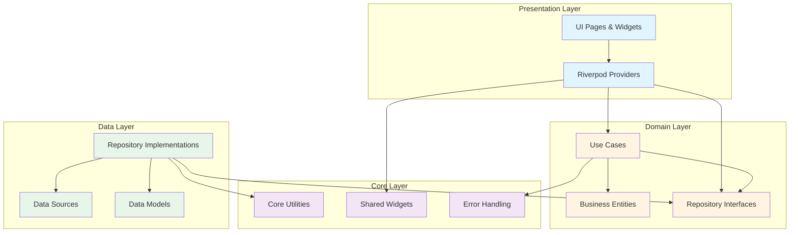
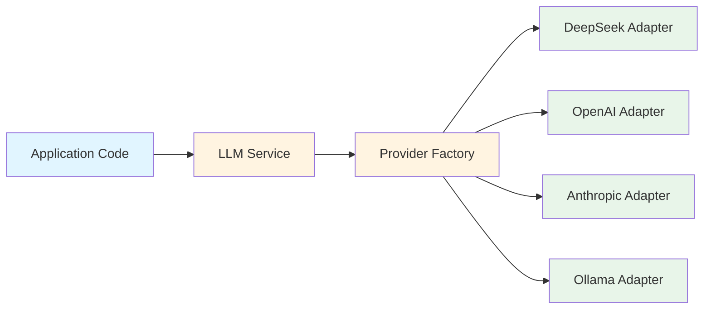

# Flutter Application Architecture Documentation

## Overview

This document defines the architecture for the Flutter Health Management App for Android, following Feature-First Clean Architecture patterns. The architecture is designed to support local-only MVP functionality with a clear path for post-MVP enhancements including cloud sync, authentication, and LLM integration.

**Reference**: This architecture is based on technical decisions documented in `artifacts/requirements.md`.

## Architecture Pattern

### Feature-First Clean Architecture

The application follows a **Feature-First Clean Architecture** approach, which combines the benefits of feature-based organization with Clean Architecture's dependency inversion principles.

#### Core Principles

1. **Features are Self-Contained**: Each feature module contains its own data, domain, and presentation layers
2. **Core Layer is Shared**: Common utilities, widgets, constants, and infrastructure are in `lib/core/`
3. **Dependency Rule**: Outer layers depend on inner layers (presentation → domain → data)
4. **Independence**: Features can be developed, tested, and maintained independently
5. **Testability**: Clear separation of concerns enables comprehensive unit and widget testing

#### Benefits for This Project

- **Scalability**: Easy to add new health management features without affecting existing modules
- **Testability**: Each layer can be tested in isolation (80% minimum unit test coverage target)
- **Maintainability**: Clear boundaries make code easier to understand and modify
- **Team Collaboration**: Multiple developers can work on different features simultaneously
- **MVP Focus**: MVP features can be developed independently while post-MVP features are planned

### Layer Structure

Each feature follows this three-layer structure:

```
lib/features/{feature}/
├── data/
│   ├── models/          # Data transfer objects (DTOs)
│   ├── repositories/    # Repository implementations
│   └── datasources/    # Local (Hive) and remote data sources
├── domain/
│   ├── entities/       # Business entities (pure Dart classes)
│   └── usecases/       # Business logic use cases
└── presentation/
    ├── pages/          # Feature screens/pages
    ├── widgets/        # Feature-specific widgets
    └── providers/      # Riverpod providers for state management
```

#### Data Layer

**Responsibility**: Data access and persistence

- **Models**: Data transfer objects that map to storage formats (Hive adapters, JSON)
- **Repositories**: Implement domain repository interfaces, coordinate data sources
- **Data Sources**: 
  - Local: Hive database for MVP (offline-first)
  - Remote: Future API clients for post-MVP sync

**Dependencies**: Can depend on domain entities, but not on presentation layer

#### Domain Layer

**Responsibility**: Business logic and rules

- **Entities**: Pure Dart classes representing business concepts (no Flutter dependencies)
- **Use Cases**: Encapsulate specific business operations (e.g., `CalculateMovingAverage`, `DetectPlateau`)

**Dependencies**: Pure Dart, no external dependencies (except Dart core libraries)

#### Presentation Layer

**Responsibility**: UI and user interaction

- **Pages**: Full-screen widgets (screens)
- **Widgets**: Reusable UI components specific to the feature
- **Providers**: Riverpod providers that connect UI to business logic

**Dependencies**: Can depend on domain layer (entities, use cases) and data layer (repositories)

### Architecture Diagram



## State Management

### Riverpod Configuration

Riverpod is the default state management solution, providing:
- **Type Safety**: Compile-time safety with code generation
- **Dependency Injection**: Built-in DI without separate framework
- **Testing**: Easy mocking and testing of providers
- **Performance**: Efficient rebuilds with fine-grained reactivity

### Provider Organization

#### Global Providers (`lib/core/providers/`)

Core infrastructure providers shared across all features:

```dart
// lib/core/providers/database_provider.dart
final hiveDatabaseProvider = Provider<HiveInterface>((ref) {
  return HiveDatabase();
});

// lib/core/providers/llm_provider.dart (post-MVP)
final llmProviderProvider = Provider<LLMProvider>((ref) {
  final config = ref.watch(llmConfigProvider);
  return LLMProviderFactory.create(config.provider, config.model);
});
```

#### Feature Providers (`lib/features/{feature}/presentation/providers/`)

Feature-specific providers that manage feature state:

```dart
// lib/features/health_tracking/presentation/providers/weight_tracking_provider.dart
final weightMetricsProvider = FutureProvider<List<HealthMetric>>((ref) async {
  final repository = ref.watch(healthTrackingRepositoryProvider);
  return await repository.getWeightMetrics();
});

final weightTrendProvider = Provider<WeightTrend>((ref) {
  final metrics = ref.watch(weightMetricsProvider).value ?? [];
  return WeightTrendCalculator.calculate(metrics);
});
```

### Provider Lifecycle

- **Auto-dispose**: Providers automatically dispose when no longer watched
- **Keep-alive**: Use `keepAlive: true` for providers that should persist
- **Family Providers**: Use for parameterized providers (e.g., `metricByIdProvider(id)`)

### State Management Best Practices

1. **Keep State Local**: Use local state (StatefulWidget) for UI-only state
2. **Use Providers for Business Logic**: Business logic and data fetching should use providers
3. **Avoid Provider Chains**: Don't create deep provider dependency chains
4. **Use Async Providers**: Use `FutureProvider` or `StreamProvider` for async operations
5. **Error Handling**: Always handle error states in providers

## LLM API Abstraction Layer (Post-MVP)

### Architecture Overview

The LLM integration is designed as a post-MVP feature but the architecture must support it from the start. The abstraction layer enables easy switching between LLM providers without modifying application code.

### Design Pattern: Provider Pattern with Adapters



### Core Components

#### 1. LLM Provider Interface

```dart
// lib/core/llm/llm_provider.dart
abstract class LLMProvider {
  Future<LLMResponse> generateCompletion(LLMRequest request);
  Future<Stream<LLMResponse>> generateStream(LLMRequest request);
  String get providerName;
  bool get supportsStreaming;
}
```

#### 2. Provider Adapters

Each LLM provider has its own adapter implementing the interface:

- `DeepSeekAdapter` - DeepSeek API (default, cost-effective)
- `OpenAIAdapter` - OpenAI GPT-4o-mini (fallback)
- `AnthropicAdapter` - Anthropic Claude 3 Haiku
- `OllamaAdapter` - Ollama (for offline development/testing)

#### 3. Provider Factory

```dart
// lib/core/llm/llm_provider_factory.dart
class LLMProviderFactory {
  static LLMProvider create(String providerName, String model) {
    switch (providerName) {
      case 'deepseek':
        return DeepSeekAdapter(model: model);
      case 'openai':
        return OpenAIAdapter(model: model);
      case 'anthropic':
        return AnthropicAdapter(model: model);
      case 'ollama':
        return OllamaAdapter(model: model);
      default:
        throw UnsupportedProviderException(providerName);
    }
  }
}
```

#### 4. Configuration System

Runtime configuration for provider/model selection:

```dart
// lib/core/llm/llm_config.dart
class LLMConfig {
  final String provider; // 'deepseek', 'openai', 'anthropic', 'ollama'
  final String model;
  final String? apiKey;
  final int maxTokens;
  final double temperature;
  final bool enablePromptCaching;
  final int rateLimitPerMinute;
}
```

#### 5. LLM Service

High-level service that applications use:

```dart
// lib/features/llm_integration/domain/services/llm_service.dart
class LLMService {
  final LLMProvider provider;
  
  Future<String> generateWeeklyReview(WeeklyReviewData data);
  Future<List<MealSuggestion>> suggestMeals(MealSuggestionRequest request);
  Future<WorkoutModification> adaptWorkout(WorkoutAdaptationRequest request);
}
```

### Integration Points

- **Weekly Reviews**: `lib/features/behavioral_support/` uses LLM service for personalized reviews
- **Meal Planning**: `lib/features/nutrition_management/` uses LLM service for meal suggestions
- **Workout Adaptation**: `lib/features/exercise_management/` uses LLM service for workout modifications
- **Feature Requests**: Interactive chat for structured feature request creation

### Benefits

- **Easy Provider Switching**: Change provider via configuration, no code changes
- **Cost Optimization**: Switch to most cost-effective provider (DeepSeek recommended)
- **Fallback Support**: Automatic fallback if primary provider fails
- **Testing**: Mock providers for unit testing
- **Future-Proof**: Easy to add new providers (e.g., new LLM APIs)

## Coding Standards

### Naming Conventions

**Files**: snake_case
- Example: `health_tracking_repository.dart`, `calculate_moving_average.dart`

**Classes**: PascalCase
- Example: `HealthTrackingRepository`, `CalculateMovingAverage`

**Variables and Methods**: camelCase
- Example: `calculateMovingAverage()`, `weightMetrics`

**Constants**: lowerCamelCase with `k` prefix
- Example: `kDefaultMovingAverageDays`, `kMaxWeightValue`

**Private Members**: camelCase with `_` prefix
- Example: `_calculateAverage()`, `_internalState`

**Folders**: snake_case
- Example: `health_tracking/`, `nutrition_management/`

### Code Organization Patterns

#### 1. Feature Module Structure

Each feature follows the same structure for consistency:

```
lib/features/{feature}/
├── data/
│   ├── models/
│   │   └── {feature}_model.dart
│   ├── repositories/
│   │   └── {feature}_repository_impl.dart
│   └── datasources/
│       ├── local/
│       │   └── {feature}_local_datasource.dart
│       └── remote/ (post-MVP)
│           └── {feature}_remote_datasource.dart
├── domain/
│   ├── entities/
│   │   └── {feature}_entity.dart
│   ├── repositories/
│   │   └── {feature}_repository.dart (interface)
│   └── usecases/
│       └── {action}_{feature}_usecase.dart
└── presentation/
    ├── pages/
    │   └── {feature}_page.dart
    ├── widgets/
    │   └── {feature}_widget.dart
    └── providers/
        └── {feature}_provider.dart
```

#### 2. Error Handling

Comprehensive error handling is critical for user experience and data integrity. The application uses `fpdart` Either type for functional error handling across all layers.

**Error Handling Architecture**:

```dart
import 'package:fpdart/fpdart.dart';

typedef Result<T> = Either<Failure, T>;

// Base Failure class
abstract class Failure {
  final String message;
  final int? code;
  
  Failure(this.message, [this.code]);
  
  @override
  String toString() => message;
}

// Specific failure types
class ValidationFailure extends Failure {
  final Map<String, String> fieldErrors;
  
  ValidationFailure(String message, [this.fieldErrors = const {}]) : super(message);
}

class NetworkFailure extends Failure {
  final int? statusCode;
  
  NetworkFailure(String message, [this.statusCode]) : super(message, statusCode);
}

class DatabaseFailure extends Failure {
  DatabaseFailure(String message) : super(message);
}

class PermissionFailure extends Failure {
  PermissionFailure(String message) : super(message);
}

class NotFoundFailure extends Failure {
  NotFoundFailure(String resource) : super('$resource not found');
}

class CacheFailure extends Failure {
  CacheFailure(String message) : super(message);
}
```

**Error Handling Patterns by Layer**:

**1. Domain Layer (Use Cases)**:

Use cases should return `Result<T>` for all operations that can fail:

```dart
class CalculateMovingAverage {
  Result<double> call(List<HealthMetric> metrics) {
    // Validation errors
    if (metrics.isEmpty) {
      return Left(ValidationFailure('Metrics list cannot be empty'));
    }
    
    if (metrics.length < 7) {
      return Left(ValidationFailure(
        'Insufficient data: 7 days required, got ${metrics.length}',
      ));
    }
    
    // Filter valid weights
    final validWeights = metrics
        .where((m) => m.weight != null)
        .map((m) => m.weight!)
        .toList();
    
    if (validWeights.length < 7) {
      return Left(ValidationFailure(
        'Insufficient weight data: ${validWeights.length} entries with weight',
      ));
    }
    
    // Business logic - should not throw exceptions
    try {
      final sum = validWeights.reduce((a, b) => a + b);
      final average = sum / validWeights.length;
      return Right(average);
    } catch (e) {
      return Left(Failure('Calculation error: ${e.toString()}'));
    }
  }
}
```

**2. Data Layer (Repositories)**:

Repositories handle data access errors and convert them to domain failures:

```dart
class HealthTrackingRepositoryImpl implements HealthTrackingRepository {
  final HealthTrackingLocalDataSource localDataSource;
  
  @override
  Future<Result<HealthMetric>> saveHealthMetric(HealthMetric metric) async {
    try {
      // Validation
      final validationResult = HealthMetricValidator.validate(metric);
      if (!validationResult.isValid) {
        return Left(ValidationFailure(
          'Validation failed',
          validationResult.errors,
        ));
      }
      
      // Data access
      final savedMetric = await localDataSource.saveHealthMetric(metric);
      return Right(savedMetric);
    } on HiveError catch (e) {
      return Left(DatabaseFailure('Failed to save health metric: ${e.message}'));
    } catch (e) {
      return Left(Failure('Unexpected error: ${e.toString()}'));
    }
  }
  
  @override
  Future<Result<List<HealthMetric>>> getHealthMetrics({
    DateTime? startDate,
    DateTime? endDate,
  }) async {
    try {
      final metrics = await localDataSource.getHealthMetrics(
        startDate: startDate,
        endDate: endDate,
      );
      return Right(metrics);
    } on HiveError catch (e) {
      return Left(DatabaseFailure('Failed to fetch health metrics: ${e.message}'));
    } catch (e) {
      return Left(Failure('Unexpected error: ${e.toString()}'));
    }
  }
}
```

**3. Presentation Layer (Providers)**:

Providers handle errors and provide user-friendly error messages:

```dart
final weightMetricsProvider = FutureProvider<List<HealthMetric>>((ref) async {
  final repository = ref.watch(healthTrackingRepositoryProvider);
  
  final result = await repository.getHealthMetrics();
  
  return result.fold(
    (failure) {
      // Log error for debugging
      debugPrint('Error fetching weight metrics: ${failure.message}');
      
      // Throw exception to trigger error state in UI
      throw failure;
    },
    (metrics) => metrics,
  );
});

// Error handling in UI
class WeightTrackingWidget extends ConsumerWidget {
  @override
  Widget build(BuildContext context, WidgetRef ref) {
    final metricsAsync = ref.watch(weightMetricsProvider);
    
    return metricsAsync.when(
      data: (metrics) => WeightChart(metrics: metrics),
      loading: () => CircularProgressIndicator(),
      error: (error, stack) {
        // Handle specific error types
        if (error is ValidationFailure) {
          return ErrorWidget(message: error.message);
        } else if (error is DatabaseFailure) {
          return ErrorWidget(
            message: 'Unable to load data. Please try again.',
            retry: () => ref.invalidate(weightMetricsProvider),
          );
        } else {
          return ErrorWidget(
            message: 'An unexpected error occurred.',
            retry: () => ref.invalidate(weightMetricsProvider),
          );
        }
      },
    );
  }
}
```

**4. Error Propagation Patterns**:

**Chained Operations**:
```dart
Future<Result<double>> calculateAndSaveAverage(List<HealthMetric> metrics) async {
  // Chain operations with flatMap
  return calculateMovingAverage(metrics).then(
    (result) => result.fold(
      (failure) => Left(failure),
      (average) async {
        // Continue with next operation
        final saveResult = await saveAverage(average);
        return saveResult;
      },
    ),
  );
}

// Using flatMap for cleaner chaining
Future<Result<double>> calculateAndSaveAverageFlatMap(
  List<HealthMetric> metrics,
) async {
  return await calculateMovingAverage(metrics).flatMap(
    (average) => saveAverage(average),
  );
}
```

**Error Recovery**:
```dart
Future<Result<List<HealthMetric>>> getHealthMetricsWithFallback() async {
  // Try primary source
  final primaryResult = await localDataSource.getHealthMetrics();
  
  return primaryResult.fold(
    (failure) {
      // Try fallback
      return cacheDataSource.getHealthMetrics().fold(
        (cacheFailure) => Left(failure), // Return original error
        (cachedMetrics) => Right(cachedMetrics), // Return cached data
      );
    },
    (metrics) => Right(metrics),
  );
}
```

**5. Validation Error Handling**:

For form validation, collect all field errors:

```dart
class ValidationResult {
  final bool isValid;
  final Map<String, String> fieldErrors;
  
  ValidationResult._(this.isValid, this.fieldErrors);
  
  factory ValidationResult.success() {
    return ValidationResult._(true, {});
  }
  
  factory ValidationResult.failure(Map<String, String> fieldErrors) {
    return ValidationResult._(false, fieldErrors);
  }
}

// Usage in use case
class SaveWeightUseCase {
  Result<HealthMetric> call({
    required double weight,
    required DateTime date,
  }) {
    final errors = <String, String>{};
    
    // Validate weight
    if (weight < 20 || weight > 500) {
      errors['weight'] = 'Weight must be between 20 and 500 kg';
    }
    
    // Validate date
    if (date.isAfter(DateTime.now())) {
      errors['date'] = 'Date cannot be in the future';
    }
    
    // Return validation failure if errors exist
    if (errors.isNotEmpty) {
      return Left(ValidationFailure(
        'Validation failed',
        errors,
      ));
    }
    
    // Continue with business logic
    // ...
  }
}

// Display validation errors in UI
class WeightEntryForm extends StatelessWidget {
  final Map<String, String>? errors;
  
  @override
  Widget build(BuildContext context) {
    return Column(
      children: [
        TextField(
          // ... weight input
        ),
        if (errors?['weight'] != null)
          Text(
            errors!['weight']!,
            style: TextStyle(color: Colors.red),
          ),
        // ... more fields
      ],
    );
  }
}
```

**6. Async Error Handling**:

For async operations with Either:

```dart
Future<Result<T>> asyncOperation() async {
  try {
    // Async operation
    final result = await someAsyncCall();
    return Right(result);
  } catch (e) {
    return Left(Failure('Operation failed: ${e.toString()}'));
  }
}

// Using Future.then with Either
Future<Result<String>> fetchAndProcess() async {
  return await fetchData().then(
    (result) => result.fold(
      (failure) => Left(failure),
      (data) => processData(data),
    ),
  );
}
```

**7. Error Logging**:

Always log errors for debugging while providing user-friendly messages:

```dart
class ErrorLogger {
  static void logError(Failure failure, {StackTrace? stackTrace}) {
    // Log to crash reporting service (Firebase Crashlytics, Sentry, etc.)
    debugPrint('Error: ${failure.message}');
    if (stackTrace != null) {
      debugPrint('Stack trace: $stackTrace');
    }
    
    // Log specific error types
    if (failure is ValidationFailure) {
      debugPrint('Validation errors: ${failure.fieldErrors}');
    } else if (failure is NetworkFailure) {
      debugPrint('Network error status: ${failure.statusCode}');
    }
  }
}

// Usage
result.fold(
  (failure) {
    ErrorLogger.logError(failure);
    // Show user-friendly message
    showErrorSnackBar(_getUserFriendlyMessage(failure));
  },
  (data) => handleSuccess(data),
);
```

**Error Handling Best Practices**:

1. **Always Return Result Types**: Use `Result<T>` for operations that can fail
2. **Specific Failure Types**: Create specific failure classes for different error categories
3. **User-Friendly Messages**: Provide clear, actionable error messages to users
4. **Log Errors**: Log detailed errors for debugging while keeping user messages simple
5. **Don't Swallow Errors**: Always handle or propagate errors, never ignore them
6. **Validate Early**: Validate inputs at the use case level before data layer
7. **Recovery Strategies**: Implement fallback mechanisms where appropriate
8. **Error Boundaries**: Use error widgets and try-catch in presentation layer

#### 3. Documentation Requirements

**Dartdoc for Public APIs**:
```dart
/// Calculates the 7-day moving average of weight metrics.
///
/// Returns the average weight over the last 7 days (inclusive of today).
/// Returns `null` if less than 7 days of data are available.
///
/// Example:
/// ```dart
/// final metrics = [/* ... */];
/// final average = calculator.calculate7DayAverage(metrics);
/// ```
double? calculate7DayAverage(List<HealthMetric> metrics) {
  // Implementation
}
```

**Inline Comments for Complex Logic**:
```dart
// Calculate moving average using sliding window algorithm
// Time complexity: O(n) where n is the number of metrics
// Space complexity: O(1) - only stores running sum and count
double? calculate7DayAverage(List<HealthMetric> metrics) {
  // Implementation with comments explaining complex parts
}
```

### Code Quality Standards

- **Linter**: Use `flutter_lints` (latest) with strict rules
- **Test Coverage**: 80% minimum for business logic (domain layer), 60% minimum for UI (presentation layer)
- **Type Safety**: Avoid `dynamic` types, use explicit types
- **Null Safety**: Always handle null cases explicitly
- **Immutability**: Prefer immutable data structures (use `freezed` for complex models)

## Git Commit Message Standards

### CRISPE Framework

All commit messages follow the CRISPE Framework as defined in `artifacts/requirements.md`.

### Commit Message Format

```
<type>(<scope>): <subject>

<business-focused paragraph explaining why and user impact>

<technical paragraph with bullet points>
- Technical implementation detail 1
- Technical implementation detail 2
- Dependencies or system interactions
- Performance considerations

<footer with task reference>
```

### Commit Types

- `feat`: New feature
- `fix`: Bug fix
- `docs`: Documentation changes
- `style`: Code style changes (formatting, no logic change)
- `refactor`: Code refactoring (no feature change or bug fix)
- `test`: Adding or updating tests
- `chore`: Maintenance tasks (dependencies, build config)
- `perf`: Performance improvements
- `ci`: CI/CD changes
- `build`: Build system changes
- `revert`: Revert a previous commit

### Commit Scope

Scope should match the feature or module:
- `health-tracking`: Health tracking feature
- `nutrition`: Nutrition management feature
- `exercise`: Exercise management feature
- `core`: Core utilities or shared code
- `llm`: LLM integration (post-MVP)

### Example Commit Message

```
feat(health-tracking): Add 7-day moving average calculation

This enhancement improves user experience by providing more accurate 
weight trend visualization, reducing anxiety from daily weight fluctuations. 
Users can now see meaningful progress trends that account for natural 
body weight variations, leading to better adherence and motivation.

- Implemented MovingAverageCalculator service with 7-day window
- Added WeightTrendRepository method to fetch historical data
- Created WeightTrendChart widget using fl_chart library
- Added unit tests for moving average calculation edge cases
- Performance: O(n) time complexity with efficient sliding window algorithm
- Data: Requires minimum 7 days of weight entries for calculation

Refs FR-042
```

### Commit Message Rules

1. **Subject Line**: Maximum 50 characters, imperative mood, capitalized, no period
2. **Task Number**: Goes in footer, not subject line
3. **Business First**: First paragraph explains business value and user impact
4. **Technical Second**: Second paragraph lists technical implementation details
5. **No Past Tense**: Use "Add" not "Added", "Fix" not "Fixed"
6. **No Implementation Details in Subject**: Subject describes what, not how

## Git Workflow Process

### Branching Strategy

**Feature Branch Workflow**: All development happens on feature branches, merged to `main` via pull requests.

#### Branch Types

- **Feature**: `feature/FR-XXX-short-description` (e.g., `feature/FR-042-7-day-moving-average`)
- **Bug Fix**: `bugfix/BF-XXX-short-description` (e.g., `bugfix/BF-015-weight-chart-crash`)
- **Hotfix**: `hotfix/critical-issue-description` (e.g., `hotfix/data-loss-prevention`)
- **Chore**: `chore/description` (e.g., `chore/update-dependencies`)

#### Branch Creation Process

```bash
# 1. Ensure main branch is up to date
git checkout main
git pull origin main

# 2. Create and switch to new feature branch
git checkout -b feature/FR-XXX-description

# 3. Verify branch creation
git branch
```

### Pull Request Process

#### PR Status Lifecycle

1. 🟡 **Draft**: Initial creation, work in progress
2. 🟢 **Ready for Review**: All checks pass, ready for review
3. 🔵 **In Review**: Under active code review
4. ✅ **Approved**: Approved by required reviewers
5. 🟣 **Merged**: Successfully merged to `main`

#### PR Requirements

- **Minimum 1 Approval**: Required before merge
- **All CI/CD Checks**: Must pass before merge
- **No Merge Conflicts**: Must resolve conflicts before merge
- **Complete Description**: Must include business value, technical details, testing notes

#### PR Template

See `artifacts/requirements.md` section "Git Workflow Process" for complete PR template including:
- Business value description
- Technical changes checklist
- Testing checklist
- Code review checklist
- Screenshots/demo (for UI changes)

### Code Review Process

#### Code Review Checklist

Reviewers should verify:

**Functionality**
- Code works as intended
- Edge cases handled
- Error handling implemented
- No obvious bugs

**Code Quality**
- Follows project coding standards
- Code is readable and maintainable
- No code duplication
- Proper naming conventions
- Comments added where necessary

**Architecture**
- Follows project architecture patterns
- No unnecessary dependencies
- Proper separation of concerns
- Design patterns used appropriately

**Testing**
- Unit tests cover new functionality
- Tests are meaningful and not trivial
- Edge cases tested
- Integration tests updated (if needed)

**Security & Privacy**
- No sensitive data exposed
- Input validation implemented
- Security best practices followed
- Privacy considerations addressed (for health data)

**Performance**
- No obvious performance issues
- Efficient algorithms/data structures
- Memory leaks checked
- Database queries optimized (if applicable)

**Documentation**
- Code is self-documenting
- Complex logic explained
- README updated (if needed)
- API documentation updated (if applicable)

**UI/UX** (if applicable)
- Design system followed
- Accessibility requirements met
- Responsive design considered
- User experience validated

### Merge Process

#### Pre-Merge Checklist

- [ ] All required approvals obtained
- [ ] All CI/CD checks passing
- [ ] No merge conflicts
- [ ] Branch is up to date with `main`
- [ ] PR description complete
- [ ] Related feature request/bug fix updated

#### Merge Strategy

**Squash and Merge** (Preferred): Combines all commits into one, cleaner history

**Merge Commit**: Preserves branch history, creates merge commit

**Rebase and Merge**: Linear history, rewrites commits (use with caution)

#### Post-Merge Actions

1. Update feature request/bug fix status to ✅ Completed
2. Update sprint document if item was in sprint
3. Update Product Backlog
4. Delete merged branch (if not auto-deleted)
5. Tag release if applicable

### Branch Protection Rules

The `main` branch is protected with the following rules:

- Require pull request before merging
- Require approvals (minimum 1)
- Require status checks to pass
- Require branches to be up to date
- Restrict force pushes
- Restrict deletions

## Design Decisions and Rationale

### Why Feature-First Clean Architecture?

- **Scalability**: Easy to add new health management features without affecting existing modules
- **Testability**: Clear separation enables 80% minimum unit test coverage target
- **Team Collaboration**: Multiple developers can work on different features simultaneously
- **Maintainability**: Clear boundaries make code easier to understand and modify

### Why Riverpod over Provider?

- **Type Safety**: Better compile-time safety with code generation
- **Testing**: Easier mocking and testing of providers
- **Dependency Injection**: Built-in DI without separate framework
- **Performance**: More efficient rebuilds with fine-grained reactivity

### Why Hive for Local Storage?

- **Flutter Integration**: Better Flutter integration than SQLite
- **Performance**: Better performance for key-value storage patterns
- **Simplicity**: Simpler API than SQLite for MVP needs
- **Type Safety**: Strong typing with code generation

### Why LLM Abstraction Layer?

- **Cost Optimization**: Easy switching to most cost-effective provider (DeepSeek)
- **Flexibility**: Support multiple providers simultaneously (primary + fallback)
- **Future-Proof**: Easy to add new LLM providers as they emerge
- **Testing**: Mock providers for unit testing without API costs

## MVP vs Post-MVP Architecture

### MVP Scope

- **Local-Only**: No cloud sync, no authentication
- **Hive Database**: Local storage only
- **No LLM Integration**: LLM features deferred to post-MVP
- **Core Features**: Health tracking, nutrition, exercise (subset of full feature set)

### Post-MVP Enhancements

- **Cloud Sync**: DreamHost PHP/MySQL backend with Slim Framework
- **Authentication**: JWT-based authentication
- **LLM Integration**: Full LLM API abstraction layer implementation
- **Additional Features**: Medication management, behavioral support, advanced analytics

### Architecture Support

The architecture is designed to support post-MVP enhancements:

- **Data Layer**: Ready for remote data sources (interfaces defined, implementations deferred)
- **LLM Layer**: Abstraction layer designed, adapters can be added post-MVP
- **Sync Architecture**: Designed but not implemented (see `phase-3-integration/sync-architecture-design.md`)

## Performance Optimization Guidelines

Performance is critical for user experience, especially with health data tracking and visualization. This section provides comprehensive performance optimization strategies.

### Database Query Optimization

**Efficient Hive Queries**:
```dart
// ❌ Bad: Loads all records into memory
final allMetrics = healthMetricsBox.values.toList();
final filtered = allMetrics.where((m) => m.date.isAfter(startDate)).toList();

// ✅ Good: Query with filters before loading
final filtered = healthMetricsBox.values
    .where((m) => m.date.isAfter(startDate))
    .where((m) => m.userId == currentUserId)
    .toList();

// ✅ Better: Use indexes for date range queries
// Index healthMetricsBox by date for efficient queries
final filtered = healthMetricsBox.values
    .where((m) => 
        m.date.isAfter(startDate) && 
        m.date.isBefore(endDate) &&
        m.userId == currentUserId)
    .toList();
```

**Pagination for Large Datasets**:
```dart
class HealthMetricsRepository {
  Future<List<HealthMetric>> getHealthMetricsPaginated({
    required int page,
    required int pageSize,
    DateTime? startDate,
    DateTime? endDate,
  }) async {
    // Use skip and take for pagination
    final allMetrics = await getAllMetrics(startDate: startDate, endDate: endDate);
    
    return allMetrics
        .skip(page * pageSize)
        .take(pageSize)
        .toList();
  }
}
```

**Batch Operations**:
```dart
// ❌ Bad: Multiple individual writes
for (final metric in metrics) {
  await healthMetricsBox.put(metric.id, metric);
}

// ✅ Good: Batch write operation
await healthMetricsBox.putAll(
  Map.fromEntries(metrics.map((m) => MapEntry(m.id, m)))
);
```

### UI Performance Optimization

**Lazy Loading and List Optimization**:
```dart
// Use ListView.builder for large lists
ListView.builder(
  itemCount: metrics.length,
  itemBuilder: (context, index) {
    return HealthMetricCard(metric: metrics[index]);
  },
);

// Use AutomaticKeepAliveClientMixin for expensive widgets
class ExpensiveChartWidget extends StatefulWidget {
  @override
  _ExpensiveChartWidgetState createState() => _ExpensiveChartWidgetState();
}

class _ExpensiveChartWidgetState extends State<ExpensiveChartWidget>
    with AutomaticKeepAliveClientMixin {
  @override
  bool get wantKeepAlive => true; // Keep widget alive when scrolled out of view
  
  @override
  Widget build(BuildContext context) {
    super.build(context);
    return // ... expensive chart widget
  }
}
```

**Image Optimization**:
```dart
// Compress images before storing
Future<File> compressImage(File imageFile) async {
  final compressedImage = await FlutterImageCompress.compressWithFile(
    imageFile.absolute.path,
    minWidth: 1920,
    minHeight: 1080,
    quality: 85, // Balance between quality and size
  );
  
  // Save compressed image
  final compressedFile = File('${imageFile.path}_compressed.jpg');
  await compressedFile.writeAsBytes(compressedImage!);
  return compressedFile;
}

// Use cached network images (post-MVP)
CachedNetworkImage(
  imageUrl: imageUrl,
  placeholder: (context, url) => CircularProgressIndicator(),
  errorWidget: (context, url, error) => Icon(Icons.error),
);
```

**Chart Rendering Optimization**:
```dart
// Limit data points for chart rendering
List<ChartDataPoint> optimizeChartData(List<HealthMetric> metrics) {
  const maxPoints = 100; // Limit to 100 data points
  
  if (metrics.length <= maxPoints) {
    return metrics.map((m) => ChartDataPoint(m.date, m.weight)).toList();
  }
  
  // Sample data for large datasets
  final step = (metrics.length / maxPoints).ceil();
  return List.generate(
    maxPoints,
    (index) {
      final metric = metrics[index * step];
      return ChartDataPoint(metric.date, metric.weight);
    },
  );
}
```

### Memory Management

**Proper Resource Disposal**:
```dart
class HealthMetricsProvider extends StateNotifier<List<HealthMetric>> {
  StreamSubscription? _subscription;
  
  @override
  void dispose() {
    _subscription?.cancel(); // Cancel subscriptions
    super.dispose();
  }
}

// Use dispose() for controllers
class WeightEntryPage extends StatefulWidget {
  @override
  _WeightEntryPageState createState() => _WeightEntryPageState();
}

class _WeightEntryPageState extends State<WeightEntryPage> {
  final TextEditingController _weightController = TextEditingController();
  
  @override
  void dispose() {
    _weightController.dispose(); // Dispose controllers
    super.dispose();
  }
}
```

**Image Memory Management**:
```dart
// Dispose image resources properly
class ProgressPhotoWidget extends StatelessWidget {
  final String imagePath;
  
  @override
  Widget build(BuildContext context) {
    return Image.file(
      File(imagePath),
      cacheWidth: 400, // Limit image resolution for memory efficiency
      cacheHeight: 400,
    );
  }
}
```

### Computation Optimization

**Caching Calculations**:
```dart
class MovingAverageCache {
  static final Map<String, CachedAverage> _cache = {};
  
  static double? getCachedAverage(String key) {
    final cached = _cache[key];
    if (cached == null) return null;
    
    // Check if cache is still valid (refresh every hour)
    if (DateTime.now().difference(cached.timestamp).inHours > 1) {
      _cache.remove(key);
      return null;
    }
    
    return cached.value;
  }
  
  static void setCachedAverage(String key, double value) {
    _cache[key] = CachedAverage(value: value, timestamp: DateTime.now());
  }
}

class CachedAverage {
  final double value;
  final DateTime timestamp;
  
  CachedAverage({required this.value, required this.timestamp});
}

// Usage
double? calculate7DayAverage(List<HealthMetric> metrics) {
  final cacheKey = _generateCacheKey(metrics);
  final cached = MovingAverageCache.getCachedAverage(cacheKey);
  
  if (cached != null) {
    return cached; // Return cached value
  }
  
  // Calculate if not cached
  final average = _calculateAverage(metrics);
  MovingAverageCache.setCachedAverage(cacheKey, average);
  
  return average;
}
```

**Debouncing and Throttling**:
```dart
// Debounce search input
class SearchDebouncer {
  Timer? _timer;
  
  void debounce(VoidCallback callback, {Duration delay = const Duration(milliseconds: 300)}) {
    _timer?.cancel();
    _timer = Timer(delay, callback);
  }
  
  void dispose() {
    _timer?.cancel();
  }
}

// Usage in search
final _debouncer = SearchDebouncer();

void onSearchChanged(String query) {
  _debouncer.debounce(() {
    // Perform search after user stops typing
    performSearch(query);
  });
}
```

### Network Optimization (Post-MVP)

**Request Batching**:
```dart
// Batch multiple API requests
class SyncBatch {
  final List<HealthMetric> metrics = [];
  final List<Meal> meals = [];
  
  Future<void> sync() async {
    // Batch all data in single request
    await apiClient.syncBatch({
      'health_metrics': metrics,
      'meals': meals,
    });
  }
}
```

**Offline Queue Management**:
```dart
class OfflineQueue {
  final Queue<SyncTask> _queue = Queue();
  
  void enqueue(SyncTask task) {
    _queue.add(task);
    _tryProcessQueue();
  }
  
  Future<void> _tryProcessQueue() async {
    if (!await _isOnline()) return;
    
    while (_queue.isNotEmpty) {
      final task = _queue.removeFirst();
      try {
        await task.execute();
      } catch (e) {
        _queue.addFirst(task); // Retry on error
        break;
      }
    }
  }
}
```

### Performance Monitoring

**Performance Metrics**:
```dart
class PerformanceMonitor {
  static void trackScreenLoad(String screenName, Duration loadTime) {
    if (loadTime.inMilliseconds > 1000) {
      debugPrint('⚠️ Slow screen load: $screenName took ${loadTime.inMilliseconds}ms');
    }
  }
  
  static void trackDatabaseQuery(String queryName, Duration queryTime) {
    if (queryTime.inMilliseconds > 500) {
      debugPrint('⚠️ Slow database query: $queryName took ${queryTime.inMilliseconds}ms');
    }
  }
}

// Usage
void loadHealthMetrics() {
  final stopwatch = Stopwatch()..start();
  
  final metrics = await repository.getHealthMetrics();
  
  stopwatch.stop();
  PerformanceMonitor.trackDatabaseQuery('getHealthMetrics', stopwatch.elapsed);
  
  return metrics;
}
```

**Performance Best Practices Summary**:

1. **Database**: Use indexes, pagination, batch operations
2. **UI**: Lazy loading, keep-alive widgets, image optimization
3. **Memory**: Dispose resources, limit image resolution, clear caches
4. **Computation**: Cache calculations, debounce/throttle inputs
5. **Network**: Batch requests, offline queue (post-MVP)
6. **Monitoring**: Track performance metrics, identify bottlenecks

## References

- **Requirements**: `artifacts/requirements.md` - Technical decisions and MVP scope
- **Orchestration Definition**: `artifacts/orchestration-definition.md` - Overall orchestration structure
- **Project Structure**: `artifacts/phase-1-foundations/project-structure-specification.md` - Detailed folder organization
- **Git Standards**: `artifacts/requirements.md` sections "Git Commit Message Standards" and "Git Workflow Process"

---

**Last Updated**: [Date]  
**Version**: 1.0  
**Status**: MVP Architecture Complete

