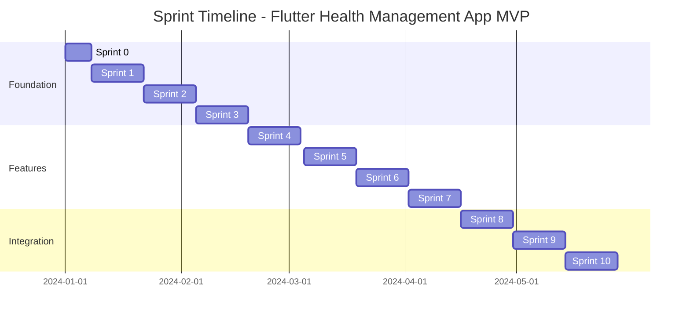
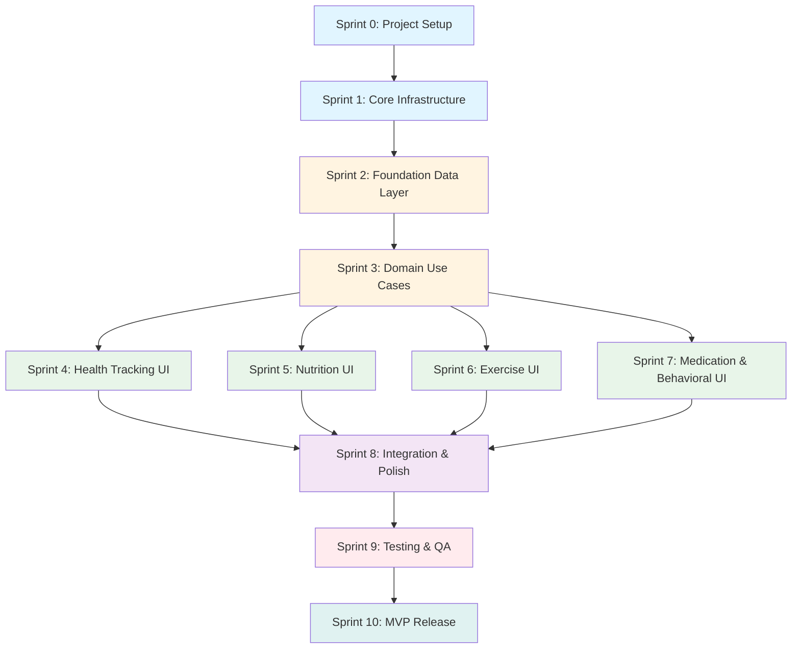

# Sprint Overview: Flutter Health Management App

## Overview

This document provides a high-level overview of all sprints for the Flutter Health Management App for Android MVP implementation. Sprints are organized based on the implementation order defined in `artifacts/implementation-order.md`.

**Total Sprints**: 11 (Sprint 0-10)  
**Completed Sprints**: 9 (Sprints 0-8)  
**Remaining Sprints**: 2 (Sprints 9-10)  
**Total Duration**: ~22 weeks (including Sprint 0)  
**Completed Duration**: ~15 weeks  
**Remaining Duration**: ~4 weeks  
**Team Velocity**: Target 21 points per sprint (adjustable based on team size)  
**Progress**: 83% complete (193/232 story points)

## Sprint Summary Table

| Sprint | Name | Goal | Story Points | Duration | Status | Phase |
|--------|------|------|--------------|----------|--------|-------|
| 0 | Project Setup | Initialize Flutter project and development environment | 5 | 1 week | ✅ | Phase 0 |
| 1 | Core Infrastructure | Establish core utilities, error handling, Hive foundation, data export | 26 | 2 weeks | ✅ | Phase 1 |
| 2 | Foundation Data Layer | Implement all domain entities, data models, and repositories | 34 | 2 weeks | ✅ | Phase 2 |
| 3 | Domain Use Cases | Implement all business logic use cases and clinical safety checks | 29 | 2 weeks | ✅ | Phase 3 |
| 4 | Health Tracking UI | Implement health tracking user interface | 21 | 2 weeks | ✅ | Phase 4 |
| 5 | Nutrition UI | Implement nutrition tracking user interface | 21 | 2 weeks | ✅ | Phase 5 |
| 6 | Exercise UI | Implement exercise tracking user interface | 18 | 2 weeks | ✅ | Phase 6 |
| 7 | Medication & Behavioral UI | Implement medication and behavioral support interfaces | 18 | 2 weeks | ✅ | Phase 7 |
| 8 | Integration & Polish | Navigation, safety alerts, notifications, UI polish | 21 | 1 week | ✅ | Phase 8 |
| 9 | Testing & QA | Complete unit tests, widget tests, integration tests | 26 | 2 weeks | ⭕ | Phase 9 |
| 10 | MVP Release | Final bug fixes, documentation, release preparation | 13 | 2 weeks | ⭕ | Phase 10 |

**Total Story Points**: 232 points  
**Completed Story Points**: 193 points (83%)  
**Remaining Story Points**: 39 points (17%)  
**Total Duration**: 22 weeks (~5.5 months)  
**Completed Duration**: ~15 weeks

## Sprint Timeline

## Sprint Dependencies

## Critical Path Across Sprints

```mermaid
flowchart LR
    A[Sprint 0: Setup] --> B[Sprint 1: Core]
    B --> C[Sprint 2: Data]
    C --> D[Sprint 3: Use Cases]
    D --> E[Sprint 4-7: UI Features]
    E --> F[Sprint 8: Integration]
    F --> G[Sprint 9: Testing]
    G --> H[Sprint 10: Release]
    
    style A fill:#ffcdd2
    style B fill:#ffcdd2
    style C fill:#ffcdd2
    style D fill:#ffcdd2
    style E fill:#c8e6c9
    style F fill:#ffcdd2
    style G fill:#ffcdd2
    style H fill:#ffcdd2
```

**Critical Path Sprints**: Sprints 0, 1, 2, 3, 8, 9, 10 (must be completed in sequence)  
**Parallel Development Sprints**: Sprints 4, 5, 6, 7 (can be developed in parallel after Sprint 3)

## Sprint Details

### Sprint 0: Project Setup

**Duration**: 1 week  
**Story Points**: 5  
**Phase**: Phase 0  
**Status**: ✅ Completed

**Goal**: Initialize Flutter project and set up development environment

**Key Deliverables**:
- Flutter project initialized
- Project structure created
- Dependencies installed
- Development environment ready

**Dependencies**: None

**Sprint Document**: `sprint/sprint-00-project-setup.md`

---

### Sprint 1: Core Infrastructure

**Duration**: 2 weeks  
**Story Points**: 26  
**Phase**: Phase 1  
**Status**: ✅ Completed

**Goal**: Establish core utilities, error handling framework, Hive database foundation, and data export functionality

**Key Deliverables**:
- Core constants and utilities
- Error handling framework (fpdart Either)
- Shared widgets
- Hive database initialization
- Data export functionality

**Dependencies**: Sprint 0

**Sprint Document**: `sprint/sprint-01-core-infrastructure.md`

---

### Sprint 2: Foundation Data Layer

**Duration**: 2 weeks  
**Story Points**: 34  
**Phase**: Phase 2  
**Status**: ✅ Completed

**Goal**: Implement all domain entities, Hive data models, and repository implementations

**Key Deliverables**:
- All domain entities (UserProfile, HealthMetric, Medication, Meal, Exercise, Habit, Goal)
- All Hive data models and adapters
- All repository interfaces and implementations
- All Hive boxes initialized

**Dependencies**: Sprint 1

**Sprint Document**: `sprint/sprint-02-foundation-data-layer.md`

---

### Sprint 3: Domain Use Cases

**Duration**: 2 weeks  
**Story Points**: 29  
**Phase**: Phase 3  
**Status**: ✅ Completed

**Goal**: Implement all business logic use cases, calculation utilities, and clinical safety alert checks

**Key Deliverables**:
- All use cases for health tracking, nutrition, exercise, medication, behavioral support
- Calculation utilities (moving averages, plateaus, macros)
- Clinical safety alert system
- Validation logic

**Dependencies**: Sprint 2

**Parallel Development**: Use cases for different features can be developed in parallel

**Sprint Document**: `sprint/sprint-03-domain-use-cases.md`

---

### Sprint 4: Health Tracking UI

**Duration**: 2 weeks  
**Story Points**: 21  
**Phase**: Phase 4  
**Status**: ✅ Completed

**Goal**: Implement complete health tracking user interface

**Key Deliverables**:
- Health tracking providers (Riverpod)
- Health tracking pages (weight entry, measurements, sleep/energy)
- Health tracking widgets (charts, cards, forms)
- Weight trend visualization
- Body measurements tracking
- Sleep and energy tracking

**Dependencies**: Sprint 3

**Parallel Development**: Can be developed in parallel with Sprints 5, 6, 7

**Sprint Document**: `sprint/sprint-04-health-tracking-ui.md`

---

### Sprint 5: Nutrition UI

**Duration**: 2 weeks  
**Story Points**: 21  
**Phase**: Phase 5  
**Status**: ✅ Completed

**Goal**: Implement complete nutrition tracking user interface

**Key Deliverables**:
- Nutrition providers (Riverpod)
- Nutrition pages (meal logging, recipe library, macro tracking)
- Nutrition widgets (macro charts, meal cards, recipe cards)
- Meal logging interface
- Recipe library
- Macro tracking visualization

**Dependencies**: Sprint 3

**Parallel Development**: Can be developed in parallel with Sprints 4, 6, 7

**Sprint Document**: `sprint/sprint-05-nutrition-ui.md`

---

### Sprint 6: Exercise UI

**Duration**: 2 weeks  
**Story Points**: 18  
**Phase**: Phase 6  
**Status**: ✅ Completed

**Goal**: Implement complete exercise tracking user interface

**Key Deliverables**:
- Exercise providers (Riverpod)
- Exercise pages (workout plans, workout logging)
- Exercise widgets (workout cards, exercise lists)
- Workout plan interface
- Workout logging
- Activity tracking display

**Dependencies**: Sprint 3

**Parallel Development**: Can be developed in parallel with Sprints 4, 5, 7

**Sprint Document**: `sprint/sprint-06-exercise-ui.md`

---

### Sprint 7: Medication & Behavioral UI

**Duration**: 2 weeks  
**Story Points**: 18  
**Phase**: Phase 7  
**Status**: ✅ Completed

**Goal**: Implement medication management and behavioral support user interfaces

**Key Deliverables**:
- Medication providers and pages
- Behavioral support providers and pages
- Medication widgets
- Habit tracking interface
- Goal tracking interface

**Dependencies**: Sprint 3

**Parallel Development**: Can be developed in parallel with Sprints 4, 5, 6

**Sprint Document**: `sprint/sprint-07-medication-behavioral-ui.md`

---

### Sprint 8: Integration & Polish

**Duration**: 1 week (accelerated)  
**Story Points**: 21  
**Phase**: Phase 8  
**Status**: ✅ Completed

**Goal**: Integrate all features, implement navigation, safety alerts, notifications, and polish UI/UX

**Key Deliverables**:
- Navigation and routing system
- Clinical safety alerts UI
- Notification system (medication reminders)
- Data export/import UI
- UI/UX polish (design system, accessibility)

**Dependencies**: Sprints 4, 5, 6, 7

**Sprint Document**: `sprint/sprint-08-integration-polish.md`

**Note**: Bug BF-001 (Export/Import cloud storage issue) discovered during testing. Bug report created and added to backlog for resolution in Sprint 9 or Sprint 10.

---

### Sprint 9: Testing & QA

**Duration**: 2 weeks  
**Story Points**: 26  
**Phase**: Phase 9

**Goal**: Complete all testing requirements, achieve coverage targets, and perform quality assurance

**Key Deliverables**:
- Unit tests (80% coverage target)
- Widget tests (60% coverage target)
- Integration tests for critical flows
- Performance optimization
- Bug fixes

**Dependencies**: Sprint 8

---

### Sprint 10: MVP Release

**Duration**: 2 weeks  
**Story Points**: 13  
**Phase**: Phase 10

**Goal**: Finalize MVP, complete documentation, and prepare for release

**Key Deliverables**:
- Final bug fixes
- Documentation completion
- Release preparation
- MVP release

**Dependencies**: Sprint 9

---

## Velocity Tracking

### Team Velocity Assumptions

- **Target Velocity**: 21 points per sprint (2-week sprints)
- **Team Size**: Adjustable (typically 3-5 developers)
- **Story Point Scale**: Fibonacci (1, 2, 3, 5, 8, 13)

### Velocity Adjustment

If team velocity differs from target:
- **Higher Velocity**: Can complete sprints faster or add more features
- **Lower Velocity**: May need to extend sprint duration or reduce scope

### Sprint Capacity Planning

**Sprint Capacity Calculation**:
- Developer capacity: ~5-7 points per developer per sprint
- Team of 3 developers: ~15-21 points per sprint
- Team of 4 developers: ~20-28 points per sprint
- Team of 5 developers: ~25-35 points per sprint

**Adjustment Strategy**:
- If sprint has more points than team capacity: Split into multiple sprints or reduce scope
- If sprint has fewer points than team capacity: Add additional tasks or start next sprint early

## Risk Management

### High-Risk Sprints

1. **Sprint 2 (Foundation Data Layer)**: Large scope, complex data models
   - **Mitigation**: Break down into smaller tasks, parallel development of different entities

2. **Sprint 3 (Domain Use Cases)**: Complex business logic
   - **Mitigation**: Use cases can be developed in parallel, thorough testing

3. **Sprint 9 (Testing & QA)**: Coverage targets may be challenging
   - **Mitigation**: Write tests alongside implementation, continuous testing

### Dependencies Risks

- **Sprint 1 → Sprint 2**: Core infrastructure must be solid
- **Sprint 2 → Sprint 3**: Data layer must be complete
- **Sprint 3 → Sprints 4-7**: Use cases must be ready
- **Sprints 4-7 → Sprint 8**: All feature UIs must be complete

## Parallel Development Opportunities

### Sprint 3: Use Cases
- Health tracking use cases
- Nutrition use cases
- Exercise use cases
- Medication use cases
- Behavioral support use cases

**Can be developed in parallel by different developers**

### Sprints 4-7: Feature UIs
- Sprint 4: Health Tracking UI
- Sprint 5: Nutrition UI
- Sprint 6: Exercise UI
- Sprint 7: Medication & Behavioral UI

**Can be developed in parallel by different developers after Sprint 3**

### Sprint 9: Testing
- Unit tests
- Widget tests
- Integration tests

**Can be written in parallel by different developers**

## Sprint Planning Process

### Pre-Sprint Planning

1. Review implementation order document
2. Review previous sprint retrospective
3. Review backlog items
4. Estimate story points
5. Assign tasks to developers

### Sprint Planning Meeting

1. Review sprint goal
2. Review user stories
3. Break down stories into tasks
4. Estimate task points
5. Assign tasks
6. Identify dependencies and risks

### Daily Standups

- What did I complete yesterday?
- What will I work on today?
- Are there any blockers?

### Sprint Review

- Demo completed features
- Review acceptance criteria
- Gather feedback
- Update product backlog

### Sprint Retrospective

- What went well?
- What could be improved?
- Action items for next sprint

## References

- **Implementation Order**: `artifacts/implementation-order.md`
- **Sprint Planning Template**: `sprint-planning-template.md`
- **Architecture**: `artifacts/phase-1-foundations/architecture-documentation.md`
- **Requirements**: `artifacts/requirements.md`

---

**Last Updated**: 2025-12-30  
**Version**: 1.1  
**Status**: Sprints 0-8 Complete, Sprints 9-10 Pending

