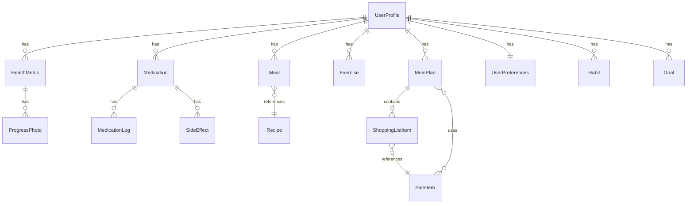

# Data Models and Entity Definitions

## Overview

This document defines all data models and entity definitions for the Flutter Health Management App for Android. Entities follow Clean Architecture patterns, with domain entities in the domain layer and data models (DTOs) in the data layer.

**Reference**: Based on requirements in `artifacts/requirements.md` and database schema in `artifacts/phase-1-foundations/database-schema.md`.

## Architecture Pattern

### Domain Entities vs Data Models

- **Domain Entities** (`lib/features/{feature}/domain/entities/`): Pure Dart classes, no Flutter dependencies, business logic
- **Data Models** (`lib/features/{feature}/data/models/`): Hive adapters, JSON serialization, data transfer objects

### Entity Relationships



## Core Entities

### UserProfile

**Purpose**: User account and profile information

**Domain Entity**:
```dart
// lib/features/user_profile/domain/entities/user_profile.dart
class UserProfile {
  final String id; // UUID
  final String name;
  final String email;
  final DateTime dateOfBirth;
  final Gender gender;
  final double height; // cm
  final double targetWeight; // kg
  final bool syncEnabled; // false for MVP
  final DateTime createdAt;
  final DateTime updatedAt;
  
  UserProfile({
    required this.id,
    required this.name,
    required this.email,
    required this.dateOfBirth,
    required this.gender,
    required this.height,
    required this.targetWeight,
    this.syncEnabled = false,
    required this.createdAt,
    required this.updatedAt,
  });
  
  // Business logic methods
  int get age {
    final now = DateTime.now();
    return now.year - dateOfBirth.year - 
           (now.month > dateOfBirth.month || 
            (now.month == dateOfBirth.month && now.day >= dateOfBirth.day) ? 0 : 1);
  }
  
  double? get bmi {
    if (height <= 0) return null;
    return targetWeight / ((height / 100) * (height / 100));
  }
}
```

**Data Model** (Hive):
```dart
// lib/features/user_profile/data/models/user_profile_model.dart
@HiveType(typeId: 0)
class UserProfileModel extends HiveObject {
  @HiveField(0)
  String id;
  
  @HiveField(1)
  String name;
  
  @HiveField(2)
  String email;
  
  @HiveField(3)
  DateTime dateOfBirth;
  
  @HiveField(4)
  String gender; // 'male', 'female', 'other'
  
  @HiveField(5)
  double height;
  
  @HiveField(6)
  double targetWeight;
  
  @HiveField(7)
  bool syncEnabled;
  
  @HiveField(8)
  DateTime createdAt;
  
  @HiveField(9)
  DateTime updatedAt;
  
  // Convert to domain entity
  UserProfile toEntity() {
    return UserProfile(
      id: id,
      name: name,
      email: email,
      dateOfBirth: dateOfBirth,
      gender: Gender.values.firstWhere((g) => g.name == gender),
      height: height,
      targetWeight: targetWeight,
      syncEnabled: syncEnabled,
      createdAt: createdAt,
      updatedAt: updatedAt,
    );
  }
  
  // Convert from domain entity
  factory UserProfileModel.fromEntity(UserProfile entity) {
    return UserProfileModel()
      ..id = entity.id
      ..name = entity.name
      ..email = entity.email
      ..dateOfBirth = entity.dateOfBirth
      ..gender = entity.gender.name
      ..height = entity.height
      ..targetWeight = entity.targetWeight
      ..syncEnabled = entity.syncEnabled
      ..createdAt = entity.createdAt
      ..updatedAt = entity.updatedAt;
  }
}
```

**Validation Rules**:
- **Email**: Valid email format, unique (enforced at repository level)
- **Name**: 1-100 characters, required
- **Height**: 50-300 cm (reasonable human range)
- **Target Weight**: 20-500 kg (reasonable range)
- **Date of Birth**: Cannot be in future, must be reasonable age (13-120 years)

**Validation Implementation**:
```dart
class UserProfileValidator {
  static ValidationResult validate(UserProfile profile) {
    final errors = <String, String>{};
    
    if (profile.email.isEmpty || !_isValidEmail(profile.email)) {
      errors['email'] = 'Please enter a valid email address';
    }
    
    if (profile.name.isEmpty || profile.name.length > 100) {
      errors['name'] = 'Name must be between 1 and 100 characters';
    }
    
    if (profile.height < 50 || profile.height > 300) {
      errors['height'] = 'Height must be between 50 and 300 cm';
    }
    
    if (profile.targetWeight < 20 || profile.targetWeight > 500) {
      errors['targetWeight'] = 'Target weight must be between 20 and 500 kg';
    }
    
    final age = profile.age;
    if (age < 13 || age > 120) {
      errors['dateOfBirth'] = 'Age must be between 13 and 120 years';
    }
    
    if (errors.isEmpty) {
      return ValidationResult.success();
    }
    return ValidationResult.failure(errors);
  }
  
  static bool _isValidEmail(String email) {
    return RegExp(r'^[\w-\.]+@([\w-]+\.)+[\w-]{2,4}$').hasMatch(email);
  }
}
```

### HealthMetric

**Purpose**: Daily health tracking data (weight, sleep, energy, heart rate, measurements)

**Domain Entity**:
```dart
// lib/features/health_tracking/domain/entities/health_metric.dart
class HealthMetric {
  final String id; // UUID
  final String userId; // FK to UserProfile
  final DateTime date;
  final double? weight; // kg, nullable
  final int? sleepQuality; // 1-10, nullable
  final int? energyLevel; // 1-10, nullable
  final int? restingHeartRate; // bpm, nullable
  final Map<String, double>? bodyMeasurements; // waist, hips, neck, chest, thigh
  final String? notes;
  final DateTime createdAt;
  final DateTime updatedAt;
  
  HealthMetric({
    required this.id,
    required this.userId,
    required this.date,
    this.weight,
    this.sleepQuality,
    this.energyLevel,
    this.restingHeartRate,
    this.bodyMeasurements,
    this.notes,
    required this.createdAt,
    required this.updatedAt,
  });
  
  // Business logic: Check if metric has any data
  bool get hasData {
    return weight != null ||
           sleepQuality != null ||
           energyLevel != null ||
           restingHeartRate != null ||
           (bodyMeasurements != null && bodyMeasurements!.isNotEmpty);
  }
}
```

**Data Model** (Hive):
```dart
// lib/features/health_tracking/data/models/health_metric_model.dart
@HiveType(typeId: 1)
class HealthMetricModel extends HiveObject {
  @HiveField(0)
  String id;
  
  @HiveField(1)
  String userId;
  
  @HiveField(2)
  DateTime date;
  
  @HiveField(3)
  double? weight;
  
  @HiveField(4)
  int? sleepQuality;
  
  @HiveField(5)
  int? energyLevel;
  
  @HiveField(6)
  int? restingHeartRate;
  
  @HiveField(7)
  Map<String, double>? bodyMeasurements;
  
  @HiveField(8)
  String? notes;
  
  @HiveField(9)
  DateTime createdAt;
  
  @HiveField(10)
  DateTime updatedAt;
  
  HealthMetric toEntity() {
    return HealthMetric(
      id: id,
      userId: userId,
      date: date,
      weight: weight,
      sleepQuality: sleepQuality,
      energyLevel: energyLevel,
      restingHeartRate: restingHeartRate,
      bodyMeasurements: bodyMeasurements,
      notes: notes,
      createdAt: createdAt,
      updatedAt: updatedAt,
    );
  }
  
  factory HealthMetricModel.fromEntity(HealthMetric entity) {
    return HealthMetricModel()
      ..id = entity.id
      ..userId = entity.userId
      ..date = entity.date
      ..weight = entity.weight
      ..sleepQuality = entity.sleepQuality
      ..energyLevel = entity.energyLevel
      ..restingHeartRate = entity.restingHeartRate
      ..bodyMeasurements = entity.bodyMeasurements
      ..notes = entity.notes
      ..createdAt = entity.createdAt
      ..updatedAt = entity.updatedAt;
  }
}
```

**Validation Rules**:
- **Weight**: 20-500 kg (reasonable human range), nullable
- **Sleep Quality**: 1-10 (integer), required if provided, nullable
- **Energy Level**: 1-10 (integer), required if provided, nullable
- **Resting Heart Rate**: 40-200 bpm (reasonable range), nullable
- **Body Measurements**: All positive numbers, reasonable ranges:
  - Waist: 50-200 cm
  - Hips: 60-250 cm
  - Neck: 25-60 cm
  - Chest: 70-200 cm
  - Thigh: 30-100 cm
- **Date**: Cannot be in future, required
- **At least one metric required**: Weight, sleep, energy, heart rate, or measurements

**Validation Implementation**:
```dart
class HealthMetricValidator {
  static ValidationResult validate(HealthMetric metric) {
    final errors = <String, String>{};
    
    if (metric.date.isAfter(DateTime.now())) {
      errors['date'] = 'Date cannot be in the future';
    }
    
    if (metric.weight != null) {
      if (metric.weight! < 20 || metric.weight! > 500) {
        errors['weight'] = 'Weight must be between 20 and 500 kg';
      }
    }
    
    if (metric.sleepQuality != null) {
      if (metric.sleepQuality! < 1 || metric.sleepQuality! > 10) {
        errors['sleepQuality'] = 'Sleep quality must be between 1 and 10';
      }
    }
    
    if (metric.energyLevel != null) {
      if (metric.energyLevel! < 1 || metric.energyLevel! > 10) {
        errors['energyLevel'] = 'Energy level must be between 1 and 10';
      }
    }
    
    if (metric.restingHeartRate != null) {
      if (metric.restingHeartRate! < 40 || metric.restingHeartRate! > 200) {
        errors['restingHeartRate'] = 'Resting heart rate must be between 40 and 200 bpm';
      }
    }
    
    if (metric.bodyMeasurements != null) {
      final measurementRanges = {
        'waist': (50.0, 200.0),
        'hips': (60.0, 250.0),
        'neck': (25.0, 60.0),
        'chest': (70.0, 200.0),
        'thigh': (30.0, 100.0),
      };
      
      for (final entry in metric.bodyMeasurements!.entries) {
        final range = measurementRanges[entry.key.toLowerCase()];
        if (range != null) {
          if (entry.value < range.$1 || entry.value > range.$2) {
            errors['bodyMeasurements.${entry.key}'] = 
                '${entry.key} must be between ${range.$1} and ${range.$2} cm';
          }
        }
      }
    }
    
    if (!metric.hasData) {
      errors['general'] = 'At least one metric (weight, sleep, energy, heart rate, or measurements) must be provided';
    }
    
    if (errors.isEmpty) {
      return ValidationResult.success();
    }
    return ValidationResult.failure(errors);
  }
}
```

### Medication

**Purpose**: Medication tracking and management

**Domain Entity**:
```dart
// lib/features/medication_management/domain/entities/medication.dart
class Medication {
  final String id; // UUID
  final String userId; // FK to UserProfile
  final String name;
  final String dosage;
  final MedicationFrequency frequency;
  final List<TimeOfDay> times; // List of times medication is taken
  final DateTime startDate;
  final DateTime? endDate; // null if active
  final bool reminderEnabled;
  final DateTime createdAt;
  final DateTime updatedAt;
  
  Medication({
    required this.id,
    required this.userId,
    required this.name,
    required this.dosage,
    required this.frequency,
    required this.times,
    required this.startDate,
    this.endDate,
    this.reminderEnabled = true,
    required this.createdAt,
    required this.updatedAt,
  });
  
  // Business logic: Check if medication is active
  bool get isActive {
    if (endDate == null) return true;
    return DateTime.now().isBefore(endDate!);
  }
}
```

**Data Model** (Hive):
```dart
// lib/features/medication_management/data/models/medication_model.dart
@HiveType(typeId: 2)
class MedicationModel extends HiveObject {
  @HiveField(0)
  String id;
  
  @HiveField(1)
  String userId;
  
  @HiveField(2)
  String name;
  
  @HiveField(3)
  String dosage;
  
  @HiveField(4)
  String frequency; // 'daily', 'twiceDaily', etc.
  
  @HiveField(5)
  List<String> times; // List of time strings (e.g., ['08:00', '20:00'])
  
  @HiveField(6)
  DateTime startDate;
  
  @HiveField(7)
  DateTime? endDate;
  
  @HiveField(8)
  bool reminderEnabled;
  
  @HiveField(9)
  DateTime createdAt;
  
  @HiveField(10)
  DateTime updatedAt;
  
  Medication toEntity() {
    return Medication(
      id: id,
      userId: userId,
      name: name,
      dosage: dosage,
      frequency: MedicationFrequency.values.firstWhere(
        (f) => f.name == frequency,
      ),
      times: times.map((t) => TimeOfDay.fromString(t)).toList(),
      startDate: startDate,
      endDate: endDate,
      reminderEnabled: reminderEnabled,
      createdAt: createdAt,
      updatedAt: updatedAt,
    );
  }
  
  factory MedicationModel.fromEntity(Medication entity) {
    return MedicationModel()
      ..id = entity.id
      ..userId = entity.userId
      ..name = entity.name
      ..dosage = entity.dosage
      ..frequency = entity.frequency.name
      ..times = entity.times.map((t) => t.toString()).toList()
      ..startDate = entity.startDate
      ..endDate = entity.endDate
      ..reminderEnabled = entity.reminderEnabled
      ..createdAt = entity.createdAt
      ..updatedAt = entity.updatedAt;
  }
}
```

**Validation Rules**:
- **Name**: Required, 1-100 characters
- **Dosage**: Required, 1-50 characters
- **Times**: At least one time required, max 10 times per day
- **Start Date**: Required, cannot be in future
- **End Date**: Optional, must be after start date if provided

### Meal

**Purpose**: Meal logging and nutrition tracking

**Domain Entity**:
```dart
// lib/features/nutrition_management/domain/entities/meal.dart
class Meal {
  final String id; // UUID
  final String userId; // FK to UserProfile
  final DateTime date;
  final MealType mealType;
  final String name;
  final double protein; // grams
  final double fats; // grams
  final double netCarbs; // grams
  final double calories;
  final List<String> ingredients;
  final String? recipeId; // FK to Recipe, nullable
  final DateTime createdAt;
  
  Meal({
    required this.id,
    required this.userId,
    required this.date,
    required this.mealType,
    required this.name,
    required this.protein,
    required this.fats,
    required this.netCarbs,
    required this.calories,
    required this.ingredients,
    this.recipeId,
    required this.createdAt,
  });
  
  // Business logic: Calculate macro percentages
  Map<String, double> get macroPercentages {
    if (calories == 0) return {'protein': 0, 'fats': 0, 'carbs': 0};
    
    final proteinCal = protein * 4;
    final fatsCal = fats * 9;
    final carbsCal = netCarbs * 4;
    
    return {
      'protein': (proteinCal / calories) * 100,
      'fats': (fatsCal / calories) * 100,
      'carbs': (carbsCal / calories) * 100,
    };
  }
}
```

**Data Model** (Hive):
```dart
// lib/features/nutrition_management/data/models/meal_model.dart
@HiveType(typeId: 4)
class MealModel extends HiveObject {
  @HiveField(0)
  String id;
  
  @HiveField(1)
  String userId;
  
  @HiveField(2)
  DateTime date;
  
  @HiveField(3)
  String mealType; // 'breakfast', 'lunch', 'dinner', 'snack'
  
  @HiveField(4)
  String name;
  
  @HiveField(5)
  double protein;
  
  @HiveField(6)
  double fats;
  
  @HiveField(7)
  double netCarbs;
  
  @HiveField(8)
  double calories;
  
  @HiveField(9)
  List<String> ingredients;
  
  @HiveField(10)
  String? recipeId;
  
  @HiveField(11)
  DateTime createdAt;
  
  Meal toEntity() {
    return Meal(
      id: id,
      userId: userId,
      date: date,
      mealType: MealType.values.firstWhere((m) => m.name == mealType),
      name: name,
      protein: protein,
      fats: fats,
      netCarbs: netCarbs,
      calories: calories,
      ingredients: ingredients,
      recipeId: recipeId,
      createdAt: createdAt,
    );
  }
  
  factory MealModel.fromEntity(Meal entity) {
    return MealModel()
      ..id = entity.id
      ..userId = entity.userId
      ..date = entity.date
      ..mealType = entity.mealType.name
      ..name = entity.name
      ..protein = entity.protein
      ..fats = entity.fats
      ..netCarbs = entity.netCarbs
      ..calories = entity.calories
      ..ingredients = ingredients
      ..recipeId = entity.recipeId
      ..createdAt = entity.createdAt;
  }
}
```

**Validation Rules**:
- **Name**: Required, 1-200 characters
- **Protein**: >= 0 grams
- **Fats**: >= 0 grams
- **Net Carbs**: >= 0 grams, < 40g absolute maximum for low-carb validation
- **Calories**: 800-5000 kcal/day (safety limits, validated at daily level)
- **Date**: Required, cannot be in future
- **Daily Macro Totals**: Should aim for target ratios (35% protein, 55% fats, <40g net carbs)

### Exercise

**Purpose**: Exercise and workout tracking

**Domain Entity**:
```dart
// lib/features/exercise_management/domain/entities/exercise.dart
class Exercise {
  final String id; // UUID
  final String userId; // FK to UserProfile
  final String name;
  final ExerciseType type;
  final List<String> muscleGroups;
  final List<String> equipment;
  final int? duration; // minutes, nullable
  final int? sets; // nullable
  final int? reps; // nullable
  final double? weight; // kg, nullable
  final double? distance; // km, nullable
  final DateTime date;
  final String? notes;
  final DateTime createdAt;
  final DateTime updatedAt;
  
  Exercise({
    required this.id,
    required this.userId,
    required this.name,
    required this.type,
    required this.muscleGroups,
    required this.equipment,
    this.duration,
    this.sets,
    this.reps,
    this.weight,
    this.distance,
    required this.date,
    this.notes,
    required this.createdAt,
    required this.updatedAt,
  });
}
```

**Validation Rules**:
- **Name**: Required, 1-200 characters
- **Duration**: > 0 minutes if provided
- **Sets**: > 0 if provided
- **Reps**: > 0 if provided
- **Weight**: > 0 kg if provided
- **Distance**: > 0 km if provided
- **Date**: Required, cannot be in future

### Recipe

**Purpose**: Recipe library (pre-populated)

**Domain Entity**:
```dart
// lib/features/nutrition_management/domain/entities/recipe.dart
class Recipe {
  final String id; // UUID
  final String name;
  final String? description;
  final int servings;
  final int prepTime; // minutes
  final int cookTime; // minutes
  final RecipeDifficulty difficulty;
  final double protein; // grams per serving
  final double fats; // grams per serving
  final double netCarbs; // grams per serving
  final double calories; // per serving
  final List<String> ingredients;
  final List<String> instructions;
  final List<String> tags;
  final String? imageUrl;
  final DateTime createdAt;
  final DateTime updatedAt;
  
  Recipe({
    required this.id,
    required this.name,
    this.description,
    required this.servings,
    required this.prepTime,
    required this.cookTime,
    required this.difficulty,
    required this.protein,
    required this.fats,
    required this.netCarbs,
    required this.calories,
    required this.ingredients,
    required this.instructions,
    required this.tags,
    this.imageUrl,
    required this.createdAt,
    required this.updatedAt,
  });
  
  // Business logic: Total time
  int get totalTime => prepTime + cookTime;
}
```

## Enums

### MealType

```dart
enum MealType {
  breakfast,
  lunch,
  dinner,
  snack;
  
  String get displayName {
    switch (this) {
      case MealType.breakfast:
        return 'Breakfast';
      case MealType.lunch:
        return 'Lunch';
      case MealType.dinner:
        return 'Dinner';
      case MealType.snack:
        return 'Snack';
    }
  }
}
```

### MedicationFrequency

```dart
enum MedicationFrequency {
  daily,
  twiceDaily,
  threeTimesDaily,
  weekly,
  asNeeded;
  
  String get displayName {
    switch (this) {
      case MedicationFrequency.daily:
        return 'Once Daily';
      case MedicationFrequency.twiceDaily:
        return 'Twice Daily';
      case MedicationFrequency.threeTimesDaily:
        return 'Three Times Daily';
      case MedicationFrequency.weekly:
        return 'Weekly';
      case MedicationFrequency.asNeeded:
        return 'As Needed';
    }
  }
}
```

### ExerciseType

```dart
enum ExerciseType {
  strength,
  cardio,
  flexibility,
  other;
  
  String get displayName {
    switch (this) {
      case ExerciseType.strength:
        return 'Strength Training';
      case ExerciseType.cardio:
        return 'Cardio';
      case ExerciseType.flexibility:
        return 'Flexibility';
      case ExerciseType.other:
        return 'Other';
    }
  }
}
```

### Gender

```dart
enum Gender {
  male,
  female,
  other;
  
  String get displayName {
    switch (this) {
      case Gender.male:
        return 'Male';
      case Gender.female:
        return 'Female';
      case Gender.other:
        return 'Other';
    }
  }
}
```

### RecipeDifficulty

```dart
enum RecipeDifficulty {
  easy,
  medium,
  hard;
  
  String get displayName {
    switch (this) {
      case RecipeDifficulty.easy:
        return 'Easy';
      case RecipeDifficulty.medium:
        return 'Medium';
      case RecipeDifficulty.hard:
        return 'Hard';
    }
  }
}
```

### TimeOfDay

```dart
class TimeOfDay {
  final int hour;
  final int minute;
  
  TimeOfDay({required this.hour, required this.minute});
  
  factory TimeOfDay.fromString(String timeString) {
    final parts = timeString.split(':');
    return TimeOfDay(
      hour: int.parse(parts[0]),
      minute: int.parse(parts[1]),
    );
  }
  
  @override
  String toString() {
    return '${hour.toString().padLeft(2, '0')}:${minute.toString().padLeft(2, '0')}';
  }
  
  static List<TimeOfDay> get defaultTimes => [
    TimeOfDay(hour: 8, minute: 0),   // Morning
    TimeOfDay(hour: 12, minute: 0),  // Afternoon
    TimeOfDay(hour: 18, minute: 0), // Evening
    TimeOfDay(hour: 22, minute: 0), // Night
  ];
}
```

## Supporting Entities

### UserPreferences

```dart
class UserPreferences {
  final String dietaryApproach; // 'low_carb', 'keto', 'balanced', etc.
  final List<TimeOfDay> preferredMealTimes;
  final List<String> allergies;
  final List<String> dislikes;
  final List<String> fitnessGoals;
  final Map<String, bool> notificationPreferences;
  final String units; // 'metric', 'imperial'
  final String theme; // 'light', 'dark', 'system'
  
  UserPreferences({
    required this.dietaryApproach,
    required this.preferredMealTimes,
    required this.allergies,
    required this.dislikes,
    required this.fitnessGoals,
    required this.notificationPreferences,
    required this.units,
    required this.theme,
  });
  
  factory UserPreferences.defaults() {
    return UserPreferences(
      dietaryApproach: 'low_carb',
      preferredMealTimes: TimeOfDay.defaultTimes,
      allergies: [],
      dislikes: [],
      fitnessGoals: [],
      notificationPreferences: {
        'medicationReminders': true,
        'workoutReminders': true,
        'mealReminders': false,
      },
      units: 'metric',
      theme: 'system',
    );
  }
}
```

### ProgressPhoto

```dart
class ProgressPhoto {
  final String id; // UUID
  final String healthMetricId; // FK to HealthMetric
  final PhotoType photoType;
  final String imagePath; // Path to image file
  final DateTime date;
  final DateTime createdAt;
  
  ProgressPhoto({
    required this.id,
    required this.healthMetricId,
    required this.photoType,
    required this.imagePath,
    required this.date,
    required this.createdAt,
  });
}

enum PhotoType {
  front,
  side,
  back;
}
```

### MedicationLog

```dart
class MedicationLog {
  final String id; // UUID
  final String medicationId; // FK to Medication
  final DateTime takenAt;
  final String dosage;
  final String? notes;
  final DateTime createdAt;
  
  MedicationLog({
    required this.id,
    required this.medicationId,
    required this.takenAt,
    required this.dosage,
    this.notes,
    required this.createdAt,
  });
}
```

### SideEffect

```dart
class SideEffect {
  final String id; // UUID
  final String medicationId; // FK to Medication
  final String name;
  final SideEffectSeverity severity;
  final DateTime startDate;
  final DateTime? endDate; // null if ongoing
  final String? notes;
  final DateTime createdAt;
  
  SideEffect({
    required this.id,
    required this.medicationId,
    required this.name,
    required this.severity,
    required this.startDate,
    this.endDate,
    this.notes,
    required this.createdAt,
  });
  
  bool get isOngoing => endDate == null;
}

enum SideEffectSeverity {
  mild,
  moderate,
  severe;
}
```

### Habit

**Purpose**: Habit tracking and streak management for behavioral support

**Domain Entity**:
```dart
// lib/features/behavioral_support/domain/entities/habit.dart
class Habit {
  final String id; // UUID
  final String userId; // FK to UserProfile
  final String name;
  final HabitCategory category;
  final String? description;
  final List<DateTime> completedDates;
  final int currentStreak;
  final int longestStreak;
  final DateTime startDate;
  final DateTime createdAt;
  final DateTime updatedAt;
  
  Habit({
    required this.id,
    required this.userId,
    required this.name,
    required this.category,
    this.description,
    required this.completedDates,
    required this.currentStreak,
    required this.longestStreak,
    required this.startDate,
    required this.createdAt,
    required this.updatedAt,
  });
  
  // Business logic: Check if completed today
  bool isCompletedToday() {
    final today = DateTime.now();
    final todayOnly = DateTime(today.year, today.month, today.day);
    return completedDates.any((date) =>
        date.year == todayOnly.year &&
        date.month == todayOnly.month &&
        date.day == todayOnly.day);
  }
  
  // Business logic: Check if completed on specific date
  bool isCompletedOnDate(DateTime date) {
    final dateOnly = DateTime(date.year, date.month, date.day);
    return completedDates.any((completedDate) =>
        completedDate.year == dateOnly.year &&
        completedDate.month == dateOnly.month &&
        completedDate.day == dateOnly.day);
  }
}

enum HabitCategory {
  nutrition,
  exercise,
  sleep,
  medication,
  selfCare,
  other;
  
  String get displayName {
    switch (this) {
      case HabitCategory.nutrition:
        return 'Nutrition';
      case HabitCategory.exercise:
        return 'Exercise';
      case HabitCategory.sleep:
        return 'Sleep';
      case HabitCategory.medication:
        return 'Medication';
      case HabitCategory.selfCare:
        return 'Self-Care';
      case HabitCategory.other:
        return 'Other';
    }
  }
}
```

**Data Model** (Hive):
```dart
// lib/features/behavioral_support/data/models/habit_model.dart
@HiveType(typeId: 13)
class HabitModel extends HiveObject {
  @HiveField(0)
  String id;
  
  @HiveField(1)
  String userId;
  
  @HiveField(2)
  String name;
  
  @HiveField(3)
  String category; // 'nutrition', 'exercise', etc.
  
  @HiveField(4)
  String? description;
  
  @HiveField(5)
  List<DateTime> completedDates;
  
  @HiveField(6)
  int currentStreak;
  
  @HiveField(7)
  int longestStreak;
  
  @HiveField(8)
  DateTime startDate;
  
  @HiveField(9)
  DateTime createdAt;
  
  @HiveField(10)
  DateTime updatedAt;
  
  Habit toEntity() {
    return Habit(
      id: id,
      userId: userId,
      name: name,
      category: HabitCategory.values.firstWhere((c) => c.name == category),
      description: description,
      completedDates: completedDates,
      currentStreak: currentStreak,
      longestStreak: longestStreak,
      startDate: startDate,
      createdAt: createdAt,
      updatedAt: updatedAt,
    );
  }
  
  factory HabitModel.fromEntity(Habit entity) {
    return HabitModel()
      ..id = entity.id
      ..userId = entity.userId
      ..name = entity.name
      ..category = entity.category.name
      ..description = entity.description
      ..completedDates = List.from(entity.completedDates)
      ..currentStreak = entity.currentStreak
      ..longestStreak = entity.longestStreak
      ..startDate = entity.startDate
      ..createdAt = entity.createdAt
      ..updatedAt = entity.updatedAt;
  }
}
```

**Validation Rules**:
- **Name**: Required, 1-100 characters
- **Category**: Required, must be valid category
- **Description**: Optional, max 500 characters
- **Start Date**: Required, cannot be in future

### Goal

**Purpose**: Identity-based and behavior goals for health transformation

**Domain Entity**:
```dart
// lib/features/behavioral_support/domain/entities/goal.dart
class Goal {
  final String id; // UUID
  final String userId; // FK to UserProfile
  final GoalType type;
  final String description;
  final String? target; // Text description of target
  final double? targetValue; // Numeric target value
  final double currentValue;
  final DateTime? deadline;
  final String? linkedMetric; // Link to health metric type
  final GoalStatus status;
  final DateTime? completedAt;
  final DateTime createdAt;
  final DateTime updatedAt;
  
  Goal({
    required this.id,
    required this.userId,
    required this.type,
    required this.description,
    this.target,
    this.targetValue,
    required this.currentValue,
    this.deadline,
    this.linkedMetric,
    required this.status,
    this.completedAt,
    required this.createdAt,
    required this.updatedAt,
  });
  
  // Business logic: Calculate progress percentage
  double get progressPercentage {
    if (targetValue == null || targetValue == 0) return 0.0;
    return (currentValue / targetValue!).clamp(0.0, 1.0) * 100;
  }
  
  // Business logic: Check if goal is achieved
  bool get isAchieved {
    if (targetValue == null) return false;
    return currentValue >= targetValue!;
  }
  
  // Business logic: Days remaining until deadline
  int? get daysRemaining {
    if (deadline == null) return null;
    final now = DateTime.now();
    final difference = deadline!.difference(now).inDays;
    return difference > 0 ? difference : 0;
  }
}

enum GoalType {
  identity,
  behavior,
  outcome;
  
  String get displayName {
    switch (this) {
      case GoalType.identity:
        return 'Identity Goal';
      case GoalType.behavior:
        return 'Behavior Goal';
      case GoalType.outcome:
        return 'Outcome Goal';
    }
  }
}

enum GoalStatus {
  inProgress,
  completed,
  paused,
  cancelled;
  
  String get displayName {
    switch (this) {
      case GoalStatus.inProgress:
        return 'In Progress';
      case GoalStatus.completed:
        return 'Completed';
      case GoalStatus.paused:
        return 'Paused';
      case GoalStatus.cancelled:
        return 'Cancelled';
    }
  }
}
```

**Data Model** (Hive):
```dart
// lib/features/behavioral_support/data/models/goal_model.dart
@HiveType(typeId: 14)
class GoalModel extends HiveObject {
  @HiveField(0)
  String id;
  
  @HiveField(1)
  String userId;
  
  @HiveField(2)
  String type; // 'identity', 'behavior', 'outcome'
  
  @HiveField(3)
  String description;
  
  @HiveField(4)
  String? target;
  
  @HiveField(5)
  double? targetValue;
  
  @HiveField(6)
  double currentValue;
  
  @HiveField(7)
  DateTime? deadline;
  
  @HiveField(8)
  String? linkedMetric;
  
  @HiveField(9)
  String status; // 'inProgress', 'completed', etc.
  
  @HiveField(10)
  DateTime? completedAt;
  
  @HiveField(11)
  DateTime createdAt;
  
  @HiveField(12)
  DateTime updatedAt;
  
  Goal toEntity() {
    return Goal(
      id: id,
      userId: userId,
      type: GoalType.values.firstWhere((t) => t.name == type),
      description: description,
      target: target,
      targetValue: targetValue,
      currentValue: currentValue,
      deadline: deadline,
      linkedMetric: linkedMetric,
      status: GoalStatus.values.firstWhere((s) => s.name == status),
      completedAt: completedAt,
      createdAt: createdAt,
      updatedAt: updatedAt,
    );
  }
  
  factory GoalModel.fromEntity(Goal entity) {
    return GoalModel()
      ..id = entity.id
      ..userId = entity.userId
      ..type = entity.type.name
      ..description = entity.description
      ..target = entity.target
      ..targetValue = entity.targetValue
      ..currentValue = entity.currentValue
      ..deadline = entity.deadline
      ..linkedMetric = entity.linkedMetric
      ..status = entity.status.name
      ..completedAt = entity.completedAt
      ..createdAt = entity.createdAt
      ..updatedAt = entity.updatedAt;
  }
}
```

**Validation Rules**:
- **Description**: Required, 1-500 characters
- **Target Value**: Required for behavior/outcome goals
- **Deadline**: Optional, must be in future if provided
- **Linked Metric**: Optional, must be valid metric type if provided
- **Current Value**: >= 0

## Validation Result

```dart
class ValidationResult {
  final bool isValid;
  final Map<String, String> errors;
  
  ValidationResult._(this.isValid, this.errors);
  
  factory ValidationResult.success() {
    return ValidationResult._(true, {});
  }
  
  factory ValidationResult.failure(Map<String, String> errors) {
    return ValidationResult._(false, errors);
  }
  
  String? get firstError {
    if (errors.isEmpty) return null;
    return errors.values.first;
  }
}
```

## References

- **Requirements**: `artifacts/requirements.md` - Data model specifications and validation rules
- **Database Schema**: `artifacts/phase-1-foundations/database-schema.md` - Hive box definitions
- **Architecture**: `artifacts/phase-1-foundations/architecture-documentation.md` - Clean Architecture patterns

---

**Last Updated**: [Date]  
**Version**: 1.0  
**Status**: Data Models Complete

