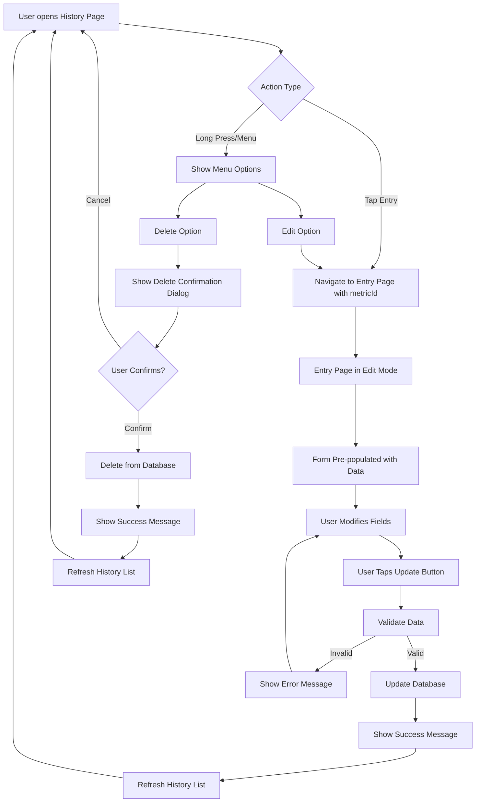
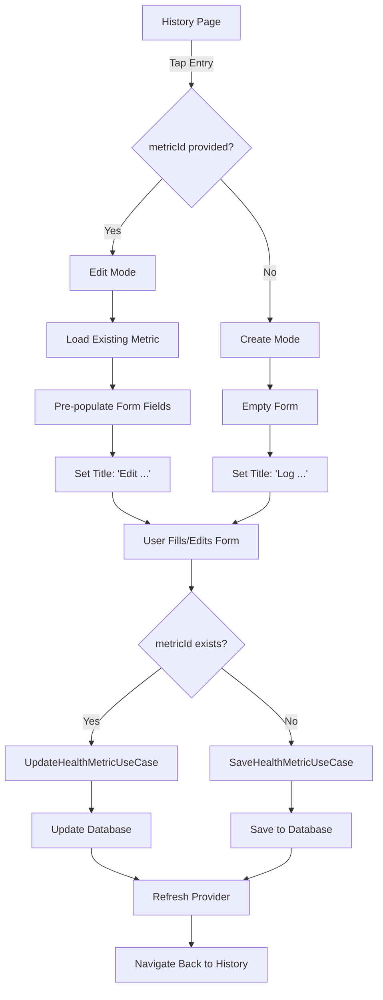
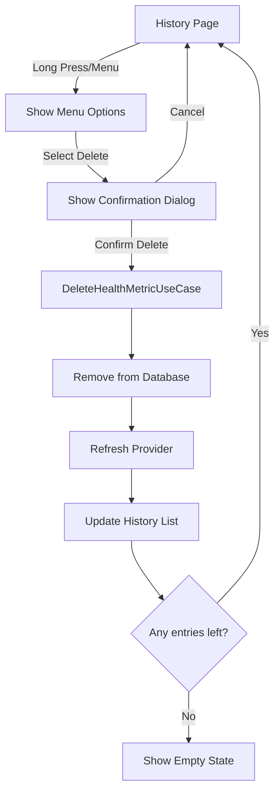

# Feature Request: FR-006 - Update Health Tracking History

**Status**: ⭕ Not Started  
**Priority**: 🟠 High  
**Story Points**: 8  
**Created**: 2025-01-02  
**Updated**: 2025-01-02  
**Assigned Sprint**: Backlog

## Description

Enable users to edit and delete existing health tracking entries from history pages. Currently, users can view their health tracking history but cannot modify or remove entries, which limits their ability to correct mistakes or remove incorrect data.

## User Story

As a user, I want to edit or delete my health tracking history entries, so that I can correct mistakes, update incorrect values, or remove entries that were logged in error.

## User Flow



## Acceptance Criteria

### Core Requirements
- [ ] Users can tap on any entry in history pages to edit it
- [ ] Entry pages support "edit mode" when opened with an existing metric ID
- [ ] Entry pages pre-populate with existing metric data when in edit mode
- [ ] Users can update all metric fields (weight, heart rate, blood pressure, sleep, energy, body measurements, notes)
- [ ] Updated entries preserve the original creation date but update the `updatedAt` timestamp
- [ ] Users can delete entries from history pages with confirmation dialog
- [ ] Deleted entries are permanently removed from the database
- [ ] History pages refresh automatically after edit/delete operations
- [ ] All validation rules apply when editing (same as when creating new entries)

### Edit Functionality
- [ ] Edit mode indicated in UI (page title shows "Edit Heart Rate" vs "Log Heart Rate")
- [ ] Entry pages accept optional `metricId` parameter to enable edit mode
- [ ] When `metricId` is provided, page loads existing metric data
- [ ] When `metricId` is provided, save button text changes to "Update" (or similar)
- [ ] Update operation preserves original `id`, `userId`, `date`, and `createdAt`
- [ ] Update operation updates `updatedAt` timestamp
- [ ] Success message shown after successful update
- [ ] Navigation returns to history page after successful update
- [ ] Error handling for cases where metric doesn't exist

### Delete Functionality
- [ ] Delete button/action available on history entry items (long press or menu)
- [ ] Delete confirmation dialog with:
  - Clear warning message
  - Entry details (date, metric value)
  - "Cancel" and "Delete" buttons
  - Delete button is destructive (red/warning color)
- [ ] Delete operation removes entry permanently
- [ ] Success message shown after successful delete
- [ ] History list refreshes after deletion
- [ ] Empty state shown if all entries are deleted

### Supported History Pages
- [ ] `HeartRateHistoryPage` - Edit/delete heart rate entries
- [ ] `BloodPressureHistoryPage` - Edit/delete blood pressure entries
- [ ] `SleepEnergyHistoryPage` - Edit/delete sleep and energy entries
- [ ] `BodyMeasurementsHistoryPage` - Edit/delete body measurement entries
- [ ] Weight history (if exists) - Edit/delete weight entries

## Business Value

This feature improves data quality and user experience by:
- Allowing users to correct mistakes in logged data (typos, wrong values)
- Enabling users to remove accidental entries or test data
- Increasing user trust in the app by providing control over their data
- Improving data accuracy for trend calculations and clinical safety alerts
- Reducing user frustration when errors are discovered after logging
- Providing essential CRUD functionality that users expect from health tracking apps

## Technical Requirements

### Domain Layer
- Create `UpdateHealthMetricUseCase`:
  - Input: `HealthMetric` entity (must have existing `id`)
  - Validates metric data (reuse validation logic from `SaveHealthMetricUseCase`)
  - Calls `repository.updateHealthMetric()`
  - Returns `Result<HealthMetric>` with `Either<Failure, HealthMetric>`
  - Updates `updatedAt` timestamp automatically
  - Preserves `id`, `userId`, `date`, and `createdAt`
- Create `DeleteHealthMetricUseCase`:
  - Input: `String metricId`
  - Calls `repository.deleteHealthMetric(id)`
  - Returns `Result<void>` with `Either<Failure, void>`
  - Handles `NotFoundFailure` if metric doesn't exist
- Validation: Reuse validation logic from `SaveHealthMetricUseCase` (extract to shared validator if needed)

### Data Layer
- Repository already has `updateHealthMetric()` method - verify implementation
- Repository already has `deleteHealthMetric()` method - verify implementation
- Ensure data source properly updates `updatedAt` timestamp
- Ensure delete operation removes entry from Hive database

### Presentation Layer

#### Screen Layouts

##### History Page with Edit/Delete Actions

```
┌─────────────────────────────────────────┐
│  ← Heart Rate History                   │
├─────────────────────────────────────────┤
│                                         │
│  ┌───────────────────────────────────┐ │
│  │  ❤️  72 BPM              ⋮ [menu] │ │
│  │      Today at 8:30 AM             │ │
│  │      "Morning resting rate"       │ │
│  └───────────────────────────────────┘ │
│           [TAP TO EDIT]                 │
│                                         │
│  ┌───────────────────────────────────┐ │
│  │  ❤️  68 BPM              ⋮ [menu] │ │
│  │      January 1, 2025              │ │
│  └───────────────────────────────────┘ │
│           [TAP TO EDIT]                 │
│                                         │
│  ┌───────────────────────────────────┐ │
│  │  ❤️  75 BPM              ⋮ [menu] │ │
│  │      December 31, 2024            │ │
│  └───────────────────────────────────┘ │
│           [TAP TO EDIT]                 │
│                                         │
│  [Menu Options (long press or ⋮):]     │
│    • Edit Entry                         │
│    • Delete Entry  [DESTRUCTIVE]       │
│                                         │
└─────────────────────────────────────────┘
```

##### Entry Page in Edit Mode

```
┌─────────────────────────────────────────┐
│  ← Edit Heart Rate                      │
├─────────────────────────────────────────┤
│                                         │
│  Resting Heart Rate                     │
│  ┌─────────────────────────────────┐   │
│  │        72                       │   │
│  └─────────────────────────────────┘   │
│  BPM                                    │
│                                         │
│  Date                                   │
│  ┌─────────────────────────────────┐   │
│  │  January 2, 2025        📅      │   │
│  └─────────────────────────────────┘   │
│                                         │
│  Notes (Optional)                       │
│  ┌─────────────────────────────────┐   │
│  │ Morning resting rate            │   │
│  │                                 │   │
│  └─────────────────────────────────┘   │
│                                         │
│  ┌─────────────────────────────────┐   │
│  │      Update Entry               │   │
│  └─────────────────────────────────┘   │
│                                         │
│  [Button text: "Update" vs "Save"]     │
│                                         │
└─────────────────────────────────────────┘
```

##### Delete Confirmation Dialog

```
┌─────────────────────────────────────────┐
│                                         │
│         ⚠️  Delete Entry?               │
│                                         │
│  Are you sure you want to delete       │
│  this entry?                            │
│                                         │
│  ┌─────────────────────────────────┐   │
│  │  ❤️  72 BPM                     │   │
│  │      January 2, 2025            │   │
│  └─────────────────────────────────┘   │
│                                         │
│  This action cannot be undone.          │
│                                         │
│  ┌──────────────┐  ┌──────────────┐   │
│  │   Cancel     │  │   Delete     │   │
│  └──────────────┘  └──────────────┘   │
│       [Normal]         [Red/Destructive]│
│                                         │
└─────────────────────────────────────────┘
```

#### Entry Page Flow



#### Delete Flow



#### Entry Pages Updates
- Update all entry pages to accept optional `metricId` parameter:
  - `HeartRateEntryPage({super.key, this.metricId})`
  - `BloodPressureEntryPage({super.key, this.metricId})`
  - `SleepEnergyPage({super.key, this.metricId})`
  - `MeasurementsPage({super.key, this.metricId})`
  - `WeightEntryPage({super.key, this.metricId})`
- Add logic to load existing metric when `metricId` is provided:
  - Fetch metric using `GetHealthMetricUseCase` (or repository directly via provider)
  - Pre-populate form fields with existing data
  - Set page title to indicate edit mode
  - Update save button text to "Update" or "Save Changes"
- Update save logic:
  - If `metricId` is provided, call `UpdateHealthMetricUseCase`
  - If `metricId` is null, call `SaveHealthMetricUseCase` (existing behavior)
  - Handle success/error states appropriately

#### History Pages Updates
- Make history list items tappable:
  - Navigate to corresponding entry page with `metricId` parameter
  - Example: `Navigator.push(context, HeartRateEntryPage(metricId: metric.id).route())`
- Add delete action:
  - Option 1: Long press on list item shows delete option
  - Option 2: Trailing icon/menu button shows delete option
  - Option 3: Swipe-to-delete gesture (more complex, optional)
- Implement delete confirmation dialog:
  - Use `showDialog()` with `AlertDialog`
  - Show metric details (date, value)
  - Destructive action button styling
- Call `DeleteHealthMetricUseCase` when confirmed
- Refresh provider after delete to update UI

#### Providers
- Update `healthMetricsProvider` to refresh after update/delete operations
- May need to add `ref.invalidate()` calls or update state after operations
- Ensure Riverpod providers handle loading states correctly

### Navigation
- Update routes to support optional `metricId` parameter:
  - Route to entry pages with optional query parameter or named route parameter
  - Example: `/heart-rate-entry?metricId=123` or `/heart-rate-entry/:metricId`
- Ensure navigation works correctly from history pages to entry pages
- Ensure navigation back to history page works after edit/delete

### Error Handling
- Handle `NotFoundFailure` when metric doesn't exist (e.g., deleted by another operation)
- Handle validation errors when updating (show error messages in UI)
- Handle database errors gracefully
- Show user-friendly error messages in snackbars or dialogs

### Testing Requirements
- Unit tests for `UpdateHealthMetricUseCase`:
  - Successful update
  - Validation failures
  - Not found errors
  - Preserves original fields correctly
  - Updates `updatedAt` timestamp
- Unit tests for `DeleteHealthMetricUseCase`:
  - Successful deletion
  - Not found errors
- Widget tests for entry pages in edit mode:
  - Pre-population of fields
  - Update button text
  - Save behavior when editing
- Widget tests for history pages:
  - Navigation to edit page
  - Delete confirmation dialog
  - Delete operation
  - List refresh after delete

## Reference Documents

- `artifacts/phase-2-features/health-tracking-module-specification.md` - Health Tracking module specification
- `artifacts/phase-1-foundations/data-models.md` - HealthMetric data model
- `artifacts/phase-5-management/backlog/feature-requests/FR-001-health-tracking-ui-redesign.md` - History pages implementation

## Technical References

- Repository Interface: `HealthTrackingRepository.updateHealthMetric()`
- Repository Interface: `HealthTrackingRepository.deleteHealthMetric()`
- Use Case: `SaveHealthMetricUseCase` (validation logic reference)
- Use Case: `UpdateHealthMetricUseCase` (to be created)
- Use Case: `DeleteHealthMetricUseCase` (to be created)
- Entity: `HealthMetric` entity with `id`, `createdAt`, `updatedAt` fields
- Pages: All history pages and entry pages in `lib/features/health_tracking/presentation/pages/`

## Dependencies

- `HealthTrackingRepository` must have `updateHealthMetric()` and `deleteHealthMetric()` methods implemented (already exist)
- History pages must be implemented (completed in FR-001)
- Entry pages must be implemented (already exist)
- Validation logic from `SaveHealthMetricUseCase` should be reusable or extracted to shared validator

## Notes

- This feature is essential for data quality and user experience
- The repository layer already supports update/delete operations, so this is primarily a presentation layer feature
- Consider extracting validation logic to a shared `HealthMetricValidator` class if it's duplicated between save and update use cases
- Long press vs menu button vs swipe-to-delete: Consider user experience and platform conventions (Material Design recommends menu button or long press)
- Consider adding a "last updated" indicator in history pages to show when entries were modified
- For weight entries specifically, consider impact on moving averages and trend calculations when entries are updated or deleted

## History

- 2025-01-02 - Created

