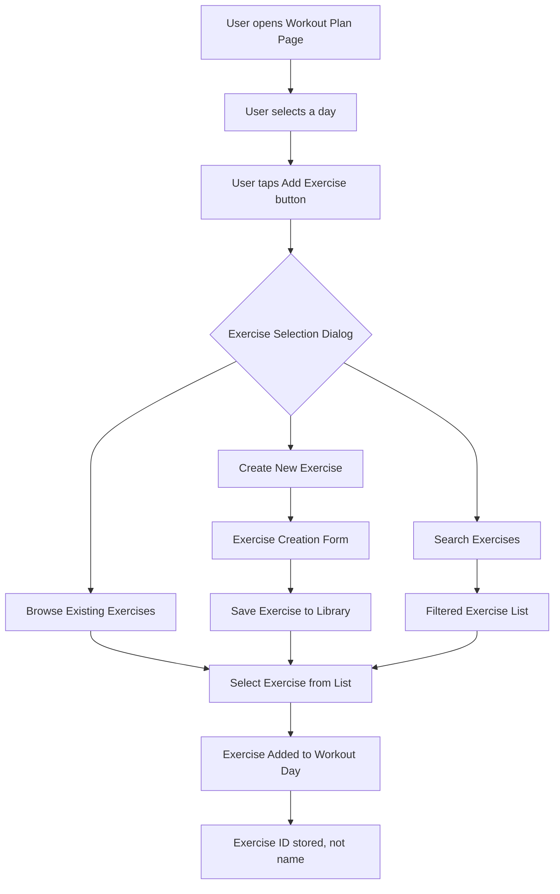

# Feature Request: FR-016 - Exercise Library and Workout Plan Integration

**Status**: ⭕ Not Started  
**Priority**: 🟠 High  
**Story Points**: 13  
**Created**: 2025-01-03  
**Updated**: 2025-01-27  
**Assigned Sprint**: [Sprint 13](../sprints/sprint-13-exercise-library-and-bug-fixes.md)

## Description

Complete the exercise management feature by implementing an exercise library system and proper integration with workout plans. Currently, users can create workout plans but can only add exercises by typing names as strings. The system should allow users to browse, select, and manage a library of exercises that can be reused across workout plans, with proper entity linking (Exercise IDs) instead of storing exercise names as strings.

## User Story

As a user, I want to browse and select from my exercise library when creating workout plans, so that I can reuse exercises across multiple plans, maintain consistency, and avoid typing the same exercise names repeatedly.

## User Flow

## Acceptance Criteria

### Exercise Library Management
- [ ] Users can access an exercise library page from the exercise tab
- [ ] Exercise library displays all exercises created by the user
- [ ] Users can create new exercises with full details (name, type, muscle groups, equipment, notes)
- [ ] Users can edit existing exercises in the library
- [ ] Users can delete exercises from the library (with confirmation)
- [ ] Exercise library supports search/filter functionality
- [ ] Exercise library shows exercise details (type, muscle groups, equipment)

### Workout Plan Integration
- [ ] When adding exercises to workout plans, users can browse and select from exercise library
- [ ] Exercise selection dialog shows list of existing exercises
- [ ] Exercise selection dialog allows creating new exercises on-the-fly
- [ ] Exercise selection dialog supports search/filter
- [ ] Selected exercises are linked by Exercise entity ID, not by name string
- [ ] Workout plans properly reference Exercise entities via `exerciseIds` field
- [ ] Workout plan display shows exercise names (resolved from Exercise entities)

### Data Model Updates
- [ ] `WorkoutDay.exerciseIds` properly stores Exercise entity IDs
- [ ] Workout plan creation validates that exercise IDs reference existing Exercise entities
- [ ] Exercise deletion checks if exercise is used in any workout plans (warn user)
- [ ] Workout plan display resolves exercise IDs to Exercise entities for display

### UI/UX Requirements
- [ ] Exercise library page accessible from exercise tab (menu or button)
- [ ] Exercise selection dialog is user-friendly and intuitive
- [ ] Exercise creation form matches the one in workout logging page (for consistency)
- [ ] Search/filter works smoothly with large exercise lists
- [ ] Loading states shown when fetching exercises
- [ ] Error handling for failed operations

## Business Value

This feature completes the exercise management functionality and provides significant value:

- **User Experience**: Users can create exercise templates once and reuse them across multiple workout plans, saving time and ensuring consistency
- **Data Quality**: Proper entity linking ensures data integrity and allows for better tracking and analytics
- **Feature Completeness**: Completes the workout plan feature that was partially implemented in MVP
- **Scalability**: Exercise library allows users to build a comprehensive exercise database over time
- **User Retention**: Better organization and reusability encourages continued use of workout planning features

## Technical Requirements

### Domain Layer

#### New Use Cases
- Create `GetExerciseLibraryUseCase`:
  - Input: `String userId`
  - Returns: `Result<List<Exercise>>` - all exercises for user
  - Fetches exercises via repository
- Create `GetExerciseByIdUseCase`:
  - Input: `String exerciseId`
  - Returns: `Result<Exercise>`
  - Used to resolve exercise IDs to entities for display
- Create `CreateExerciseTemplateUseCase`:
  - Input: Exercise details (name, type, muscle groups, equipment, notes)
  - Returns: `Result<Exercise>`
  - Creates exercise without date (template/library exercise)
  - Note: May need to adjust Exercise entity to support template exercises (no date required)
- Create `UpdateExerciseTemplateUseCase`:
  - Input: `Exercise` entity with updated fields
  - Returns: `Result<Exercise>`
  - Updates exercise template
- Create `DeleteExerciseTemplateUseCase`:
  - Input: `String exerciseId`
  - Returns: `Result<void>`
  - Checks if exercise is used in workout plans (warn if used)
  - Deletes exercise from library

#### Exercise Entity Considerations
- Current `Exercise` entity requires a `date` field (for logged workouts)
- May need to support "template" exercises without dates, OR
- Use a separate `ExerciseTemplate` entity, OR
- Store template exercises with a special date (e.g., epoch date) to distinguish them
- **Recommendation**: Review Exercise entity design - may need to make `date` optional or create `ExerciseTemplate` entity

### Data Layer

#### Repository Updates
- Verify `ExerciseRepository.getExercisesByUserId()` works correctly
- May need `getExerciseTemplatesByUserId()` if using separate template entity
- Ensure exercise deletion properly removes from database
- Add validation to check if exercise is referenced in workout plans before deletion

### Presentation Layer

#### New Pages/Widgets

##### Exercise Library Page
- **Location**: `lib/features/exercise_management/presentation/pages/exercise_library_page.dart`
- **Features**:
  - List of all user's exercises
  - Search/filter bar
  - Create new exercise button
  - Edit/delete actions for each exercise
  - Exercise details display (type, muscle groups, equipment)

##### Exercise Selection Dialog
- **Location**: `lib/features/exercise_management/presentation/widgets/exercise_selection_dialog.dart`
- **Features**:
  - List of existing exercises (scrollable)
  - Search/filter input
  - "Create New Exercise" button
  - Exercise selection (tap to select)
  - Returns selected `Exercise` entity or null

##### Exercise Template Form
- **Location**: `lib/features/exercise_management/presentation/widgets/exercise_template_form.dart`
- **Features**:
  - Reuse form from workout logging page (or extract to shared widget)
  - Create/edit exercise templates
  - All fields: name, type, muscle groups, equipment, notes
  - No date field (for templates)

#### Updates to Existing Pages

##### Workout Plan Page
- **File**: `lib/features/exercise_management/presentation/pages/workout_plan_page.dart`
- **Changes**:
  - Replace `_AddExerciseDialog` (simple text input) with `ExerciseSelectionDialog`
  - Update `_addExerciseToDay()` to use exercise selection dialog
  - Store Exercise entity IDs instead of names in `_dayExercises`
  - Update `_savePlan()` to use Exercise IDs when creating `WorkoutDay` entities
  - Display exercise names (resolved from Exercise entities) in day schedule cards

##### Exercise Page
- **File**: `lib/features/exercise_management/presentation/pages/exercise_page.dart`
- **Changes**:
  - Add button/menu option to access Exercise Library
  - Navigate to `ExerciseLibraryPage`

#### Providers
- Create `exerciseLibraryProvider`:
  - `FutureProvider<List<Exercise>>` that fetches all exercises for current user
  - Used by exercise library page and exercise selection dialog
- Update `workoutPlansProvider` to resolve exercise IDs to Exercise entities for display
- May need `exerciseByIdProvider` (family provider) to fetch individual exercises by ID

### Navigation
- Add route to `ExerciseLibraryPage` from exercise tab
- Exercise selection dialog is a modal dialog (no route needed)
- Ensure navigation flows work correctly

### Error Handling
- Handle cases where exercise ID doesn't exist (orphaned references)
- Handle cases where user tries to delete exercise used in workout plans
- Show user-friendly error messages
- Handle network/database errors gracefully

### Data Migration (if needed)
- If existing workout plans have exercise names as strings, may need migration:
  - Attempt to match exercise names to Exercise entities
  - Create Exercise entities for unmatched names (or mark as "legacy")
  - Update workout plans to use Exercise IDs

## Reference Documents

- `artifacts/phase-2-features/exercise-management-module-specification.md` - Exercise Management module specification (if exists)
- `artifacts/phase-1-foundations/data-models.md` - Exercise and WorkoutPlan data models
- Current implementation: `app/lib/features/exercise_management/`

## Technical References

### Current Implementation
- **Workout Plan Page**: `app/lib/features/exercise_management/presentation/pages/workout_plan_page.dart`
  - Line 75-88: `_addExerciseToDay()` - currently uses simple text input dialog
  - Line 598-641: `_AddExerciseDialog` - simple text input, needs replacement
  - Line 29: `_dayExercises` - currently `Map<String, List<String>>` (day -> exercise names), should be `Map<String, List<String>>` (day -> exercise IDs)
- **Workout Logging Page**: `app/lib/features/exercise_management/presentation/pages/workout_logging_page.dart`
  - Line 387-683: `_ExerciseEntryDialog` - full exercise form, can be reused/extracted
- **Exercise Entity**: `app/lib/features/exercise_management/domain/entities/exercise.dart`
  - Requires `date` field - may need adjustment for template exercises
- **Workout Plan Entity**: `app/lib/features/exercise_management/domain/entities/workout_plan.dart`
  - Line 6-7: `WorkoutDay.exerciseIds` - expects List<String> of Exercise IDs (correct design)
- **Exercise Repository**: `app/lib/features/exercise_management/domain/repositories/exercise_repository.dart`
  - Line 19: `getExercisesByUserId()` - already exists, can be used for library

### To Be Created
- **Exercise Library Page**: `lib/features/exercise_management/presentation/pages/exercise_library_page.dart`
- **Exercise Selection Dialog**: `lib/features/exercise_management/presentation/widgets/exercise_selection_dialog.dart`
- **Exercise Template Form**: `lib/features/exercise_management/presentation/widgets/exercise_template_form.dart` (or extract from workout logging)
- **Use Cases**: 
  - `GetExerciseLibraryUseCase`
  - `GetExerciseByIdUseCase`
  - `CreateExerciseTemplateUseCase`
  - `UpdateExerciseTemplateUseCase`
  - `DeleteExerciseTemplateUseCase`

## Dependencies

- Exercise repository must have `getExercisesByUserId()` implemented (already exists)
- Exercise entity design decision needed (template exercises vs logged exercises)
- Workout plan entity already supports Exercise IDs (correct design)
- Exercise creation form exists in workout logging page (can be reused)

## Notes

### Design Decisions Needed

1. **Exercise Template vs Logged Exercise**:
   - Option A: Make `Exercise.date` optional, use null for templates
   - Option B: Create separate `ExerciseTemplate` entity
   - Option C: Use special date value (e.g., epoch) to distinguish templates
   - **Recommendation**: Option A (make date optional) - simpler, single entity

2. **Exercise Selection UX**:
   - Should exercise selection dialog allow creating new exercises inline?
   - Should it be a separate page or modal dialog?
   - **Recommendation**: Modal dialog with "Create New" button that opens form dialog

3. **Exercise Deletion**:
   - Should deletion be blocked if exercise is used in workout plans?
   - Should it warn but allow deletion?
   - Should it remove exercise from workout plans automatically?
   - **Recommendation**: Warn user but allow deletion, show which plans are affected

4. **Data Migration**:
   - Existing workout plans may have exercise names as strings
   - Need strategy to migrate or handle legacy data
   - **Recommendation**: On first access, attempt to match names to exercises, create exercises for unmatched names

### Implementation Considerations

- Reuse exercise form from workout logging page to maintain consistency
- Consider extracting exercise form to shared widget
- Exercise library should be searchable and filterable for good UX
- Consider pagination if user has many exercises
- Exercise selection should be fast and intuitive
- Consider caching exercise library for performance

### Testing Considerations

- Test exercise library CRUD operations
- Test exercise selection in workout plan creation
- Test exercise deletion when used in workout plans
- Test search/filter functionality
- Test data migration from legacy workout plans
- Test error handling for orphaned exercise IDs

## History

- 2025-01-03 - Created - Identified incomplete exercise management feature during code review

