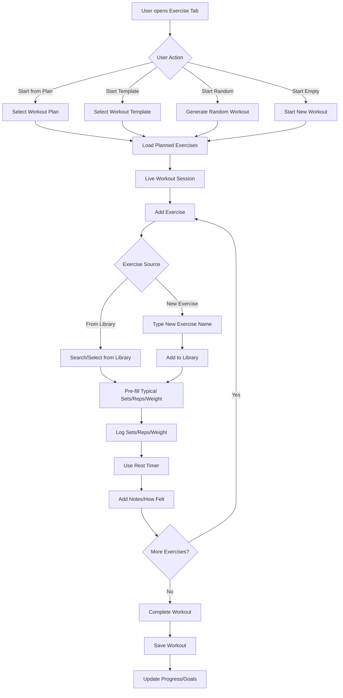
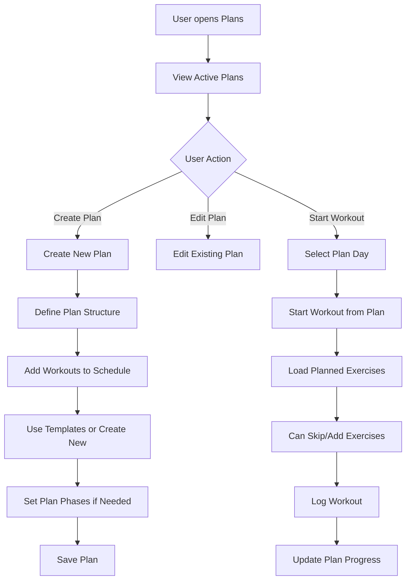

# Feature Request: FR-017 - Comprehensive Exercise Tracking

**Status**: ⭕ Not Started  
**Priority**: 🟠 High  
**Story Points**: 21  
**Created**: 2025-01-27  
**Updated**: 2025-01-27  
**Assigned Sprint**: Backlog

## Description

Implement comprehensive exercise tracking functionality based on user requirements discovery. This feature enables users to log workouts during sessions (live logging), manage workout plans and templates, track progress toward fitness goals, view workout history in multiple ways, and receive reminders for scheduled workouts. The system supports flexible workout logging including incomplete workouts, multiple workouts per day, and comprehensive data tracking including sets, reps, weight, rest time, notes, and subjective metrics (energy, difficulty, mood).

## User Story

As a fitness enthusiast, I want to comprehensively track my workouts with live logging, workout plans, progress tracking, and history viewing, so that I can maintain consistency, see my progress over time, and follow structured workout programs while having the flexibility to adapt workouts as needed.

## User Flow

### Core Workout Logging Flow


### Workout Plan Management Flow


## Acceptance Criteria

### Live Workout Logging
- [ ] User can start a workout session and log exercises in real-time during the session
- [ ] User can log sets, reps, weight, rest time, notes, and how they felt for each exercise
- [ ] User can log multiple workouts in one day (e.g., morning run + evening gym)
- [ ] User can edit workouts after logging them
- [ ] User can delete workouts
- [ ] User can log incomplete/failed workouts (e.g., only completed 2 of 5 planned exercises)
- [ ] User can skip exercises in a planned workout
- [ ] User can add extra exercises not in the plan during the session

### Exercise Library Integration
- [ ] User can search/select exercises from library when logging
- [ ] If exercise not found, user can type new exercise name and it gets added to library automatically
- [ ] App pre-fills typical sets/reps/weight for each exercise (changeable)
- [ ] User can vary sets/reps/weight for same exercise on different days
- [ ] Exercise library remembers exercises user has used before
- [ ] Each exercise stores typical sets/reps/weight that pre-fills but is changeable

### Quick Workout Logging
- [ ] User can use quick-add options: most recent workout, scheduled workout, quick templates, copy from previous
- [ ] Quick-add buttons available for most common exercises/workouts
- [ ] App suggests workouts based on previous sessions
- [ ] User can generate random workouts when not following a plan

### Workout Plans & Scheduling
- [ ] User can create plans with individual workouts OR schedule of when to do certain workouts
- [ ] User can create plans from scratch, use workout templates, or copy/modify existing plans
- [ ] Plans can have different phases (e.g., "Week 1-2: Build-up", "Week 3-4: Intensity")
- [ ] User can have multiple active plans simultaneously
- [ ] Plans are repeatable (complete, then start again)
- [ ] User can start a workout from a plan (e.g., select "Monday Workout")
- [ ] Workout template loads with exercises pre-filled when starting from plan
- [ ] Plan progress is tracked (e.g., "Week 2 of 4 completed")

### Workout Templates
- [ ] User can save frequently used workouts as templates (e.g., "Push Day")
- [ ] Templates can be reused in plans or started directly
- [ ] Templates can be modified without affecting past workouts

### History & Progress Tracking
- [ ] User can view workout history by date, by exercise, or by plan
- [ ] Most important details shown: notes and how user felt
- [ ] User can compare workouts (e.g., "This Monday vs Last Monday")
- [ ] User can see trends over time (e.g., "Bench Press weight increased from 90kg to 100kg over 2 months")
- [ ] User can track progress toward goals (e.g., "Do 50 pushups in a row", "Run 5k under 35 minutes")
- [ ] Consistency metrics are displayed and tracked
- [ ] Streak tracking is implemented (e.g., "7 day workout streak")

### Goals & Metrics
- [ ] User can set specific fitness goals (e.g., "50 pushups in a row", "Run 5k under 35 minutes")
- [ ] App tracks progress toward goals
- [ ] Primary focus: consistency metrics
- [ ] Goals can be edited and deleted

### Workout Details & Customization
- [ ] User can log sets, reps, weight, duration, rest time, notes, how user felt
- [ ] Built-in rest timer that automatically logs rest time
- [ ] User can add notes at both exercise level and workout level
- [ ] User can track energy level, difficulty, mood for workouts
- [ ] User can vary sets/reps for same exercise on different days

### Notifications & Reminders
- [ ] User receives reminders for scheduled workouts (e.g., "Time for your Monday workout")
- [ ] User receives reminders if they miss a planned workout
- [ ] Streak tracking notifications are sent

## Business Value

This feature provides comprehensive exercise tracking capabilities that are essential for users who want to:
- **Maintain Consistency**: Track workouts regularly with reminders and streak tracking
- **Follow Structured Programs**: Use workout plans and templates to follow training programs
- **See Progress**: View trends, compare workouts, and track goals to stay motivated
- **Flexibility**: Adapt workouts as needed (skip exercises, add extras, log incomplete workouts)
- **Efficiency**: Quick-add options and pre-filled data reduce logging time
- **Comprehensive Tracking**: Track all relevant metrics (sets, reps, weight, rest, notes, subjective metrics)

This feature is critical for MVP as exercise tracking is a core feature of the health management app. It enables users to comprehensively manage their fitness activities and see meaningful progress over time.

## Technical Requirements

### Domain Layer

#### New Entities
- **WorkoutSession**: Represents a logged workout session
  - `id`: String
  - `userId`: String
  - `date`: DateTime
  - `startTime`: DateTime?
  - `endTime`: DateTime?
  - `duration`: Duration?
  - `planId`: String? (if started from plan)
  - `planDay`: String? (which day of plan)
  - `templateId`: String? (if started from template)
  - `workoutNotes`: String?
  - `energyLevel`: int? (1-10 scale)
  - `difficulty`: int? (1-10 scale)
  - `mood`: String?
  - `isComplete`: bool
  - `exercises`: List<ExerciseEntry>
  
- **ExerciseEntry**: Exercise logged within a workout session
  - `id`: String
  - `exerciseId`: String (references Exercise entity)
  - `exerciseName`: String (denormalized for history)
  - `sets`: List<SetEntry>
  - `restTime`: Duration?
  - `notes`: String?
  - `order`: int (order in workout)
  
- **SetEntry**: Individual set within an exercise
  - `id`: String
  - `setNumber`: int
  - `reps`: int?
  - `weight`: double?
  - `duration`: Duration? (for time-based exercises)
  - `restTime`: Duration? (rest after this set)
  - `completed`: bool
  - `notes`: String?

- **WorkoutTemplate**: Reusable workout template
  - `id`: String
  - `userId`: String
  - `name`: String
  - `description`: String?
  - `exercises`: List<TemplateExercise>
  - `createdAt`: DateTime
  - `updatedAt`: DateTime
  
- **TemplateExercise**: Exercise in a template
  - `exerciseId`: String
  - `typicalSets`: int?
  - `typicalReps`: int?
  - `typicalWeight`: double?
  - `typicalRestTime`: Duration?
  - `order`: int
  - `notes`: String?

- **WorkoutPlan**: Multi-day workout plan
  - `id`: String
  - `userId`: String
  - `name`: String
  - `description`: String?
  - `startDate`: DateTime?
  - `endDate`: DateTime?
  - `isActive`: bool
  - `isRepeatable`: bool
  - `phases`: List<PlanPhase>?
  - `schedule`: Map<String, List<String>> (day -> workout template IDs or exercise IDs)
  - `currentWeek`: int?
  - `totalWeeks`: int?
  - `createdAt`: DateTime
  - `updatedAt`: DateTime

- **PlanPhase**: Phase within a workout plan
  - `id`: String
  - `name`: String
  - `description`: String?
  - `startWeek`: int
  - `endWeek`: int
  - `focus`: String? (e.g., "Build-up", "Intensity")

- **FitnessGoal**: User fitness goal
  - `id`: String
  - `userId`: String
  - `name`: String
  - `description`: String?
  - `type`: GoalType (e.g., REPS, WEIGHT, TIME, DISTANCE, CONSISTENCY)
  - `targetValue`: double
  - `currentValue`: double
  - `unit`: String
  - `targetDate`: DateTime?
  - `isAchieved`: bool
  - `achievedDate`: DateTime?
  - `createdAt`: DateTime
  - `updatedAt`: DateTime

- **WorkoutStreak**: Tracks workout streaks
  - `userId`: String
  - `currentStreak`: int
  - `longestStreak`: int
  - `lastWorkoutDate`: DateTime?
  - `updatedAt`: DateTime

#### New Use Cases

**Workout Logging Use Cases**:
- `StartWorkoutSessionUseCase`: Start a new workout session
- `LogExerciseUseCase`: Log an exercise during session
- `LogSetUseCase`: Log a set for an exercise
- `CompleteWorkoutSessionUseCase`: Complete and save workout session
- `UpdateWorkoutSessionUseCase`: Update an existing workout session
- `DeleteWorkoutSessionUseCase`: Delete a workout session
- `GetWorkoutHistoryUseCase`: Get workout history (by date, exercise, or plan)
- `CompareWorkoutsUseCase`: Compare two workouts

**Workout Plan Use Cases**:
- `CreateWorkoutPlanUseCase`: Create a new workout plan
- `UpdateWorkoutPlanUseCase`: Update an existing plan
- `DeleteWorkoutPlanUseCase`: Delete a plan
- `StartWorkoutFromPlanUseCase`: Start a workout session from a plan
- `GetActivePlansUseCase`: Get all active plans for user
- `GetPlanProgressUseCase`: Get progress for a plan
- `RepeatPlanUseCase`: Restart a completed plan

**Workout Template Use Cases**:
- `CreateWorkoutTemplateUseCase`: Create a workout template
- `UpdateWorkoutTemplateUseCase`: Update a template
- `DeleteWorkoutTemplateUseCase`: Delete a template
- `GetWorkoutTemplatesUseCase`: Get all templates for user
- `StartWorkoutFromTemplateUseCase`: Start workout from template

**Progress Tracking Use Cases**:
- `CalculateExerciseTrendsUseCase`: Calculate trends for an exercise over time
- `TrackGoalProgressUseCase`: Update progress toward a goal
- `CalculateConsistencyMetricsUseCase`: Calculate consistency metrics
- `UpdateWorkoutStreakUseCase`: Update workout streak after workout
- `GetWorkoutStreakUseCase`: Get current streak information

**Quick Actions Use Cases**:
- `GetMostRecentWorkoutUseCase`: Get most recent workout for quick-add
- `GetScheduledWorkoutUseCase`: Get scheduled workout for today
- `GenerateRandomWorkoutUseCase`: Generate a random workout
- `CopyPreviousWorkoutUseCase`: Copy a previous workout

**Exercise Library Use Cases** (may overlap with FR-016):
- `GetExerciseLibraryUseCase`: Get all exercises in library
- `UpdateExerciseTypicalValuesUseCase`: Update typical sets/reps/weight for exercise
- `SearchExercisesUseCase`: Search exercises in library

### Data Layer

#### Repository Interfaces
- `WorkoutSessionRepository`:
  - `Future<Result<WorkoutSession>> saveWorkoutSession(WorkoutSession session)`
  - `Future<Result<List<WorkoutSession>>> getWorkoutHistory(String userId, {DateTime? startDate, DateTime? endDate, String? exerciseId, String? planId})`
  - `Future<Result<WorkoutSession>> getWorkoutSessionById(String id)`
  - `Future<Result<void>> deleteWorkoutSession(String id)`
  - `Future<Result<List<WorkoutSession>>> getWorkoutsByDate(String userId, DateTime date)`
  - `Future<Result<List<WorkoutSession>>> getWorkoutsByExercise(String userId, String exerciseId)`
  - `Future<Result<List<WorkoutSession>>> getWorkoutsByPlan(String userId, String planId)`

- `WorkoutPlanRepository`:
  - `Future<Result<WorkoutPlan>> saveWorkoutPlan(WorkoutPlan plan)`
  - `Future<Result<WorkoutPlan>> getWorkoutPlanById(String id)`
  - `Future<Result<List<WorkoutPlan>>> getActivePlans(String userId)`
  - `Future<Result<List<WorkoutPlan>>> getAllPlans(String userId)`
  - `Future<Result<void>> deleteWorkoutPlan(String id)`
  - `Future<Result<void>> updatePlanProgress(String planId, int currentWeek)`

- `WorkoutTemplateRepository`:
  - `Future<Result<WorkoutTemplate>> saveWorkoutTemplate(WorkoutTemplate template)`
  - `Future<Result<WorkoutTemplate>> getWorkoutTemplateById(String id)`
  - `Future<Result<List<WorkoutTemplate>>> getWorkoutTemplates(String userId)`
  - `Future<Result<void>> deleteWorkoutTemplate(String id)`

- `FitnessGoalRepository`:
  - `Future<Result<FitnessGoal>> saveFitnessGoal(FitnessGoal goal)`
  - `Future<Result<FitnessGoal>> getFitnessGoalById(String id)`
  - `Future<Result<List<FitnessGoal>>> getActiveGoals(String userId)`
  - `Future<Result<void>> deleteFitnessGoal(String id)`
  - `Future<Result<void>> updateGoalProgress(String goalId, double currentValue)`

- `WorkoutStreakRepository`:
  - `Future<Result<WorkoutStreak>> getWorkoutStreak(String userId)`
  - `Future<Result<void>> updateWorkoutStreak(String userId, DateTime workoutDate)`

#### Data Sources
- **Hive Implementation**: All repositories use Hive for local storage
- **Data Models**: Create Hive adapters for all new entities
- **Migration**: Handle data migration if needed for existing exercise data

### Presentation Layer

#### New Pages

**Workout Logging Page**:
- `lib/features/exercise_management/presentation/pages/workout_logging_page.dart`
- Live workout session interface
- Add exercises during session
- Log sets/reps/weight in real-time
- Built-in rest timer
- Add notes and subjective metrics
- Complete/save workout

**Workout History Page**:
- `lib/features/exercise_management/presentation/pages/workout_history_page.dart`
- View workouts by date, exercise, or plan
- Filter and search functionality
- Compare workouts feature
- Show trends and progress

**Workout Plan Management Page**:
- `lib/features/exercise_management/presentation/pages/workout_plan_management_page.dart`
- Create, edit, delete plans
- View active plans
- Plan progress tracking
- Start workout from plan

**Workout Template Management Page**:
- `lib/features/exercise_management/presentation/pages/workout_template_management_page.dart`
- Create, edit, delete templates
- View all templates
- Start workout from template

**Fitness Goals Page**:
- `lib/features/exercise_management/presentation/pages/fitness_goals_page.dart`
- Create, edit, delete goals
- View goal progress
- Track goal achievement

**Progress & Analytics Page**:
- `lib/features/exercise_management/presentation/pages/progress_analytics_page.dart`
- Exercise trends over time
- Consistency metrics
- Streak tracking
- Progress charts

### UI Layout Designs (ASCII Art)

#### 1. Workout Logging Page (Live Session)

```
╔═══════════════════════════════════════════════╗
║  Workout Session                    [⏸️] [✓]  ║ ← App Bar (Pause, Complete)
╠═══════════════════════════════════════════════╣
║                                               ║
║  ╔═════════════════════════════════════════╗ ║
║  ║   Workout Timer: 00:45:23               ║ ║
║  ║   Started: 2:30 PM                      ║ ║
║  ╚═════════════════════════════════════════╝ ║
║                                               ║
║  Exercises                                    ║
║  ┌─────────────────────────────────────────┐ ║
║  │ 1. Bench Press                          │ ║
║  │    Set 1: 100kg × 10 reps  [✓]         │ ║
║  │    Set 2: 100kg × 8 reps   [✓]         │ ║
║  │    Set 3: 100kg × 6 reps   [ ]         │ ║ ← Current set
║  │    Rest: [⏱️ 01:30] [Add Set]          │ ║
║  │    Notes: [📝]                          │ ║
║  └─────────────────────────────────────────┘ ║
║                                               ║
║  ┌─────────────────────────────────────────┐ ║
║  │ 2. Barbell Row                          │ ║
║  │    Set 1: 80kg × 12 reps  [✓]          │ ║
║  │    [Add Set]                            │ ║
║  └─────────────────────────────────────────┘ ║
║                                               ║
║  ┌─────────────────────────────────────────┐ ║
║  │ 3. Overhead Press                       │ ║
║  │    [Not Started]                        │ ║
║  └─────────────────────────────────────────┘ ║
║                                               ║
║  ┌─────────────────────────────────────────┐ ║
║  │  ➕  Add Exercise                       │ ║
║  └─────────────────────────────────────────┘ ║
║                                               ║
║  ╔═════════════════════════════════════════╗ ║
║  ║   Workout Notes                         ║ ║
║  ║   ┌─────────────────────────────────┐   ║ ║
║  ║   │ Felt strong today...            │   ║ ║
║  ║   └─────────────────────────────────┘   ║ ║
║  ║                                         ║ ║
║  ║   Energy: [████████░░] 8/10            ║ ║
║  ║   Difficulty: [██████░░░░] 6/10        ║ ║
║  ║   Mood: 😊 Great                       ║ ║
║  ╚═════════════════════════════════════════╝ ║
║                                               ║
║                                   ╔═══════╗   ║
║                                   ║ Finish║   ║ ← Bottom button
║                                   ╚═══════╝   ║
╚═══════════════════════════════════════════════╝

Rest Timer Overlay (when active):
╔═══════════════════════════════════════════════╗
║                                               ║
║                                               ║
║            ╔═══════════════════╗              ║
║            ║                   ║              ║
║            ║    ⏱️  01:30      ║              ║
║            ║                   ║              ║
║            ║   Rest Time        ║              ║
║            ║                   ║              ║
║            ║  [Skip]  [Reset]   ║              ║
║            ╚═══════════════════╝              ║
║                                               ║
╚═══════════════════════════════════════════════╝
```

#### 2. Workout History Page

```
╔═══════════════════════════════════════════════╗
║  Workout History                    [🔍] [⚙️] ║ ← App Bar (Search, Filter)
╠═══════════════════════════════════════════════╣
║                                               ║
║  ┌──────────┐ ┌──────────┐ ┌──────────┐     ║ ← Filter Tabs
║  │  All     │ │ Exercise │ │  Plan    │     ║
║  └──────────┘ └──────────┘ └──────────┘     ║
║                                               ║
║  ┌─────────────────────────────────────────┐ ║
║  │  📅 Today - January 27, 2025            │ ║
║  └─────────────────────────────────────────┘ ║
║                                               ║
║  ┌─────────────────────────────────────────┐ ║
║  │  Push Day                                │ ║
║  │  2:30 PM - 1h 15m                       │ ║
║  │  Bench Press, Overhead Press, Triceps   │ ║
║  │  Energy: 8/10 | Difficulty: 6/10       │ ║
║  │  [View] [Compare] [Edit]                │ ║
║  └─────────────────────────────────────────┘ ║
║                                               ║
║  ┌─────────────────────────────────────────┐ ║
║  │  Morning Run                            │ ║
║  │  6:00 AM - 35m                          │ ║
║  │  5.2 km | 450 calories                  │ ║
║  │  [View] [Compare] [Edit]                │ ║
║  └─────────────────────────────────────────┘ ║
║                                               ║
║  ┌─────────────────────────────────────────┐ ║
║  │  📅 Yesterday - January 26, 2025         │ ║
║  └─────────────────────────────────────────┘ ║
║                                               ║
║  ┌─────────────────────────────────────────┐ ║
║  │  Pull Day                                │ ║
║  │  4:00 PM - 1h 20m                        │ ║
║  │  Deadlift, Barbell Row, Pull-ups       │ ║
║  │  Energy: 7/10 | Difficulty: 7/10       │ ║
║  │  [View] [Compare] [Edit]                │ ║
║  └─────────────────────────────────────────┘ ║
║                                               ║
║  ┌─────────────────────────────────────────┐ ║
║  │  📅 Last Week                            │ ║
║  └─────────────────────────────────────────┘ ║
║                                               ║
║  [Load More...]                               ║
║                                               ║
╚═══════════════════════════════════════════════╝

Workout Comparison View:
╔═══════════════════════════════════════════════╗
║  Compare Workouts                    [✕]      ║
╠═══════════════════════════════════════════════╣
║                                               ║
║  ┌──────────────┐    ┌──────────────┐         ║
║  │ Jan 27, 2025 │ vs │ Jan 20, 2025 │         ║
║  │ Push Day     │    │ Push Day     │         ║
║  └──────────────┘    └──────────────┘         ║
║                                               ║
║  Bench Press                                   ║
║  ┌──────────────┐    ┌──────────────┐         ║
║  │ Set 1: 100kg │    │ Set 1: 95kg  │         ║
║  │ Set 2: 100kg │    │ Set 2: 95kg  │         ║
║  │ Set 3: 100kg │    │ Set 3: 95kg  │         ║
║  └──────────────┘    └──────────────┘         ║
║                                               ║
║  Overhead Press                                ║
║  ┌──────────────┐    ┌──────────────┐         ║
║  │ Set 1: 60kg  │    │ Set 1: 55kg  │         ║
║  │ Set 2: 60kg  │    │ Set 2: 55kg  │         ║
║  └──────────────┘    └──────────────┘         ║
║                                               ║
╚═══════════════════════════════════════════════╝
```

#### 3. Workout Plan Management Page

```
╔═══════════════════════════════════════════════╗
║  Workout Plans                      [➕]      ║ ← App Bar (Create Plan)
╠═══════════════════════════════════════════════╣
║                                               ║
║  ┌──────────┐ ┌──────────┐                  ║ ← Filter Tabs
║  │  Active     │ │  All    │                  ║
║  └──────────┘ └──────────┘                  ║
║                                               ║
║  Active Plans                                 ║
║  ┌─────────────────────────────────────────┐ ║
║  │  Push/Pull/Legs Split                   │ ║
║  │  Week 2 of 4                            │ ║
║  │  ████████░░░░░░░░ 50%                   │ ║
║  │                                         │ ║
║  │  Monday: Push Day                      │ ║
║  │  Tuesday: Pull Day                     │ ║
║  │  Wednesday: Leg Day                    │ ║
║  │  Thursday: Rest                         │ ║
║  │  Friday: Push Day                      │ ║
║  │                                         │ ║
║  │  [Start Workout] [View] [Edit]         │ ║
║  └─────────────────────────────────────────┘ ║
║                                               ║
║  ┌─────────────────────────────────────────┐ ║
║  │  4-Week Strength Program                │ ║
║  │  Week 1 of 4                            │ ║
║  │  ████░░░░░░░░░░░░ 25%                   │ ║
║  │                                         │ ║
║  │  Phase 1: Build-up (Weeks 1-2)        │ ║
║  │  Phase 2: Intensity (Weeks 3-4)        │ ║
║  │                                         │ ║
║  │  [Start Workout] [View] [Edit]         │ ║
║  └─────────────────────────────────────────┘ ║
║                                               ║
║  ┌─────────────────────────────────────────┐ ║
║  │  ➕  Create New Plan                    │ ║
║  └─────────────────────────────────────────┘ ║
║                                               ║
╚═══════════════════════════════════════════════╝

Create/Edit Plan Dialog:
╔═══════════════════════════════════════════════╗
║  Create Workout Plan                [✕]      ║
╠═══════════════════════════════════════════════╣
║                                               ║
║  Plan Name:                                   ║
║  ┌─────────────────────────────────────────┐ ║
║  │ Push/Pull/Legs Split                  │ ║
║  └─────────────────────────────────────────┘ ║
║                                               ║
║  Description:                                 ║
║  ┌─────────────────────────────────────────┐ ║
║  │ 3-day split routine...                  │ ║
║  └─────────────────────────────────────────┘ ║
║                                               ║
║  Duration: [4] weeks                         ║
║  Repeatable: [✓] Yes                         ║
║                                               ║
║  Schedule:                                    ║
║  ┌─────────────────────────────────────────┐ ║
║  │ Monday:    [Push Day Template]        │ ║
║  │ Tuesday:   [Pull Day Template]         │ ║
║  │ Wednesday: [Leg Day Template]          │ ║
║  │ Thursday:  [Rest]                       │ ║
║  │ Friday:   [Push Day Template]         │ ║
║  │ Saturday: [Rest]                       │ ║
║  │ Sunday:   [Rest]                       │ ║
║  └─────────────────────────────────────────┘ ║
║                                               ║
║  Phases (Optional):                           ║
║  ┌─────────────────────────────────────────┐ ║
║  │ Phase 1: Build-up (Weeks 1-2)          │ ║
║  │ Phase 2: Intensity (Weeks 3-4)         │ ║
║  │ [Add Phase]                             │ ║
║  └─────────────────────────────────────────┘ ║
║                                               ║
║  ┌──────────────┐  ┌──────────────┐         ║
║  │   Cancel     │  │    Save      │         ║
║  └──────────────┘  └──────────────┘         ║
║                                               ║
╚═══════════════════════════════════════════════╝
```

#### 4. Workout Template Management Page

```
╔═══════════════════════════════════════════════╗
║  Workout Templates                  [➕]      ║ ← App Bar (Create Template)
╠═══════════════════════════════════════════════╣
║                                               ║
║  ┌─────────────────────────────────────────┐ ║
║  │  🔍 Search templates...                 │ ║
║  └─────────────────────────────────────────┘ ║
║                                               ║
║  My Templates                                 ║
║  ┌─────────────────────────────────────────┐ ║
║  │  Push Day                                │ ║
║  │  Bench Press, Overhead Press, Triceps   │ ║
║  │  5 exercises | ~1h 15m                │ ║
║  │  [Start] [Edit] [Delete]                │ ║
║  └─────────────────────────────────────────┘ ║
║                                               ║
║  ┌─────────────────────────────────────────┐ ║
║  │  Pull Day                                │ ║
║  │  Deadlift, Barbell Row, Pull-ups       │ ║
║  │  6 exercises | ~1h 20m                │ ║
║  │  [Start] [Edit] [Delete]                │ ║
║  └─────────────────────────────────────────┘ ║
║                                               ║
║  ┌─────────────────────────────────────────┐ ║
║  │  Leg Day                                 │ ║
║  │  Squats, Leg Press, Calf Raises            │ ║
║  │  7 exercises | ~1h 30m                │ ║
║  │  [Start] [Edit] [Delete]                │ ║
║  └─────────────────────────────────────────┘ ║
║                                               ║
║  ┌─────────────────────────────────────────┐ ║
║  │  Cardio Session                         │ ║
║  │  Running, Cycling                       │ ║
║  │  2 exercises | ~45m                    │ ║
║  │  [Start] [Edit] [Delete]                │ ║
║  └─────────────────────────────────────────┘ ║
║                                               ║
║  ┌─────────────────────────────────────────┐ ║
║  │  ➕  Create New Template                │ ║
║  └─────────────────────────────────────────┘ ║
║                                               ║
╚═══════════════════════════════════════════════╝

Create/Edit Template Dialog:
╔═══════════════════════════════════════════════╗
║  Create Workout Template           [✕]      ║
╠═══════════════════════════════════════════════╣
║                                               ║
║  Template Name:                               ║
║  ┌─────────────────────────────────────────┐ ║
║  │ Push Day                                │ ║
║  └─────────────────────────────────────────┘ ║
║                                               ║
║  Description:                                 ║
║  ┌─────────────────────────────────────────┐ ║
║  │ Upper body push exercises...            │ ║
║  └─────────────────────────────────────────┘ ║
║                                               ║
║  Exercises:                                  ║
║  ┌─────────────────────────────────────────┐ ║
║  │ 1. Bench Press                          │ ║
║  │    Typical: 3 sets × 8-10 reps @ 100kg │ ║
║  │    [Edit] [Remove]                      │ ║
║  ├─────────────────────────────────────────┤ ║
║  │ 2. Overhead Press                      │ ║
║  │    Typical: 3 sets × 8-10 reps @ 60kg │ ║
║  │    [Edit] [Remove]                      │ ║
║  ├─────────────────────────────────────────┤ ║
║  │ 3. Triceps Dips                        │ ║
║  │    Typical: 3 sets × 12-15 reps       │ ║
║  │    [Edit] [Remove]                      │ ║
║  └─────────────────────────────────────────┘ ║
║                                               ║
║  ┌─────────────────────────────────────────┐ ║
║  │  ➕  Add Exercise                       │ ║
║  └─────────────────────────────────────────┘ ║
║                                               ║
║  ┌──────────────┐  ┌──────────────┐         ║
║  │   Cancel     │  │    Save      │         ║
║  └──────────────┘  └──────────────┘         ║
║                                               ║
╚═══════════════════════════════════════════════╝
```

#### 5. Fitness Goals Page

```
╔═══════════════════════════════════════════════╗
║  Fitness Goals                      [➕]      ║ ← App Bar (Create Goal)
╠═══════════════════════════════════════════════╣
║                                               ║
║  Active Goals                                 ║
║  ┌─────────────────────────────────────────┐ ║
║  │  🎯 Do 50 Pushups in a Row             │ ║
║  │  Progress: 35 / 50 pushups             │ ║
║  │  ████████████░░░░░░░░ 70%              │ ║
║  │  Target: By March 1, 2025             │ ║
║  │  [Update Progress] [Edit] [Delete]      │ ║
║  └─────────────────────────────────────────┘ ║
║                                               ║
║  ┌─────────────────────────────────────────┐ ║
║  │  🎯 Run 5k Under 35 Minutes            │ ║
║  │  Progress: 38:15 / 35:00 minutes        │ ║
║  │  ████████████████░░░░ 85%              │ ║
║  │  Target: By February 15, 2025          │ ║
║  │  [Update Progress] [Edit] [Delete]      │ ║
║  └─────────────────────────────────────────┘ ║
║                                               ║
║  ┌─────────────────────────────────────────┐ ║
║  │  🎯 Bench Press 120kg                   │ ║
║  │  Progress: 100kg / 120kg                │ ║
║  │  ████████████░░░░░░░░ 83%              │ ║
║  │  Target: By April 1, 2025               │ ║
║  │  [Update Progress] [Edit] [Delete]      │ ║
║  └─────────────────────────────────────────┘ ║
║                                               ║
║  Achieved Goals                               ║
║  ┌─────────────────────────────────────────┐ ║
║  │  ✅ Run 5k Under 40 Minutes             │ ║
║  │  Achieved: January 20, 2025             │ ║
║  │  [View Details]                          │ ║
║  └─────────────────────────────────────────┘ ║
║                                               ║
║  ┌─────────────────────────────────────────┐ ║
║  │  ➕  Create New Goal                    │ ║
║  └─────────────────────────────────────────┘ ║
║                                               ║
╚═══════════════════════════════════════════════╝

Create/Edit Goal Dialog:
╔═══════════════════════════════════════════════╗
║  Create Fitness Goal               [✕]      ║
╠═══════════════════════════════════════════════╣
║                                               ║
║  Goal Name:                                   ║
║  ┌─────────────────────────────────────────┐ ║
║  │ Do 50 Pushups in a Row                 │ ║
║  └─────────────────────────────────────────┘ ║
║                                               ║
║  Goal Type:                                   ║
║  ┌──────────┐ ┌──────────┐ ┌──────────┐     ║
║  │  Reps    │ │ Weight   │ │  Time    │     ║
║  └──────────┘ └──────────┘ └──────────┘     ║
║                                               ║
║  Target Value:                                ║
║  ┌─────────────────────────────────────────┐ ║
║  │ 50                                      │ ║
║  └─────────────────────────────────────────┘ ║
║                                               ║
║  Unit: pushups                               ║
║                                               ║
║  Current Progress:                            ║
║  ┌─────────────────────────────────────────┐ ║
║  │ 35                                      │ ║
║  └─────────────────────────────────────────┘ ║
║                                               ║
║  Target Date (Optional):                      ║
║  ┌─────────────────────────────────────────┐ ║
║  │ March 1, 2025                           │ ║
║  └─────────────────────────────────────────┘ ║
║                                               ║
║  Description:                                 ║
║  ┌─────────────────────────────────────────┐ ║
║  │ Personal best challenge...              │ ║
║  └─────────────────────────────────────────┘ ║
║                                               ║
║  ┌──────────────┐  ┌──────────────┐         ║
║  │   Cancel     │  │    Save      │         ║
║  └──────────────┘  └──────────────┘         ║
║                                               ║
╚═══════════════════════════════════════════════╝
```

#### 6. Progress & Analytics Page

```
╔═══════════════════════════════════════════════╗
║  Progress & Analytics               [⚙️]      ║ ← App Bar (Settings)
╠═══════════════════════════════════════════════╣
║                                               ║
║  ┌──────────┐ ┌──────────┐ ┌──────────┐     ║ ← Filter Tabs
║  │ Overview │ │ Exercise │ │  Goals   │     ║
║  └──────────┘ └──────────┘ └──────────┘     ║
║                                               ║
║  Overview Tab:                                ║
║  ┌─────────────────────────────────────────┐ ║
║  │  🔥 Workout Streak                     │ ║
║  │  Current: 7 days                       │ ║
║  │  Longest: 12 days                      │ ║
║  │  ████████████░░░░░░░░                  │ ║
║  └─────────────────────────────────────────┘ ║
║                                               ║
║  ┌─────────────────────────────────────────┐ ║
║  │  📊 Consistency                         │ ║
║  │  This Week: 5/7 days (71%)             │ ║
║  │  This Month: 18/27 days (67%)          │ ║
║  │  ████████████░░░░░░░░                  │ ║
║  └─────────────────────────────────────────┘ ║
║                                               ║
║  ┌─────────────────────────────────────────┐ ║
║  │  📈 Total Workouts                     │ ║
║  │  This Week: 5                           │ ║
║  │  This Month: 18                         │ ║
║  │  All Time: 127                          │ ║
║  └─────────────────────────────────────────┘ ║
║                                               ║
║  Exercise Tab:                               ║
║  ┌─────────────────────────────────────────┐ ║
║  │  Select Exercise: [Bench Press ▼]      │ ║
║  └─────────────────────────────────────────┘ ║
║                                               ║
║  ┌─────────────────────────────────────────┐ ║
║  │  📈 Bench Press Progress                │ ║
║  │                                         │ ║
║  │  Weight Trend (Last 3 Months):         │ ║
║  │    120│                                │ ║
║  │    100│     ╱╲                         │ ║
║  │     80│   ╱    ╲    ╱╲                │ ║
║  │     60│ ╱        ╲╱    ╲              │ ║
║  │     40│                                │ ║
║  │       └─────────────────────────────   │ ║
║  │        Jan    Feb    Mar    Apr       │ ║
║  │                                         │ ║
║  │  Current: 100kg                        │ ║
║  │  Best: 105kg (Jan 15)                 │ ║
║  │  Improvement: +15kg since start        │ ║
║  └─────────────────────────────────────────┘ ║
║                                               ║
║  ┌─────────────────────────────────────────┐ ║
║  │  📊 Volume Trend                        │ ║
║  │  Total Volume (kg) over time...        │ ║
║  │  [Chart similar to above]               │ ║
║  └─────────────────────────────────────────┘ ║
║                                               ║
║  Goals Tab:                                   ║
║  ┌─────────────────────────────────────────┐ ║
║  │  🎯 Goal Progress Summary              │ ║
║  │                                         │ ║
║  │  Active Goals: 3                       │ ║
║  │  Achieved This Month: 1                │ ║
║  │                                         │ ║
║  │  [View All Goals →]                    │ ║
║  └─────────────────────────────────────────┘ ║
║                                               ║
╚═══════════════════════════════════════════════╝
```

#### 7. Quick Add Workout Dialog

```
╔═══════════════════════════════════════════════╗
║                                               ║
║                                               ║
║            ╔═══════════════════╗              ║
║            ║                   ║              ║
║            ║  Quick Add        ║              ║
║            ║                   ║              ║
║            ║  ┌──────────────┐ ║              ║
║            ║  │ 🏋️ Log       │ ║              ║
║            ║  │   Workout    │ ║              ║
║            ║  └──────────────┘ ║              ║
║            ║                   ║              ║
║            ║  ┌──────────────┐ ║              ║
║            ║  │ 📋 Most      │ ║              ║
║            ║  │   Recent    │ ║              ║
║            ║  └──────────────┘ ║              ║
║            ║                   ║              ║
║            ║  ┌──────────────┐ ║              ║
║            ║  │ 📅 Scheduled │ ║              ║
║            ║  │   Workout   │ ║              ║
║            ║  └──────────────┘ ║              ║
║            ║                   ║              ║
║            ║  ┌──────────────┐ ║              ║
║            ║  │ 🎲 Random    │ ║              ║
║            ║  │   Workout   │ ║              ║
║            ║  └──────────────┘ ║              ║
║            ║                   ║              ║
║            ║  ┌──────────────┐ ║              ║
║            ║  │ 📋 Copy      │ ║              ║
║            ║  │   Previous  │ ║              ║
║            ║  └──────────────┘ ║              ║
║            ║                   ║              ║
║            ╚═══════════════════╝              ║
║                                               ║
╚═══════════════════════════════════════════════╝
```

#### New Widgets

**Workout Session Widgets**:
- `WorkoutSessionCard`: Display workout session summary
- `ExerciseEntryWidget`: Display exercise entry in session
- `SetEntryWidget`: Display and edit set entry
- `RestTimerWidget`: Built-in rest timer with automatic logging
- `WorkoutNotesWidget`: Add notes and subjective metrics

**Quick Add Widgets**:
- `QuickAddWorkoutDialog`: Quick-add options (recent, scheduled, template, random)
- `MostRecentWorkoutButton`: Start most recent workout
- `ScheduledWorkoutButton`: Start scheduled workout for today

**History & Progress Widgets**:
- `WorkoutHistoryList`: List of workouts with filters
- `WorkoutComparisonWidget`: Compare two workouts side-by-side
- `ExerciseTrendChart`: Chart showing exercise progress over time
- `ConsistencyMetricsWidget`: Display consistency metrics
- `StreakWidget`: Display current streak

**Plan & Template Widgets**:
- `WorkoutPlanCard`: Display plan summary with progress
- `PlanProgressIndicator`: Show plan progress (e.g., "Week 2 of 4")
- `WorkoutTemplateCard`: Display template summary

#### Providers

- `workoutSessionProvider`: StateNotifierProvider for current workout session
- `workoutHistoryProvider`: FutureProvider for workout history
- `activePlansProvider`: FutureProvider for active plans
- `workoutTemplatesProvider`: FutureProvider for templates
- `fitnessGoalsProvider`: FutureProvider for active goals
- `workoutStreakProvider`: FutureProvider for streak information
- `exerciseTrendsProvider`: Family provider for exercise trends
- `consistencyMetricsProvider`: FutureProvider for consistency metrics

### Notifications & Reminders

- Implement workout reminder notifications
- Implement missed workout alerts
- Implement streak tracking notifications
- Use Flutter local notifications package
- Schedule reminders based on workout plans

### Rest Timer

- Built-in rest timer widget
- Automatic rest time logging
- Visual and audio countdown
- Configurable rest durations
- Log rest time between sets and exercises

## Reference Documents

- `artifacts/phase-5-management/backlog/user-requirements-discovery-exercise-tracking.md` - Complete user requirements discovery
- `artifacts/phase-2-features/exercise-management-module-specification.md` - Exercise management module specification (if exists)
- `artifacts/phase-1-foundations/data-models.md` - Data models documentation
- `artifacts/phase-1-foundations/health-domain-specifications.md` - Health domain rules

## Technical References

### Current Implementation
- **Exercise Entity**: `app/lib/features/exercise_management/domain/entities/exercise.dart`
- **Exercise Repository**: `app/lib/features/exercise_management/domain/repositories/exercise_repository.dart`
- **Workout Plan Entity**: `app/lib/features/exercise_management/domain/entities/workout_plan.dart`
- **Workout Logging Page**: `app/lib/features/exercise_management/presentation/pages/workout_logging_page.dart` (may need significant updates)

### Related Features
- **FR-016**: Exercise Library and Workout Plan Integration (prerequisite or can be done in parallel)
- Exercise library must be implemented before or alongside this feature

## Dependencies

- **FR-016**: Exercise Library and Workout Plan Integration should be completed first (or in parallel)
- Exercise entity and repository must support exercise library functionality
- Hive database must be set up for new entities
- Local notifications package must be added for reminders
- Chart library (fl_chart) for progress visualization

## Notes

### Implementation Phases

This is a large feature that may need to be broken down into phases:

**Phase 1 - Core Workout Logging** (MVP):
- Live workout logging
- Exercise library integration
- Basic workout history
- Edit/delete workouts

**Phase 2 - Plans & Templates**:
- Workout plans with scheduling
- Workout templates
- Start workout from plan/template
- Plan progress tracking

**Phase 3 - Progress & Goals**:
- Fitness goals
- Progress tracking
- Trends and analytics
- Consistency metrics
- Streak tracking

**Phase 4 - Advanced Features**:
- Quick-add options
- Random workout generation
- Workout comparison
- Rest timer
- Notifications and reminders

### Design Decisions Needed

1. **Workout Session State Management**:
   - How to handle in-progress workout sessions if app is closed?
   - Should sessions auto-save periodically?
   - **Recommendation**: Auto-save draft sessions, allow resume

2. **Exercise Library Integration**:
   - Should typical values update automatically based on usage?
   - How to handle exercises with varying sets/reps?
   - **Recommendation**: Update typical values based on most common usage, allow manual override

3. **Plan Progress Tracking**:
   - How to handle skipped workouts in plan progress?
   - Should progress be automatic or manual?
   - **Recommendation**: Automatic progress based on completed workouts, allow manual adjustment

4. **Goal Tracking**:
   - How to automatically detect goal progress from workouts?
   - Should goals be exercise-specific or general?
   - **Recommendation**: Support both exercise-specific and general goals, manual and automatic progress updates

5. **Rest Timer**:
   - Should rest timer be global or per-exercise?
   - How to handle multiple rest timers?
   - **Recommendation**: Single global rest timer, can be set per exercise or set

### Testing Considerations

- Test live workout logging with app backgrounding
- Test workout session state persistence
- Test exercise library integration and pre-filling
- Test workout plan creation and starting workouts from plans
- Test workout history filtering and comparison
- Test goal tracking and progress updates
- Test streak calculation and updates
- Test rest timer functionality
- Test notifications and reminders
- Test data migration if needed
- Test performance with large workout history

### Performance Considerations

- Paginate workout history for large datasets
- Cache exercise library for quick access
- Optimize trend calculations (may be expensive)
- Consider background processing for streak updates
- Limit chart data points for performance

## History

- 2025-01-27 - Created based on user requirements discovery exercise tracking document

