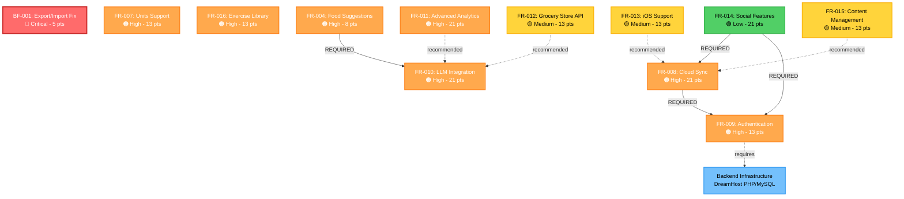

# Backlog Implementation Order Recommendation

**Created**: 2025-01-03  
**Last Updated**: 2025-01-03  
**Status**: Recommendation

## Executive Summary

This document provides a recommended implementation order for all items in the product backlog, organized by priority, dependencies, and business value. The recommendation considers technical dependencies, user impact, and development efficiency.

---

## Implementation Phases

### Phase 1: Critical Bug Fixes (IMMEDIATE)

**Priority**: 🔴 Critical - Must be completed first

#### 1. BF-001: Export/Import Functionality Not Working Properly
- **Status**: ⏳ In Progress (Sprint 10)
- **Points**: 5
- **Priority**: 🔴 Critical
- **Reason**: 
  - Blocks core functionality (data backup/restore)
  - Users cannot backup their health data
  - Data loss risk if device fails
  - Already in progress, should be completed immediately
- **Dependencies**: None
- **Estimated Effort**: 1-2 days

---

### Phase 2: Standalone MVP Features (Next Sprint)

**Priority**: 🟠 High - Can be implemented independently, no post-MVP dependencies

#### 2. FR-007: Metric/Imperial Units Support
- **Status**: ⭕ Not Started
- **Points**: 13
- **Priority**: 🟠 High
- **Reason**:
  - **User Impact**: Significantly improves accessibility for users in imperial-using regions (US, UK)
  - **No Dependencies**: Standalone feature, no external services required
  - **Technical Simplicity**: Well-defined conversion utilities, straightforward implementation
  - **Data Model Ready**: `UserPreferences` already supports units field
  - **High User Satisfaction**: Users expect unit preferences in health apps
  - **Foundation for Growth**: Enables expansion to US/UK markets
- **Dependencies**: None
- **Estimated Effort**: 1-2 weeks
- **Risk**: Low - Well-understood requirements, clear technical approach

#### 3. FR-016: Exercise Library and Workout Plan Integration
- **Status**: ⭕ Not Started
- **Points**: 13
- **Priority**: 🟠 High
- **Reason**:
  - **Completes MVP Feature**: Workout plans are partially implemented but incomplete
  - **Data Quality**: Fixes architectural issue (exercise names as strings → Exercise entity IDs)
  - **User Experience**: Users can reuse exercises across plans, improving efficiency
  - **No External Dependencies**: Can be implemented with existing data models
  - **Technical Debt**: Resolves incomplete feature from MVP
  - **Foundation**: Completes exercise management module properly
- **Dependencies**: None (Exercise entity may need minor adjustment for template exercises)
- **Estimated Effort**: 1-2 weeks
- **Risk**: Medium - Requires careful data migration for existing workout plans

#### 4. FR-004: Food Suggestion Based on Remaining Macros
- **Status**: ⭕ Not Started
- **Points**: 8
- **Priority**: 🟠 High
- **Reason**:
  - **User Value**: High - Helps users meet macro targets easily
  - **Differentiation**: Intelligent feature that improves nutrition adherence
  - **Dependency Note**: Requires LLM integration (FR-010), but can be designed now
  - **Alternative Approach**: Could implement basic rule-based suggestions first, then enhance with LLM
  - **User Request**: Directly addresses user need for macro-based food suggestions
- **Dependencies**: FR-010 (LLM Integration) - **BLOCKER**
- **Estimated Effort**: 1 week (after LLM integration)
- **Risk**: Medium - Depends on LLM integration quality
- **Recommendation**: **DEFER** until after LLM integration (FR-010)

---

### Phase 3: Post-MVP Phase 1 - Foundation Features

**Priority**: 🟠 High - Required for cloud sync and advanced features

#### 5. FR-009: User Authentication
- **Status**: ⭕ Not Started
- **Points**: 13
- **Priority**: 🟠 High
- **Reason**:
  - **Foundation for Cloud Sync**: Required prerequisite for FR-008 (Cloud Sync)
  - **Security**: Essential for protecting user data
  - **Multi-Device Support**: Enables user identity across devices
  - **Backend Dependency**: Requires backend infrastructure setup
  - **Technical Complexity**: Moderate - JWT, secure storage, password hashing
  - **Must Complete First**: Before any cloud sync features
- **Dependencies**: 
  - Backend infrastructure (DreamHost setup)
  - Database schema for users table
  - SSL certificate
  - Email service (for password reset)
- **Estimated Effort**: 2-3 weeks
- **Risk**: Medium - Requires backend development and security expertise

#### 6. FR-008: Cloud Sync & Multi-Device Support
- **Status**: ⭕ Not Started
- **Points**: 21
- **Priority**: 🟠 High
- **Reason**:
  - **User Value**: High - Multi-device access is critical for user retention
  - **Business Value**: Enables scaling and user growth
  - **Dependency**: Requires FR-009 (User Authentication) - **BLOCKER**
  - **Technical Complexity**: High - Sync architecture, conflict resolution, offline-first
  - **Backend Work**: Significant backend development required
  - **Foundation**: Enables future features (web access, etc.)
- **Dependencies**: 
  - **FR-009**: User Authentication (required)
  - Backend infrastructure (DreamHost PHP/MySQL)
  - Sync architecture implementation
  - API endpoints
- **Estimated Effort**: 4-6 weeks
- **Risk**: High - Complex feature, requires careful architecture

#### 7. FR-010: LLM Integration
- **Status**: ⭕ Not Started
- **Points**: 21
- **Priority**: 🟠 High
- **Reason**:
  - **Core Differentiator**: Transforms app from tracking tool to intelligent coach
  - **User Engagement**: Personalized insights increase retention
  - **Enables Other Features**: Required for FR-004 (Food Suggestions), FR-011 (Advanced Analytics)
  - **Architecture Ready**: Abstraction layer already designed
  - **No Backend Dependency**: Can be implemented independently (API calls only)
  - **Cost Consideration**: DeepSeek recommended for cost-effectiveness
- **Dependencies**: None (can be implemented independently)
- **Estimated Effort**: 3-4 weeks
- **Risk**: Medium - Requires prompt engineering and API integration
- **Recommendation**: **Can be done in parallel** with FR-009/FR-008 (no dependency)

#### 8. FR-004: Food Suggestion Based on Remaining Macros (Revisit)
- **Status**: ⭕ Not Started
- **Points**: 8
- **Priority**: 🟠 High
- **Reason**:
  - **Now Unblocked**: LLM integration (FR-010) completed
  - **User Value**: High - Helps users meet macro targets
  - **Quick Win**: Relatively small feature (8 points) with high user impact
  - **Leverages LLM**: Uses LLM integration for personalized suggestions
- **Dependencies**: FR-010 (LLM Integration) - **NOW AVAILABLE**
- **Estimated Effort**: 1 week
- **Risk**: Low - LLM integration already in place

#### 9. FR-011: Advanced Analytics Module
- **Status**: ⭕ Not Started
- **Points**: 21
- **Priority**: 🟠 High
- **Reason**:
  - **User Value**: High - Advanced insights and predictions
  - **Leverages LLM**: Uses LLM integration for natural language insights
  - **Differentiation**: Advanced analytics set app apart from competitors
  - **Dependency**: Benefits from LLM integration (FR-010) but not required
  - **Complexity**: High - Requires statistical analysis and pattern recognition
- **Dependencies**: 
  - FR-010 (LLM Integration) - Recommended but not required
  - User data must be available (already available)
- **Estimated Effort**: 4-5 weeks
- **Risk**: Medium-High - Complex feature with statistical requirements

---

### Phase 4: Post-MVP Phase 2 - Enhancement Features

**Priority**: 🟡 Medium - Nice to have, can wait

#### 10. FR-012: Grocery Store API Integration
- **Status**: ⭕ Not Started
- **Points**: 13
- **Priority**: 🟡 Medium
- **Reason**:
  - **Cost Optimization**: Helps users save money on groceries
  - **Regional Complexity**: Requires integration with multiple store APIs
  - **Dependency**: Enhances LLM meal planning (FR-010) but not required
  - **Business Value**: Medium - Nice feature but not critical
  - **Technical Complexity**: Medium - API integrations, web scraping considerations
- **Dependencies**: 
  - FR-010 (LLM Integration) - Recommended for sale-based meal planning
  - Grocery store API access/agreements
- **Estimated Effort**: 2-3 weeks
- **Risk**: Medium - Depends on external API availability and terms

#### 11. FR-013: iOS Support
- **Status**: ⭕ Not Started
- **Points**: 13
- **Priority**: 🟡 Medium
- **Reason**:
  - **Market Expansion**: Opens iOS market (significant user base)
  - **Platform Parity**: Users expect apps on both platforms
  - **Technical Complexity**: Medium - Flutter supports iOS, but requires testing and platform-specific features
  - **Dependency**: Cloud sync (FR-008) makes multi-platform more valuable
  - **Business Value**: Medium - Expands addressable market
- **Dependencies**: 
  - FR-008 (Cloud Sync) - Recommended for multi-device sync
  - iOS development environment setup
  - App Store submission process
- **Estimated Effort**: 2-3 weeks
- **Risk**: Low-Medium - Flutter supports iOS, but requires platform-specific testing

#### 12. FR-015: Enhanced Content Management
- **Status**: ⭕ Not Started
- **Points**: 13
- **Priority**: 🟡 Medium
- **Reason**:
  - **Content Updates**: Enables dynamic content updates
  - **User-Generated Content**: Allows community contributions
  - **Business Value**: Medium - Improves content freshness
  - **Dependency**: Cloud sync (FR-008) recommended for content distribution
  - **Technical Complexity**: Medium - Requires content management system
- **Dependencies**: 
  - FR-008 (Cloud Sync) - Recommended for content distribution
  - Backend content management system
- **Estimated Effort**: 2-3 weeks
- **Risk**: Medium - Requires backend infrastructure

#### 13. FR-014: Social Features
- **Status**: ⭕ Not Started
- **Points**: 21
- **Priority**: 🟢 Low
- **Reason**:
  - **Low Priority**: Marked as low priority in backlog
  - **Optional Feature**: Not critical for core functionality
  - **Business Value**: Low-Medium - Community features may increase engagement
  - **Dependency**: Cloud sync (FR-008) and authentication (FR-009) required
  - **Technical Complexity**: High - Requires social infrastructure
- **Dependencies**: 
  - FR-008 (Cloud Sync) - Required
  - FR-009 (User Authentication) - Required
  - Social infrastructure (friends, feeds, etc.)
- **Estimated Effort**: 4-5 weeks
- **Risk**: Medium - Complex feature with moderation requirements
- **Recommendation**: **DEFER** - Lowest priority, implement only if user demand is high

---

## Recommended Implementation Timeline

### Sprint 12 (Current/Next)
1. **BF-001**: Export/Import Fix (Complete) - 5 points
2. **FR-007**: Metric/Imperial Units Support - 13 points
   - **Total**: 18 points

### Sprint 13
3. **FR-016**: Exercise Library and Workout Plan Integration - 13 points
   - **Total**: 13 points

### Sprint 14-15 (Post-MVP Phase 1 Begins)
4. **FR-009**: User Authentication - 13 points
5. **FR-010**: LLM Integration - 21 points (can be done in parallel)
   - **Total**: 34 points (2 sprints)

### Sprint 16-17
6. **FR-008**: Cloud Sync & Multi-Device Support - 21 points
   - **Total**: 21 points (2 sprints)

### Sprint 18
7. **FR-004**: Food Suggestion Based on Remaining Macros - 8 points
8. **FR-011**: Advanced Analytics Module (start) - 21 points
   - **Total**: 29 points (partial)

### Sprint 19-20
9. **FR-011**: Advanced Analytics Module (complete) - 21 points
   - **Total**: 21 points (2 sprints)

### Sprint 21+ (Post-MVP Phase 2)
10. **FR-012**: Grocery Store API Integration - 13 points
11. **FR-013**: iOS Support - 13 points
12. **FR-015**: Enhanced Content Management - 13 points
13. **FR-014**: Social Features - 21 points (if prioritized)

---

## Dependency Graph

**Legend**:
- **Solid arrows (→)**: Required dependencies - must be completed first
- **Dashed arrows (-.->)**: Recommended dependencies - beneficial but not required
- **Color coding**: Priority levels (🔴 Critical, 🟠 High, 🟡 Medium, 🟢 Low)

---

## Key Recommendations

### Immediate Actions (Next Sprint)
1. **Complete BF-001** - Critical bug fix must be finished
2. **Start FR-007** - High user impact, no dependencies, quick win
3. **Plan FR-016** - Complete incomplete MVP feature

### Strategic Decisions
1. **FR-004 (Food Suggestions)**: 
   - **Option A**: Defer until LLM integration (FR-010) is complete
   - **Option B**: Implement basic rule-based suggestions first, enhance with LLM later
   - **Recommendation**: Option A - Wait for LLM integration for better user experience

2. **Post-MVP Phase 1 Order**:
   - **FR-009 (Auth)** and **FR-010 (LLM)** can be done in parallel (no dependencies)
   - **FR-008 (Cloud Sync)** must wait for FR-009
   - **FR-004 (Food Suggestions)** should wait for FR-010
   - **FR-011 (Analytics)** can start after FR-010 but benefits from it

3. **Post-MVP Phase 2**:
   - All features are optional enhancements
   - Prioritize based on user feedback and business needs
   - **FR-014 (Social)** should be lowest priority unless user demand is high

### Risk Mitigation
1. **Backend Infrastructure**: FR-009 and FR-008 require backend setup - plan infrastructure early
2. **LLM Costs**: Monitor API costs for FR-010, FR-004, FR-011 - implement rate limiting
3. **Data Migration**: FR-016 requires careful migration of existing workout plans
4. **Testing**: All features require comprehensive testing, especially cloud sync and LLM integration

---

## Summary Table

| Priority | Feature | Points | Phase | Dependencies | Risk |
|----------|---------|--------|-------|--------------|------|
| 🔴 Critical | BF-001: Export/Import Fix | 5 | 1 | None | Low |
| 🟠 High | FR-007: Units Support | 13 | 2 | None | Low |
| 🟠 High | FR-016: Exercise Library | 13 | 2 | None | Medium |
| 🟠 High | FR-009: Authentication | 13 | 3 | Backend | Medium |
| 🟠 High | FR-010: LLM Integration | 21 | 3 | None | Medium |
| 🟠 High | FR-008: Cloud Sync | 21 | 3 | FR-009 | High |
| 🟠 High | FR-004: Food Suggestions | 8 | 3 | FR-010 | Low |
| 🟠 High | FR-011: Advanced Analytics | 21 | 3 | FR-010 (rec) | Medium-High |
| 🟡 Medium | FR-012: Grocery Store API | 13 | 4 | FR-010 (rec) | Medium |
| 🟡 Medium | FR-013: iOS Support | 13 | 4 | FR-008 (rec) | Low-Medium |
| 🟡 Medium | FR-015: Content Management | 13 | 4 | FR-008 (rec) | Medium |
| 🟢 Low | FR-014: Social Features | 21 | 4 | FR-008, FR-009 | Medium |

**Total Points**: 175 points (excluding completed items)

---

## Notes

- **Completed Items**: FR-001, FR-002, FR-003, FR-005, FR-006 are already complete
- **In Progress**: BF-001 is in progress and should be completed first
- **Story Points**: Estimates are based on complexity, not calendar time
- **Parallel Work**: FR-009 and FR-010 can be done in parallel (different teams/developers)
- **User Feedback**: Re-evaluate priorities based on user feedback after MVP release
- **Business Priorities**: Adjust order based on business goals and market needs

---

**Last Updated**: 2025-01-03  
**Version**: 1.0  
**Status**: Recommendation for Review

