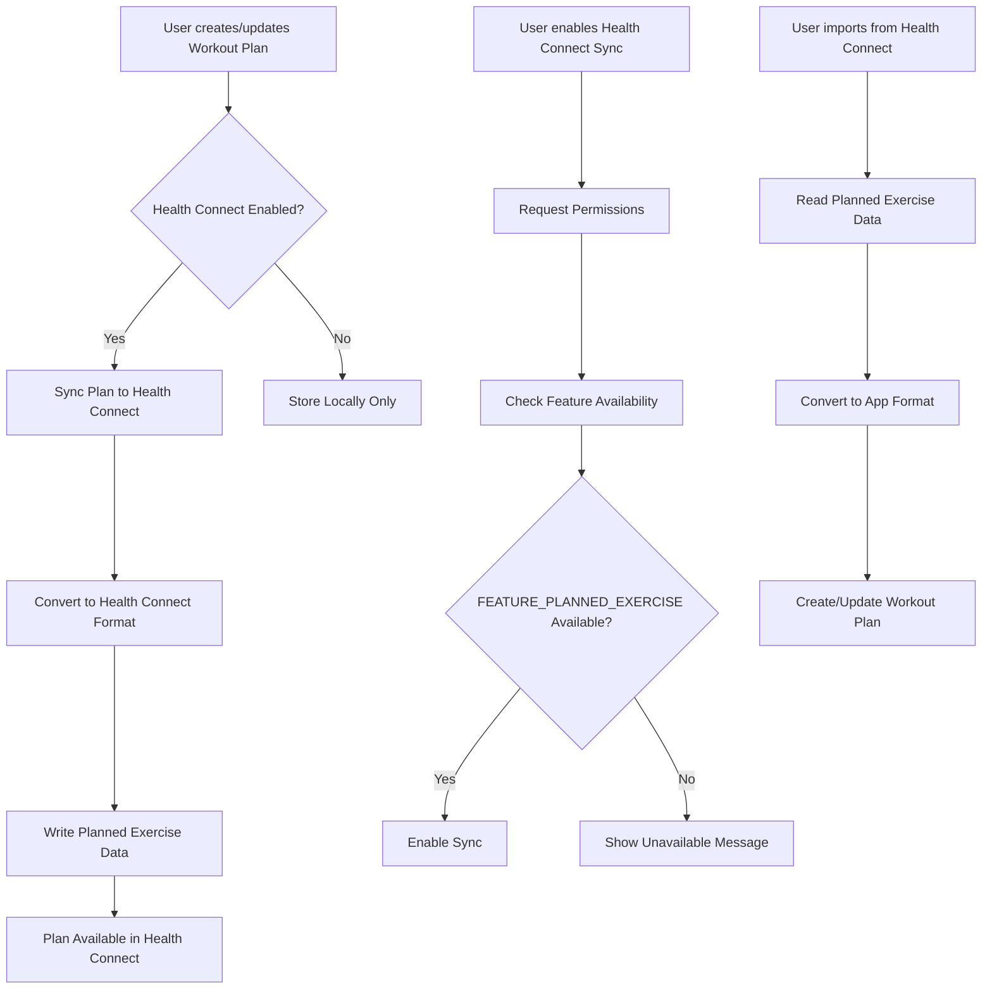

# Feature Request: FR-018 - Google Health Connect Planned Exercise Integration

**Status**: ⭕ Not Started  
**Priority**: 🟡 Medium  
**Story Points**: 13  
**Created**: 2025-01-27  
**Updated**: 2025-01-27  
**Assigned Sprint**: Backlog

## Description

Integrate Google Health Connect's `FEATURE_PLANNED_EXERCISE` to enable bidirectional synchronization of training plans and planned exercises between the app and Google Health Connect. This allows users to manage their workout plans through the app and have them accessible in Health Connect, as well as import planned exercises from other Health Connect-compatible apps.

## User Story

As a fitness enthusiast, I want my workout plans and training schedules to sync with Google Health Connect, so that I can access my planned exercises across different health and fitness apps, maintain a unified view of my training schedule, and benefit from Health Connect's ecosystem of compatible applications.

## User Flow

## Acceptance Criteria

### Health Connect Setup
- [ ] App can detect if Google Health Connect is installed on device
- [ ] App can check if `FEATURE_PLANNED_EXERCISE` is available on device
- [ ] App requests necessary permissions for reading/writing planned exercise data
- [ ] User can enable/disable Health Connect sync in settings
- [ ] App handles cases where Health Connect is not installed gracefully
- [ ] App handles cases where feature is not available on device

### Writing Planned Exercises
- [ ] When user creates a workout plan, it can be synced to Health Connect (if enabled)
- [ ] When user updates a workout plan, changes sync to Health Connect (if enabled)
- [ ] Workout plan exercises are converted to Health Connect `PlannedExercise` format
- [ ] Exercise details (name, type, sets, reps, weight, duration) are preserved in sync
- [ ] Plan schedule (days, times) are synced to Health Connect
- [ ] Sync happens automatically when plans are created/updated (if enabled)
- [ ] User can manually trigger sync for existing plans
- [ ] Sync errors are handled gracefully with user-friendly messages

### Reading Planned Exercises
- [ ] User can import planned exercises from Health Connect
- [ ] App displays list of available planned exercises from Health Connect
- [ ] User can select which planned exercises to import
- [ ] Imported planned exercises are converted to app's workout plan format
- [ ] Exercise details are preserved during import
- [ ] Imported plans can be edited and managed like native plans
- [ ] App handles conflicts when importing (e.g., duplicate plan names)

### Sync Management
- [ ] User can view sync status for each workout plan
- [ ] User can manually sync individual plans
- [ ] User can disable sync for specific plans
- [ ] App handles sync conflicts (e.g., plan modified in both app and Health Connect)
- [ ] Sync status is clearly indicated in UI
- [ ] Last sync time is displayed

### Error Handling
- [ ] App handles Health Connect permission denials gracefully
- [ ] App handles network/connectivity issues during sync
- [ ] App handles data format conversion errors
- [ ] User-friendly error messages are displayed
- [ ] Failed syncs can be retried
- [ ] App logs sync errors for debugging

## Business Value

This feature provides significant value by:

- **Ecosystem Integration**: Enables users to leverage Google Health Connect's ecosystem of compatible health and fitness apps
- **Data Portability**: Users can access their workout plans across different apps and devices
- **Unified Health View**: Planned exercises appear in Health Connect alongside other health data
- **User Convenience**: Users can manage plans in their preferred app while maintaining access elsewhere
- **Future-Proofing**: Positions the app as a Health Connect-compatible solution
- **Competitive Advantage**: Differentiates the app from competitors without Health Connect integration

## Technical Requirements

### Health Connect Integration

#### Dependencies
- Add `health_connect` Flutter package (or Android Health Connect SDK)
- Minimum Health Connect version: 1.1.0-alpha12 (for `FEATURE_PLANNED_EXERCISE`)
- Android API level: 24+ (already supported by app)

#### Permissions
- Request `READ` permission for `PlannedExercise` data type
- Request `WRITE` permission for `PlannedExercise` data type
- Handle permission requests and denials gracefully
- Check permissions before sync operations

#### Feature Availability
- Use Health Connect Feature Availability API to check if `FEATURE_PLANNED_EXERCISE` is available
- Handle cases where feature is not available (show appropriate message)
- Check feature availability on app startup and before sync operations

### Data Conversion

#### App to Health Connect
- Convert `WorkoutPlan` entity to Health Connect `PlannedExercise` format
- Map exercise details:
  - Exercise name → `exerciseName`
  - Exercise type → `exerciseType`
  - Sets → `sets`
  - Reps → `reps`
  - Weight → `weight`
  - Duration → `duration`
  - Rest time → `restTime`
- Map plan schedule:
  - Plan days → `scheduledDate`
  - Plan times → `scheduledTime`
- Handle optional fields appropriately

#### Health Connect to App
- Convert Health Connect `PlannedExercise` to app's `WorkoutPlan` format
- Map all fields back to app entities
- Handle missing or optional fields
- Create `Exercise` entities for imported exercises if needed
- Create `WorkoutPlan` entities from imported data

### Domain Layer

#### New Use Cases
- `CheckHealthConnectAvailabilityUseCase`:
  - Input: None
  - Returns: `Result<bool>` - whether Health Connect and feature are available
  - Checks if Health Connect is installed and feature is available

- `RequestHealthConnectPermissionsUseCase`:
  - Input: `List<HealthConnectPermission>` (read/write for PlannedExercise)
  - Returns: `Result<bool>` - whether permissions were granted
  - Requests necessary permissions from user

- `SyncWorkoutPlanToHealthConnectUseCase`:
  - Input: `WorkoutPlan` entity
  - Returns: `Result<void>`
  - Converts plan to Health Connect format and writes to Health Connect

- `ImportPlannedExercisesFromHealthConnectUseCase`:
  - Input: Optional filters (date range, exercise type)
  - Returns: `Result<List<PlannedExercise>>` - list of planned exercises from Health Connect
  - Reads planned exercises from Health Connect

- `ConvertHealthConnectPlannedExerciseToWorkoutPlanUseCase`:
  - Input: `PlannedExercise` (Health Connect format)
  - Returns: `Result<WorkoutPlan>`
  - Converts Health Connect format to app's WorkoutPlan entity

- `GetHealthConnectSyncStatusUseCase`:
  - Input: `String workoutPlanId`
  - Returns: `Result<SyncStatus>` - sync status for a plan
  - Checks if plan is synced and when last synced

### Data Layer

#### New Repository Interface
- `HealthConnectRepository`:
  - `Future<Result<bool>> isHealthConnectAvailable()`
  - `Future<Result<bool>> isFeatureAvailable(String feature)`
  - `Future<Result<bool>> requestPermissions(List<HealthConnectPermission> permissions)`
  - `Future<Result<bool>> hasPermissions(List<HealthConnectPermission> permissions)`
  - `Future<Result<void>> writePlannedExercise(PlannedExerciseData data)`
  - `Future<Result<List<PlannedExerciseData>>> readPlannedExercises({DateTime? startDate, DateTime? endDate})`
  - `Future<Result<SyncStatus>> getSyncStatus(String planId)`
  - `Future<Result<void>> deletePlannedExercise(String healthConnectId)`

#### Data Models
- `PlannedExerciseData`: Data transfer object for Health Connect PlannedExercise
- `SyncStatus`: Status of sync for a workout plan
  - `isSynced`: bool
  - `lastSyncedAt`: DateTime?
  - `healthConnectId`: String?
  - `syncError`: String?

### Presentation Layer

#### Settings Integration
- Add Health Connect section to app settings
- Toggle to enable/disable Health Connect sync
- Display Health Connect availability status
- Display feature availability status
- Button to request permissions
- Link to Health Connect app if not installed

#### Workout Plan Page Updates
- Add sync status indicator to workout plan cards
- Add "Sync to Health Connect" button/action
- Show sync status (synced, not synced, error)
- Show last sync time
- Add "Import from Health Connect" option

#### Sync Status Widget
- `HealthConnectSyncStatusWidget`: Shows sync status for a plan
- Visual indicators (synced icon, error icon, not synced icon)
- Last sync time display
- Manual sync button

#### Import Dialog
- `ImportPlannedExercisesDialog`: Dialog to import from Health Connect
- List of available planned exercises
- Selection checkboxes
- Preview of exercise details
- Import button

### Error Handling
- Handle Health Connect not installed
- Handle feature not available
- Handle permission denials
- Handle sync failures
- Handle data conversion errors
- Handle network/connectivity issues
- Provide user-friendly error messages
- Log errors for debugging

## Reference Documents

- [Google Health Connect - Training Plans](https://developer.android.com/health-and-fitness/guides/health-connect/develop/training-plans) - Official documentation for PlannedExercise feature
- [Google Health Connect - Feature Availability](https://developer.android.com/health-and-fitness/health-connect/features/availability) - How to check feature availability
- [Google Health Connect - Permissions](https://developer.android.com/health-and-fitness/guides/health-connect/develop/permissions) - Permission handling guide
- `FR-016-exercise-library-and-workout-plan-integration.md` - Related feature for workout plans
- `FR-017-comprehensive-exercise-tracking.md` - Related feature for exercise tracking

## Technical References

### Current Implementation
- **Workout Plan Entity**: `app/lib/features/exercise_management/domain/entities/workout_plan.dart`
- **Exercise Entity**: `app/lib/features/exercise_management/domain/entities/exercise.dart`
- **Workout Plan Repository**: `app/lib/features/exercise_management/domain/repositories/workout_plan_repository.dart`

### To Be Created
- **Health Connect Repository**: `lib/core/data/repositories/health_connect_repository.dart`
- **Health Connect Data Source**: `lib/core/data/datasources/health_connect_datasource.dart`
- **Planned Exercise Data Model**: `lib/core/data/models/planned_exercise_data.dart`
- **Sync Status Model**: `lib/core/data/models/sync_status.dart`
- **Health Connect Use Cases**: `lib/core/domain/usecases/health_connect/`
- **Health Connect Settings Page**: `lib/features/settings/presentation/pages/health_connect_settings_page.dart`
- **Sync Status Widget**: `lib/features/exercise_management/presentation/widgets/health_connect_sync_status_widget.dart`
- **Import Dialog**: `lib/features/exercise_management/presentation/widgets/import_planned_exercises_dialog.dart`

## Dependencies

- **FR-016**: Exercise Library and Workout Plan Integration must be completed first
- **FR-017**: Comprehensive Exercise Tracking should be completed or in progress
- Workout plan entity and repository must be fully implemented
- Health Connect must be installed on user's device (Android)
- Health Connect version 1.1.0-alpha12+ required for `FEATURE_PLANNED_EXERCISE`
- Flutter `health_connect` package (or Android Health Connect SDK integration)

## Notes

### Implementation Considerations

1. **Health Connect Package**:
   - Research available Flutter packages for Health Connect integration
   - May need to use platform channels to access Android Health Connect SDK directly
   - Consider using `health` package or similar if available

2. **Feature Availability**:
   - `FEATURE_PLANNED_EXERCISE` is available in Health Connect 1.1.0-alpha12+
   - Not all devices may have this version installed
   - Must gracefully handle feature unavailability

3. **Data Mapping**:
   - Health Connect's PlannedExercise format may differ from app's WorkoutPlan format
   - May need to handle missing fields or optional fields
   - Consider data loss during conversion (preserve as much as possible)

4. **Sync Strategy**:
   - Decide on sync direction: one-way (app → Health Connect) or bidirectional
   - Handle sync conflicts (plan modified in both places)
   - Consider sync frequency (immediate vs. periodic)
   - Consider sync on app startup vs. manual sync

5. **User Experience**:
   - Make sync opt-in (not automatic)
   - Clearly indicate sync status
   - Provide clear error messages
   - Allow users to disable sync per plan

6. **Testing**:
   - Test with Health Connect installed and not installed
   - Test with feature available and not available
   - Test permission flows
   - Test data conversion accuracy
   - Test sync conflicts
   - Test error scenarios

### Design Decisions Needed

1. **Sync Direction**:
   - Option A: One-way sync (app → Health Connect only)
   - Option B: Bidirectional sync (app ↔ Health Connect)
   - **Recommendation**: Start with one-way (app → Health Connect), add bidirectional later if needed

2. **Sync Timing**:
   - Option A: Automatic sync on plan create/update
   - Option B: Manual sync only
   - Option C: Automatic with manual override
   - **Recommendation**: Option C - automatic with manual sync option

3. **Conflict Resolution**:
   - Option A: App data takes precedence
   - Option B: Health Connect data takes precedence
   - Option C: User chooses per conflict
   - **Recommendation**: Option A for MVP (app data takes precedence)

4. **Import Behavior**:
   - Option A: Import creates new plans
   - Option B: Import updates existing plans if name matches
   - Option C: User chooses per import
   - **Recommendation**: Option A for MVP (always create new plans)

### Testing Considerations

- Test Health Connect availability detection
- Test feature availability detection
- Test permission requests and handling
- Test writing planned exercises to Health Connect
- Test reading planned exercises from Health Connect
- Test data conversion (app → Health Connect and Health Connect → app)
- Test sync status tracking
- Test error handling (not installed, feature unavailable, permissions denied, sync failures)
- Test with various workout plan configurations
- Test with large numbers of planned exercises
- Test sync performance

### Performance Considerations

- Sync operations should not block UI
- Consider background sync for large plans
- Cache sync status to avoid repeated Health Connect queries
- Optimize data conversion operations
- Handle large numbers of planned exercises efficiently

## History

- 2025-01-27 - Created - Request to integrate Google Health Connect FEATURE_PLANNED_EXERCISE for training plans

